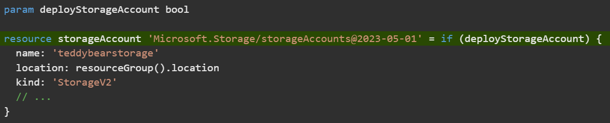

# Build flexible Bicep templates by using conditions and loops
[Link](https://learn.microsoft.com/en-us/training/modules/build-flexible-bicep-templates-conditions-loops/1-introduction)

# Introduction
When you work with Bicep templates, conditions and loops can help make your Azure deployments more flexible. With conditions, you can deploy resources only when specific constraints are in place. And with loops, you can deploy multiple resources that have similar properties.  

# Deploy resources conditionally
You can use conditions in your Bicep code to deploy resources only when specific constraints are in place.

For example, at your toy company, you need to deploy resources to various environments. When you deploy them to a production environment, you need to ensure that auditing is enabled for your Azure SQL logical servers. But when you deploy resources to development environments, you don't want to enable auditing. You want to use a single template to deploy resources to all your environments.

In this unit, you'll learn how to deploy resources conditionally.

## Use basic conditions

When you deploy a resource in Bicep, you can provide the `if` keyword followed by a condition. The condition should resolve to a Boolean (true or false) value. If the value is _true_, the resource is deployed. If the value is _false_, the resource is not deployed.

It's common to create conditions based on the values of parameters that you provide. For example, the following code deploys a storage account only when the `deployStorageAccount` parameter is set to `true`:
```bicep
param deployStorageAccount bool
    
resource storageAccount 'Microsoft.Storage/storageAccounts@2023-05-01' = if (deployStorageAccount) {
  name: 'teddybearstorage'
  location: resourceGroup().location
  kind: 'StorageV2'
  // ...
}
```

Notice that the `if` keyword is on the same line as the resource definition.

## Use expressions as conditions

The preceding example was quite basic. The `deployStorageAccount` parameter was of type `bool`, so it's clear whether it has a value of `true` or `false`.

In Bicep, conditions can also include expressions. In the following example, the code deploys a SQL auditing resource only when the `environmentName` parameter value is equal to `Production`:
```bicep
@allowed([
  'Development'
  'Production'
])
param environmentName string

resource auditingSettings 'Microsoft.Sql/servers/auditingSettings@2024-05-01-preview' = if (environmentName == 'Production') {
  parent: server
  name: 'default'
  properties: {
  }
}
```
It's usually a good idea to create a variable for the expression that you're using as a condition. That way, your template is easier to understand and read. Here's an example:
```bicep
@allowed([
  'Development'
  'Production'
])
param environmentName string

var auditingEnabled = environmentName == 'Production'

resource auditingSettings 'Microsoft.Sql/servers/auditingSettings@2024-05-01-preview' = if (auditingEnabled) {
  parent: server
  name: 'default'
  properties: {
  }
}
```

## Depend on conditionally deployed resources

When you deploy resources conditionally, you sometimes need to be aware of how Bicep evaluates the dependencies between them.

Let's continue writing some Bicep code to deploy SQL auditing settings. The Bicep file also needs to declare a storage account resource, as shown here:
```bicep
@allowed([
  'Development'
  'Production'
])
param environmentName string
param location string = resourceGroup().location
param auditStorageAccountName string = 'bearaudit${uniqueString(resourceGroup().id)}'

var auditingEnabled = environmentName == 'Production'
var storageAccountSkuName = 'Standard_LRS'

resource auditStorageAccount 'Microsoft.Storage/storageAccounts@2023-05-01' = if (auditingEnabled) {
  name: auditStorageAccountName
  location: location
  sku: {
    name: storageAccountSkuName
  }
  kind: 'StorageV2'
}

resource auditingSettings 'Microsoft.Sql/servers/auditingSettings@2024-05-01-preview' = if (auditingEnabled) {
  parent: server
  name: 'default'
  properties: {
  }
}
```

Notice that the storage account has a condition too. This means that it won't be deployed for non-production environments either. The SQL auditing settings resource can now refer to the storage account details:
```bicep
resource auditingSettings 'Microsoft.Sql/servers/auditingSettings@2024-05-01-preview' = if (auditingEnabled) {
  parent: server
  name: 'default'
  properties: {
    state: 'Enabled'
    storageEndpoint: environmentName == 'Production' ? auditStorageAccount.properties.primaryEndpoints.blob : ''
    storageAccountAccessKey: environmentName == 'Production' ? listKeys(auditStorageAccount.id, auditStorageAccount.apiVersion).keys[0].value : ''
  }
}
```

Notice that this Bicep code uses the question mark (`?`) operator within the `storageEndpoint` and `storageAccountAccessKey` properties. When the Bicep code is deployed to a production environment, the expressions are evaluated to the details from the storage account. When the code is deployed to a non-production environment, the expressions evaluate to an empty string (`''`).

You might wonder why this code is necessary, because `auditingSettings` and `auditStorageAccount` both have the same condition, and so you'll never need to deploy a SQL auditing settings resource without a storage account. Although this is true, Azure Resource Manager evaluates the property expressions before the conditionals on the resources. That means that if the Bicep code doesn't have this expression, the deployment will fail with a `ResourceNotFound` error.

> 📝 **Note:**  
>You can't define two resources with the same name in the same Bicep file and then conditionally deploy only one of them. The deployment will fail, because Resource Manager views this as a conflict.
>
>If you have several resources, all with the same condition for deployment, consider using Bicep modules. You can create a module that deploys all the resources, then put a condition on the module declaration in your main Bicep file.

# Exercise - Deploy resources conditionally
You need to deploy your toy company's resources to a variety of environments, and you want to use parameters and conditions to control what gets deployed to each environment.

In this exercise, you'll create an Azure SQL logical server and a database. You'll then add auditing settings to ensure that auditing is enabled, but you want it enabled only when you're deploying to a production environment. For auditing purposes, you need to have a storage account, which you'll also deploy only when you're deploying resources to a production environment.

During the process, you'll:

-   Create a Bicep file that defines a logical server with a database.
-   Add a storage account and SQL auditing settings, each of which is deployed with a condition.
-   Set up an infrastructure for your development environment, and then verify the result.
-   Redeploy your infrastructure against your production environment, and then look at the changes.

This exercise uses the [Bicep extension for Visual Studio Code](https://marketplace.visualstudio.com/items?itemName=ms-azuretools.vscode-bicep). Be sure to install this extension in Visual Studio Code.

## Create a Bicep template with a logical server and database

1.  Open Visual Studio Code.
    
2.  Create a new file called _main.bicep_.
    
3.  Save the empty file so that Visual Studio Code loads the Bicep tooling.
    
    You can either select **File** > **Save As** or select Ctrl+S in Windows (⌘+S on macOS). Be sure to remember where you've saved the file. For example, you might want to create a _templates_ folder in which to save it.
    
4.  To define a logical server and database, add the following content to the file, along with the parameters and variables that these resources need. Enter the content yourself instead of copying and pasting so that you can see how the tooling helps you to write your Bicep files.
```bicep
@description('The Azure region into which the resources should be deployed.')
param location string

@secure()
@description('The administrator login username for the SQL server.')
param sqlServerAdministratorLogin string

@secure()
@description('The administrator login password for the SQL server.')
param sqlServerAdministratorLoginPassword string

@description('The name and tier of the SQL database SKU.')
param sqlDatabaseSku object = {
  name: 'Standard'
  tier: 'Standard'
}

var sqlServerName = 'teddy${location}${uniqueString(resourceGroup().id)}'
var sqlDatabaseName = 'TeddyBear'

resource sqlServer 'Microsoft.Sql/servers@2024-05-01-preview' = {
  name: sqlServerName
  location: location
  properties: {
    administratorLogin: sqlServerAdministratorLogin
    administratorLoginPassword: sqlServerAdministratorLoginPassword
  }
}

resource sqlDatabase 'Microsoft.Sql/servers/databases@2024-05-01-preview' = {
  parent: sqlServer
  name: sqlDatabaseName
  location: location
  sku: sqlDatabaseSku
}
```
Notice that all of the parameters include `@description` decorators, which help to make them easier to work with. Also notice that the `sqlServerAdministratorLogin` and `sqlServerAdministratorLoginPassword` parameters have the `@secure` decorator applied to them. This tells Bicep that these parameter values are sensitive. Azure doesn't print sensitive values to logs.

## Add a storage account

In the auditing settings for the logical servers, you need to specify a storage account to contain the auditing data. You'll update your Bicep file to create this storage account, but only when auditing is going to be enabled.

1.  Below the parameter declarations, add the following parameters:
```bicep
@description('The name of the environment. This must be Development or Production.')
@allowed([
  'Development'
  'Production'
])
param environmentName string = 'Development'

@description('The name of the audit storage account SKU.')
param auditStorageAccountSkuName string = 'Standard_LRS'
```
2. Below the variable declarations, add the following variables:
```bicep
var auditingEnabled = environmentName == 'Production'
var auditStorageAccountName = take('bearaudit${location}${uniqueString(resourceGroup().id)}', 24)
```
-   Notice that you're creating a variable called `auditingEnabled`, which you'll use as the condition for deploying the auditing resources. When you create a variable like this, you make your Bicep code clearer and easier to read. Anyone who looks at the conditions on your resources will understand what's happening.
    
    Also notice that the `auditStorageAccountName` variable uses a function called `take()`. Storage account names have a maximum length of 24 characters, so this function trims the end off the string to ensure that the name is valid.
    
3. At the bottom of the file, below the resources, add the following resource definition for the storage account:
```bicep
resource auditStorageAccount 'Microsoft.Storage/storageAccounts@2023-05-01' = if (auditingEnabled) {
  name: auditStorageAccountName
  location: location
  sku: {
    name: auditStorageAccountSkuName
  }
  kind: 'StorageV2'  
}
```
Notice that the definitions for the storage account include the `if` keyword, which specifies a deployment condition.
    

## Add auditing settings

1.  Below the storage account resource you just added, add the following:
```bicep
resource sqlServerAudit 'Microsoft.Sql/servers/auditingSettings@2024-05-01-preview' = if (auditingEnabled) {
  parent: sqlServer
  name: 'default'
  properties: {
    state: 'Enabled'
    storageEndpoint: environmentName == 'Production' ? auditStorageAccount.properties.primaryEndpoints.blob : ''
    storageAccountAccessKey: environmentName == 'Production' ? auditStorageAccount.listKeys().keys[0].value : ''
  }
}
```
Notice that the definition includes the same `if` condition as the storage account. Also, the `storageEndpoint` and `storageAccountAccessKey` properties use the question mark (`?`) ternary operator to ensure that their values are always valid. If you don't do this, Azure Resource Manager evaluates the expression values before it evaluates the resource deployment condition and returns an error, because the storage account can't be found.

2. Save the changes to the file. 

## Verify your Bicep file

After you've completed all of the preceding changes, your Bicep file should look like this example:
```bicep
@description('The Azure region into which the resources should be deployed.')
param location string

@secure()
@description('The administrator login username for the SQL server.')
param sqlServerAdministratorLogin string

@secure()
@description('The administrator login password for the SQL server.')
param sqlServerAdministratorLoginPassword string

@description('The name and tier of the SQL database SKU.')
param sqlDatabaseSku object = {
  name: 'Standard'
  tier: 'Standard'
}

@description('The name of the environment. This must be Development or Production.')
@allowed([
  'Development'
  'Production'
])
param environmentName string = 'Development'

@description('The name of the audit storage account SKU.')
param auditStorageAccountSkuName string = 'Standard_LRS'

var sqlServerName = 'teddy${location}${uniqueString(resourceGroup().id)}'
var sqlDatabaseName = 'TeddyBear'
var auditingEnabled = environmentName == 'Production'
var auditStorageAccountName = take('bearaudit${location}${uniqueString(resourceGroup().id)}', 24)

resource sqlServer 'Microsoft.Sql/servers@2024-05-01-preview' = {
  name: sqlServerName
  location: location
  properties: {
    administratorLogin: sqlServerAdministratorLogin
    administratorLoginPassword: sqlServerAdministratorLoginPassword
  }
}

resource sqlDatabase 'Microsoft.Sql/servers/databases@2024-05-01-preview' = {
  parent: sqlServer
  name: sqlDatabaseName
  location: location
  sku: sqlDatabaseSku
}

resource auditStorageAccount 'Microsoft.Storage/storageAccounts@2023-05-01' = if (auditingEnabled) {
  name: auditStorageAccountName
  location: location
  sku: {
    name: auditStorageAccountSkuName
  }
  kind: 'StorageV2'  
}

resource sqlServerAudit 'Microsoft.Sql/servers/auditingSettings@2024-05-01-preview' = if (auditingEnabled) {
  parent: sqlServer
  name: 'default'
  properties: {
    state: 'Enabled'
    storageEndpoint: environmentName == 'Production' ? auditStorageAccount.properties.primaryEndpoints.blob : ''
    storageAccountAccessKey: environmentName == 'Production' ? auditStorageAccount.listKeys().keys[0].value : ''
  }
}
```
If it doesn't, either copy the example or adjust your template to match the example.

## Deploy the Bicep template to Azure

To deploy this template to Azure, you need to sign in to your Azure account from the Visual Studio Code terminal. Be sure you've installed the [Azure CLI](https://learn.microsoft.com/en-us/cli/azure/install-azure-cli), and remember to sign in with the same account that you used to activate the sandbox.

1.  On the **Terminal** menu, select **New Terminal**. The terminal window usually opens in the lower half of your screen.
    
2.  If the terminal window displays **bash** on the right side, it means the correct shell is already open. Alternatively, if you see a bash shell icon on the right, you can select it to launch the shell.
    
    
    
    If a shell other than **bash** appears, select the shell dropdown arrow, and then select **Git Bash**.
    
    
    
3.  In the terminal, go to the directory where you saved your template. For example, if you saved your template to the _templates_ folder, you can use this command:
    
    Azure CLI
    
        cd templates
        
    

### Install Bicep

Run the following command to ensure you have the latest version of Bicep:

Azure CLI

    az bicep install && az bicep upgrade
    

### Sign in to Azure

1.  In the Visual Studio Code terminal, sign in to Azure by running the following command:
    
    Azure CLI
    
        az login
        
    
2.  In the browser that opens, sign in to your Azure account. The Visual Studio Code terminal displays a list of the subscriptions associated with this account. Select the subscription called **Concierge Subscription**.
    
    If you've used more than one sandbox recently, the terminal might display more than one instance of _Concierge Subscription_. In this case, use the next two steps to set one as the default subscription.
    
    1.  Get the Concierge Subscription IDs.
        
        Azure CLI
        
              az account list \
               --refresh \
               --query "[?contains(name, 'Concierge Subscription')].id" \
               --output table
            
        
    2.  Set the default subscription by using the subscription ID. Replace _{your subscription ID}_ with the latest Concierge Subscription ID.
        
        Azure CLI
        
            az account set --subscription {your subscription ID}
            
        

### Set the default resource group

When you use the Azure CLI, you can set the default resource group and omit the parameter from the rest of the Azure CLI commands in this exercise. Set the default to the resource group that's created for you in the sandbox environment.

Azure CLI

    az configure --defaults group="[sandbox resource group name]"
    

### Deploy the template to Azure by using the Azure CLI

In the Visual Studio Code terminal, deploy the Bicep template to Azure by running the following code. Notice that you're explicitly setting the `location` parameter to `westus3`.

Azure CLI

    az deployment group create --name main --template-file main.bicep --parameters location=westus3
    

To deploy this template to Azure, sign in to your Azure account from the Visual Studio Code terminal. Be sure you've [installed Azure PowerShell](https://learn.microsoft.com/en-us/powershell/azure/install-az-ps), and sign in to the same account that activated the sandbox.

1.  On the **Terminal** menu, select **New Terminal**. The terminal window usually opens in the lower half of your screen.
    
2.  If the terminal window displays **pwsh** or **powershell** on the right side, it means the correct shell is already open. Alternatively, if you see a PowerShell shell icon on the right, you can select it to launch the shell.
    
    
    
    If a shell other than **pwsh** or **powershell** appears, select the shell dropdown arrow, and then select **PowerShell**.
    
    
    
3.  In the terminal, go to the directory where you saved your template. For example, if you saved your template in the _templates_ folder, you can use this command:
    
    Azure PowerShell
    
        Set-Location -Path templates
        
    

### Install the Bicep CLI

To use Bicep from Azure PowerShell, [install the Bicep CLI](https://learn.microsoft.com/en-us/azure/azure-resource-manager/templates/bicep-install?tabs=azure-powershell#azure-powershell).

### Sign in to Azure by using Azure PowerShell

1.  In the Visual Studio Code terminal, run the following command:
    
    Azure PowerShell
    
        Connect-AzAccount
        
    
    A browser opens so that you can sign in to your Azure account. The browser might be opened in the background.
    
2.  After you've signed in to Azure, the terminal displays a list of the subscriptions associated with this account. If you've activated the sandbox, a subscription named _Concierge Subscription_ is displayed. Select it for the rest of the exercise.
    
    If you've used more than one sandbox recently, the terminal might display more than one instance of _Concierge Subscription_. In this case, use the next two steps to set one as the default subscription.
    
    1.  Get the subscription ID. Running the following command lists your subscriptions and their IDs. Look for `Concierge Subscription`, and then copy the ID from the second column. It looks something like `aaaa0a0a-bb1b-cc2c-dd3d-eeeeee4e4e4e`.
        
        Azure PowerShell
        
            Get-AzSubscription
            
        
    2.  Change your active subscription to _Concierge Subscription_. Be sure to replace _{Your subscription ID}_ with the one that you copied.
        
        Azure PowerShell
        
            $context = Get-AzSubscription -SubscriptionId {Your subscription ID}
            Set-AzContext $context
            
        

### Set the default resource group

You can set the default resource group and omit the parameter from the rest of the Azure PowerShell commands in this exercise. Set this default to the resource group created for you in the sandbox environment.

Azure PowerShell 

    Set-AzDefault -ResourceGroupName [sandbox resource group name]
    
Azure CLI 

    az configure --defaults group="[sandbox resource group name]"

### Deploy the template to Azure by using Azure PowerShell

In the Visual Studio Code terminal, deploy the template to Azure by running the following Azure PowerShell command. This process can take a couple of minutes to complete, and then you'll have a successful deployment.


Azure PowerShell 

    New-AzResourceGroupDeployment -Name main -TemplateFile main.bicep -location westus3
    
You're prompted to enter the values for `sqlServerAdministratorLogin` and `sqlServerAdministratorLoginPassword` parameters when you execute the deployment.

> 💡 **Tip:**  
>When you enter the secure parameters, the values you choose must follow certain rules:
>
>-   `sqlServerAdministratorLogin` must not be an easily guessable login name such as `admin` or `root`. It can contain only alphanumeric characters and must start with a letter.
>-   `sqlServerAdministratorLoginPassword` must be at least eight characters long and include lowercase letters, uppercase letters, numbers, and symbols. For more information about password complexity, see the [SQL Azure password policy](https://learn.microsoft.com/en-us/sql/relational-databases/security/password-policy#password-complexity).
>
>If the parameter values don't meet the requirements, Azure SQL won't deploy your logical server.
>
>Also, _be sure to note the login and password that you enter_. You'll use them again shortly.

Because you haven't specified a value for the `environmentName` parameter, the deployment uses the default value of `Development`.

Wait for deployment to finish. If your deployment fails with a message that a location isn't accepting creation of new Windows Azure SQL Database servers, select a different region like `eastus` or `eastus2`.

## Verify the deployment

Use the Azure portal to inspect the resources that you deploy and to inspect the results of each deployment.

1.  Go to the [Azure portal](https://portal.azure.com/), and make sure you're in the sandbox subscription by doing the following:
    
    a. Select your avatar at the upper right.  
    b. Select **Switch directory**. In the list, select the **Microsoft Learn Sandbox** directory.
    
2.  On the left pane, select **Resource groups**.
    
3.  Select **\[sandbox resource group name\]**.
    
4.  In the **Overview** section, you can see that one deployment has succeeded. You can also see that a logical server and a SQL database are deployed, but the storage account for auditing isn't deployed.
    
    > 📝 **Note:**  
        The storage account with a name beginning with `cloudshell` is unrelated to your deployment and was created by the Learn sandbox.


    
5.  Next to **Deployments**, select **1 Succeeded** to see deployment details.
    
    
    
6.  Select the deployment called **main** to see which resources were deployed, and then select **Deployment details** to expand it.
    
    In this case, one logical server and one SQL database are deployed. Notice that the storage account and auditing settings aren't on the list of resources.
    
    
    
7.  Leave the page open in your browser. You'll check on deployments again later.
    

## Redeploy for the production environment

In the previous deployment, the default value for the `environmentName` parameter was used, which meant that it was set to `Development`.

Now you'll explicitly set the parameter value to `Production`. You expect that, by making this change, the storage account for auditing purposes will be deployed, and auditing will be enabled on the logical server.

### Deploy the template for the production environment

In the Visual Studio Code terminal, deploy the Bicep template to Azure by running the following code:

Azure CLI 

    az deployment group create --name main --template-file main.bicep --parameters environmentName=Production location=westus3
    

In the Visual Studio Code terminal, deploy the template to Azure by running the following Azure PowerShell command:

Azure PowerShell

    New-AzResourceGroupDeployment -Name main -TemplateFile main.bicep -environmentName Production -location westus3
    

> ⚠️ **Caution:**  
>Be sure to use the same login and password that you used previously, or the deployment won't finish successfully.
>
>After minute or two, the deployment should finish successfully.

### Verify the redeployment

To complete this exercise, verify that the redeployment has finished successfully and that auditing has been enabled.

1.  Return to the Azure portal and go to your resource group. If you already have the resource group open, select **Refresh**.
    
    You should see that an additional storage account has been deployed for auditing purposes.
    
    
    
2.  Select your logical server (look for the resource with type **SQL server**).
    
3.  In the search field, enter **Auditing**. Under **Security**, select **Auditing**.
    
    
    
4.  Verify that auditing is enabled for this logical server.
    
    


