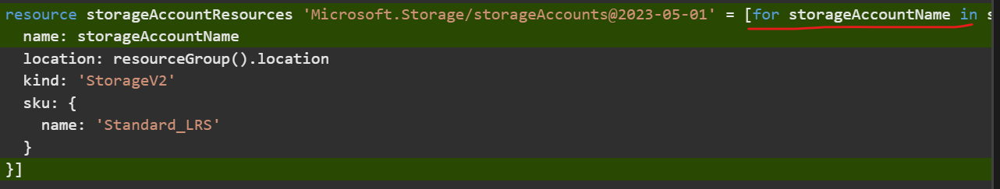
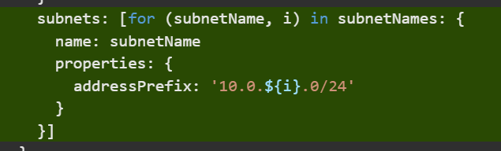
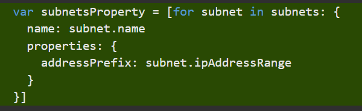

# Build flexible Bicep templates by using conditions and loops
[Link](https://learn.microsoft.com/en-us/training/modules/build-flexible-bicep-templates-conditions-loops/1-introduction)

# Introduction
When you work with Bicep templates, conditions and loops can help make your Azure deployments more flexible. With conditions, you can deploy resources only when specific constraints are in place. And with loops, you can deploy multiple resources that have similar properties.  

# Deploy resources conditionally
You can use conditions in your Bicep code to deploy resources only when specific constraints are in place.

For example, at your toy company, you need to deploy resources to various environments. When you deploy them to a production environment, you need to ensure that auditing is enabled for your Azure SQL logical servers. But when you deploy resources to development environments, you don't want to enable auditing. You want to use a single template to deploy resources to all your environments.

In this unit, you'll learn how to deploy resources conditionally.

## Use basic conditions

When you deploy a resource in Bicep, you can provide the `if` keyword followed by a condition. The condition should resolve to a Boolean (true or false) value. If the value is _true_, the resource is deployed. If the value is _false_, the resource is not deployed.

It's common to create conditions based on the values of parameters that you provide. For example, the following code deploys a storage account only when the `deployStorageAccount` parameter is set to `true`:
```bicep
param deployStorageAccount bool
    
resource storageAccount 'Microsoft.Storage/storageAccounts@2023-05-01' = if (deployStorageAccount) {
  name: 'teddybearstorage'
  location: resourceGroup().location
  kind: 'StorageV2'
  // ...
}
```

Notice that the `if` keyword is on the same line as the resource definition.

## Use expressions as conditions

The preceding example was quite basic. The `deployStorageAccount` parameter was of type `bool`, so it's clear whether it has a value of `true` or `false`.

In Bicep, conditions can also include expressions. In the following example, the code deploys a SQL auditing resource only when the `environmentName` parameter value is equal to `Production`:
```bicep
@allowed([
  'Development'
  'Production'
])
param environmentName string

resource auditingSettings 'Microsoft.Sql/servers/auditingSettings@2024-05-01-preview' = if (environmentName == 'Production') {
  parent: server
  name: 'default'
  properties: {
  }
}
```
It's usually a good idea to create a variable for the expression that you're using as a condition. That way, your template is easier to understand and read. Here's an example:
```bicep
@allowed([
  'Development'
  'Production'
])
param environmentName string

var auditingEnabled = environmentName == 'Production'

resource auditingSettings 'Microsoft.Sql/servers/auditingSettings@2024-05-01-preview' = if (auditingEnabled) {
  parent: server
  name: 'default'
  properties: {
  }
}
```

## Depend on conditionally deployed resources

When you deploy resources conditionally, you sometimes need to be aware of how Bicep evaluates the dependencies between them.

Let's continue writing some Bicep code to deploy SQL auditing settings. The Bicep file also needs to declare a storage account resource, as shown here:
```bicep
@allowed([
  'Development'
  'Production'
])
param environmentName string
param location string = resourceGroup().location
param auditStorageAccountName string = 'bearaudit${uniqueString(resourceGroup().id)}'

var auditingEnabled = environmentName == 'Production'
var storageAccountSkuName = 'Standard_LRS'

resource auditStorageAccount 'Microsoft.Storage/storageAccounts@2023-05-01' = if (auditingEnabled) {
  name: auditStorageAccountName
  location: location
  sku: {
    name: storageAccountSkuName
  }
  kind: 'StorageV2'
}

resource auditingSettings 'Microsoft.Sql/servers/auditingSettings@2024-05-01-preview' = if (auditingEnabled) {
  parent: server
  name: 'default'
  properties: {
  }
}
```

Notice that the storage account has a condition too. This means that it won't be deployed for non-production environments either. The SQL auditing settings resource can now refer to the storage account details:
```bicep
resource auditingSettings 'Microsoft.Sql/servers/auditingSettings@2024-05-01-preview' = if (auditingEnabled) {
  parent: server
  name: 'default'
  properties: {
    state: 'Enabled'
    storageEndpoint: environmentName == 'Production' ? auditStorageAccount.properties.primaryEndpoints.blob : ''
    storageAccountAccessKey: environmentName == 'Production' ? listKeys(auditStorageAccount.id, auditStorageAccount.apiVersion).keys[0].value : ''
  }
}
```

Notice that this Bicep code uses the question mark (`?`) operator within the `storageEndpoint` and `storageAccountAccessKey` properties. When the Bicep code is deployed to a production environment, the expressions are evaluated to the details from the storage account. When the code is deployed to a non-production environment, the expressions evaluate to an empty string (`''`).

You might wonder why this code is necessary, because `auditingSettings` and `auditStorageAccount` both have the same condition, and so you'll never need to deploy a SQL auditing settings resource without a storage account. Although this is true, Azure Resource Manager evaluates the property expressions before the conditionals on the resources. That means that if the Bicep code doesn't have this expression, the deployment will fail with a `ResourceNotFound` error.

> 📝 **Note:**  
>You can't define two resources with the same name in the same Bicep file and then conditionally deploy only one of them. The deployment will fail, because Resource Manager views this as a conflict.
>
>If you have several resources, all with the same condition for deployment, consider using Bicep modules. You can create a module that deploys all the resources, then put a condition on the module declaration in your main Bicep file.

# Exercise - Deploy resources conditionally
You need to deploy your toy company's resources to a variety of environments, and you want to use parameters and conditions to control what gets deployed to each environment.

In this exercise, you'll create an Azure SQL logical server and a database. You'll then add auditing settings to ensure that auditing is enabled, but you want it enabled only when you're deploying to a production environment. For auditing purposes, you need to have a storage account, which you'll also deploy only when you're deploying resources to a production environment.

During the process, you'll:

-   Create a Bicep file that defines a logical server with a database.
-   Add a storage account and SQL auditing settings, each of which is deployed with a condition.
-   Set up an infrastructure for your development environment, and then verify the result.
-   Redeploy your infrastructure against your production environment, and then look at the changes.

This exercise uses the [Bicep extension for Visual Studio Code](https://marketplace.visualstudio.com/items?itemName=ms-azuretools.vscode-bicep). Be sure to install this extension in Visual Studio Code.

## Create a Bicep template with a logical server and database

1.  Open Visual Studio Code.
    
2.  Create a new file called _main.bicep_.
    
3.  Save the empty file so that Visual Studio Code loads the Bicep tooling.
    
    You can either select **File** > **Save As** or select Ctrl+S in Windows (⌘+S on macOS). Be sure to remember where you've saved the file. For example, you might want to create a _templates_ folder in which to save it.
    
4.  To define a logical server and database, add the following content to the file, along with the parameters and variables that these resources need. Enter the content yourself instead of copying and pasting so that you can see how the tooling helps you to write your Bicep files.
```bicep
@description('The Azure region into which the resources should be deployed.')
param location string

@secure()
@description('The administrator login username for the SQL server.')
param sqlServerAdministratorLogin string

@secure()
@description('The administrator login password for the SQL server.')
param sqlServerAdministratorLoginPassword string

@description('The name and tier of the SQL database SKU.')
param sqlDatabaseSku object = {
  name: 'Standard'
  tier: 'Standard'
}

var sqlServerName = 'teddy${location}${uniqueString(resourceGroup().id)}'
var sqlDatabaseName = 'TeddyBear'

resource sqlServer 'Microsoft.Sql/servers@2024-05-01-preview' = {
  name: sqlServerName
  location: location
  properties: {
    administratorLogin: sqlServerAdministratorLogin
    administratorLoginPassword: sqlServerAdministratorLoginPassword
  }
}

resource sqlDatabase 'Microsoft.Sql/servers/databases@2024-05-01-preview' = {
  parent: sqlServer
  name: sqlDatabaseName
  location: location
  sku: sqlDatabaseSku
}
```
Notice that all of the parameters include `@description` decorators, which help to make them easier to work with. Also notice that the `sqlServerAdministratorLogin` and `sqlServerAdministratorLoginPassword` parameters have the `@secure` decorator applied to them. This tells Bicep that these parameter values are sensitive. Azure doesn't print sensitive values to logs.

## Add a storage account

In the auditing settings for the logical servers, you need to specify a storage account to contain the auditing data. You'll update your Bicep file to create this storage account, but only when auditing is going to be enabled.

1.  Below the parameter declarations, add the following parameters:
```bicep
@description('The name of the environment. This must be Development or Production.')
@allowed([
  'Development'
  'Production'
])
param environmentName string = 'Development'

@description('The name of the audit storage account SKU.')
param auditStorageAccountSkuName string = 'Standard_LRS'
```
2. Below the variable declarations, add the following variables:
```bicep
var auditingEnabled = environmentName == 'Production'
var auditStorageAccountName = take('bearaudit${location}${uniqueString(resourceGroup().id)}', 24)
```
-   Notice that you're creating a variable called `auditingEnabled`, which you'll use as the condition for deploying the auditing resources. When you create a variable like this, you make your Bicep code clearer and easier to read. Anyone who looks at the conditions on your resources will understand what's happening.
    
    Also notice that the `auditStorageAccountName` variable uses a function called `take()`. Storage account names have a maximum length of 24 characters, so this function trims the end off the string to ensure that the name is valid.
    
3. At the bottom of the file, below the resources, add the following resource definition for the storage account:
```bicep
resource auditStorageAccount 'Microsoft.Storage/storageAccounts@2023-05-01' = if (auditingEnabled) {
  name: auditStorageAccountName
  location: location
  sku: {
    name: auditStorageAccountSkuName
  }
  kind: 'StorageV2'  
}
```
Notice that the definitions for the storage account include the `if` keyword, which specifies a deployment condition.
    

## Add auditing settings

1.  Below the storage account resource you just added, add the following:
```bicep
resource sqlServerAudit 'Microsoft.Sql/servers/auditingSettings@2024-05-01-preview' = if (auditingEnabled) {
  parent: sqlServer
  name: 'default'
  properties: {
    state: 'Enabled'
    storageEndpoint: environmentName == 'Production' ? auditStorageAccount.properties.primaryEndpoints.blob : ''
    storageAccountAccessKey: environmentName == 'Production' ? auditStorageAccount.listKeys().keys[0].value : ''
  }
}
```
Notice that the definition includes the same `if` condition as the storage account. Also, the `storageEndpoint` and `storageAccountAccessKey` properties use the question mark (`?`) ternary operator to ensure that their values are always valid. If you don't do this, Azure Resource Manager evaluates the expression values before it evaluates the resource deployment condition and returns an error, because the storage account can't be found.

2. Save the changes to the file. 

## Verify your Bicep file

After you've completed all of the preceding changes, your Bicep file should look like this example:
```bicep
@description('The Azure region into which the resources should be deployed.')
param location string

@secure()
@description('The administrator login username for the SQL server.')
param sqlServerAdministratorLogin string

@secure()
@description('The administrator login password for the SQL server.')
param sqlServerAdministratorLoginPassword string

@description('The name and tier of the SQL database SKU.')
param sqlDatabaseSku object = {
  name: 'Standard'
  tier: 'Standard'
}

@description('The name of the environment. This must be Development or Production.')
@allowed([
  'Development'
  'Production'
])
param environmentName string = 'Development'

@description('The name of the audit storage account SKU.')
param auditStorageAccountSkuName string = 'Standard_LRS'

var sqlServerName = 'teddy${location}${uniqueString(resourceGroup().id)}'
var sqlDatabaseName = 'TeddyBear'
var auditingEnabled = environmentName == 'Production'
var auditStorageAccountName = take('bearaudit${location}${uniqueString(resourceGroup().id)}', 24)

resource sqlServer 'Microsoft.Sql/servers@2024-05-01-preview' = {
  name: sqlServerName
  location: location
  properties: {
    administratorLogin: sqlServerAdministratorLogin
    administratorLoginPassword: sqlServerAdministratorLoginPassword
  }
}

resource sqlDatabase 'Microsoft.Sql/servers/databases@2024-05-01-preview' = {
  parent: sqlServer
  name: sqlDatabaseName
  location: location
  sku: sqlDatabaseSku
}

resource auditStorageAccount 'Microsoft.Storage/storageAccounts@2023-05-01' = if (auditingEnabled) {
  name: auditStorageAccountName
  location: location
  sku: {
    name: auditStorageAccountSkuName
  }
  kind: 'StorageV2'  
}

resource sqlServerAudit 'Microsoft.Sql/servers/auditingSettings@2024-05-01-preview' = if (auditingEnabled) {
  parent: sqlServer
  name: 'default'
  properties: {
    state: 'Enabled'
    storageEndpoint: environmentName == 'Production' ? auditStorageAccount.properties.primaryEndpoints.blob : ''
    storageAccountAccessKey: environmentName == 'Production' ? auditStorageAccount.listKeys().keys[0].value : ''
  }
}
```
If it doesn't, either copy the example or adjust your template to match the example.

## Deploy the Bicep template to Azure

To deploy this template to Azure, you need to sign in to your Azure account from the Visual Studio Code terminal. Be sure you've installed the [Azure CLI](https://learn.microsoft.com/en-us/cli/azure/install-azure-cli), and remember to sign in with the same account that you used to activate the sandbox.

1.  On the **Terminal** menu, select **New Terminal**. The terminal window usually opens in the lower half of your screen.
    
2.  If the terminal window displays **bash** on the right side, it means the correct shell is already open. Alternatively, if you see a bash shell icon on the right, you can select it to launch the shell.
    
    
    
    If a shell other than **bash** appears, select the shell dropdown arrow, and then select **Git Bash**.
    
    
    
3.  In the terminal, go to the directory where you saved your template. For example, if you saved your template to the _templates_ folder, you can use this command:
    
    Azure CLI
    ```bash
    cd templates
    ``` 
    

### Install Bicep

Run the following command to ensure you have the latest version of Bicep:

Azure CLI
```bash
az bicep install && az bicep upgrade
```

### Sign in to Azure

1.  In the Visual Studio Code terminal, sign in to Azure by running the following command:
    
    Azure CLI
    ```bash
    az login
    ```
    
2.  In the browser that opens, sign in to your Azure account. The Visual Studio Code terminal displays a list of the subscriptions associated with this account. Select the subscription called **Concierge Subscription**.
    
    If you've used more than one sandbox recently, the terminal might display more than one instance of _Concierge Subscription_. In this case, use the next two steps to set one as the default subscription.
    
    1.  Get the Concierge Subscription IDs.
        
        Azure CLI
        ```bash
        az account list \
            --refresh \
            --query "[?contains(name, 'Concierge Subscription')].id" \
            --output table
        ```
        
    2.  Set the default subscription by using the subscription ID. Replace _{your subscription ID}_ with the latest Concierge Subscription ID.
        
        Azure CLI
        ```bash
        az account set --subscription {your subscription ID}
        ```
        

### Set the default resource group

When you use the Azure CLI, you can set the default resource group and omit the parameter from the rest of the Azure CLI commands in this exercise. Set the default to the resource group that's created for you in the sandbox environment.

Azure CLI
```bash
az configure --defaults group="[sandbox resource group name]"
```

### Deploy the template to Azure by using the Azure CLI

In the Visual Studio Code terminal, deploy the Bicep template to Azure by running the following code. Notice that you're explicitly setting the `location` parameter to `westus3`.

Azure CLI
```bash
az deployment group create --name main --template-file main.bicep --parameters location=westus3
```

To deploy this template to Azure, sign in to your Azure account from the Visual Studio Code terminal. Be sure you've [installed Azure PowerShell](https://learn.microsoft.com/en-us/powershell/azure/install-az-ps), and sign in to the same account that activated the sandbox.

1.  On the **Terminal** menu, select **New Terminal**. The terminal window usually opens in the lower half of your screen.
    
2.  If the terminal window displays **pwsh** or **powershell** on the right side, it means the correct shell is already open. Alternatively, if you see a PowerShell shell icon on the right, you can select it to launch the shell.
    
    
    
    If a shell other than **pwsh** or **powershell** appears, select the shell dropdown arrow, and then select **PowerShell**.
    
    
    
3.  In the terminal, go to the directory where you saved your template. For example, if you saved your template in the _templates_ folder, you can use this command:
    
    Azure PowerShell
    ```ps1
    Set-Location -Path templates
    ```
    

### Install the Bicep CLI

To use Bicep from Azure PowerShell, [install the Bicep CLI](https://learn.microsoft.com/en-us/azure/azure-resource-manager/templates/bicep-install?tabs=azure-powershell#azure-powershell).

### Sign in to Azure by using Azure PowerShell

1.  In the Visual Studio Code terminal, run the following command:
    
    Azure PowerShell
    ```ps1
    Connect-AzAccount
    ``` 
    
    A browser opens so that you can sign in to your Azure account. The browser might be opened in the background.
    
2.  After you've signed in to Azure, the terminal displays a list of the subscriptions associated with this account. If you've activated the sandbox, a subscription named _Concierge Subscription_ is displayed. Select it for the rest of the exercise.
    
    If you've used more than one sandbox recently, the terminal might display more than one instance of _Concierge Subscription_. In this case, use the next two steps to set one as the default subscription.
    
    1.  Get the subscription ID. Running the following command lists your subscriptions and their IDs. Look for `Concierge Subscription`, and then copy the ID from the second column. It looks something like `aaaa0a0a-bb1b-cc2c-dd3d-eeeeee4e4e4e`.
        
        Azure PowerShell
        ```ps1
        Get-AzSubscription
        ```
        
    2.  Change your active subscription to _Concierge Subscription_. Be sure to replace _{Your subscription ID}_ with the one that you copied.
        
        Azure PowerShell
        ```ps1
        $context = Get-AzSubscription -SubscriptionId {Your subscription ID}

        Set-AzContext $context
        ``` 
        

### Set the default resource group

You can set the default resource group and omit the parameter from the rest of the Azure PowerShell commands in this exercise. Set this default to the resource group created for you in the sandbox environment.

Azure PowerShell 
```ps1
Set-AzDefault -ResourceGroupName [sandbox resource group name]
```
Azure CLI 
```bash
az configure --defaults group="[sandbox resource group name]"
```
### Deploy the template to Azure by using Azure PowerShell

In the Visual Studio Code terminal, deploy the template to Azure by running the following Azure PowerShell command. This process can take a couple of minutes to complete, and then you'll have a successful deployment.


Azure PowerShell 
```ps1
New-AzResourceGroupDeployment -Name main -TemplateFile main.bicep -location westus3
```
You're prompted to enter the values for `sqlServerAdministratorLogin` and `sqlServerAdministratorLoginPassword` parameters when you execute the deployment.

> 💡 **Tip:**  
>When you enter the secure parameters, the values you choose must follow certain rules:
>
>-   `sqlServerAdministratorLogin` must not be an easily guessable login name such as `admin` or `root`. It can contain only alphanumeric characters and must start with a letter.
>-   `sqlServerAdministratorLoginPassword` must be at least eight characters long and include lowercase letters, uppercase letters, numbers, and symbols. For more information about password complexity, see the [SQL Azure password policy](https://learn.microsoft.com/en-us/sql/relational-databases/security/password-policy#password-complexity).
>
>If the parameter values don't meet the requirements, Azure SQL won't deploy your logical server.
>
>Also, _be sure to note the login and password that you enter_. You'll use them again shortly.

Because you haven't specified a value for the `environmentName` parameter, the deployment uses the default value of `Development`.

Wait for deployment to finish. If your deployment fails with a message that a location isn't accepting creation of new Windows Azure SQL Database servers, select a different region like `eastus` or `eastus2`.

## Verify the deployment

Use the Azure portal to inspect the resources that you deploy and to inspect the results of each deployment.

1.  Go to the [Azure portal](https://portal.azure.com/), and make sure you're in the sandbox subscription by doing the following:
    
    a. Select your avatar at the upper right.  
    b. Select **Switch directory**. In the list, select the **Microsoft Learn Sandbox** directory.
    
2.  On the left pane, select **Resource groups**.
    
3.  Select **\[sandbox resource group name\]**.
    
4.  In the **Overview** section, you can see that one deployment has succeeded. You can also see that a logical server and a SQL database are deployed, but the storage account for auditing isn't deployed.
    
    > 📝 **Note:**  
        The storage account with a name beginning with `cloudshell` is unrelated to your deployment and was created by the Learn sandbox.

    
    
5.  Next to **Deployments**, select **1 Succeeded** to see deployment details.
    
    
    
6.  Select the deployment called **main** to see which resources were deployed, and then select **Deployment details** to expand it.
    
    In this case, one logical server and one SQL database are deployed. Notice that the storage account and auditing settings aren't on the list of resources.
    
    
    
7.  Leave the page open in your browser. You'll check on deployments again later.
    

## Redeploy for the production environment

In the previous deployment, the default value for the `environmentName` parameter was used, which meant that it was set to `Development`.

Now you'll explicitly set the parameter value to `Production`. You expect that, by making this change, the storage account for auditing purposes will be deployed, and auditing will be enabled on the logical server.

### Deploy the template for the production environment

In the Visual Studio Code terminal, deploy the Bicep template to Azure by running the following code:

Azure CLI 
```bash
az deployment group create --name main --template-file main.bicep --parameters environmentName=Production location=westus3
```

In the Visual Studio Code terminal, deploy the template to Azure by running the following Azure PowerShell command:

Azure PowerShell
```PowerShell
New-AzResourceGroupDeployment -Name main -TemplateFile main.bicep -environmentName Production -location westus3
``` 

> ⚠️ **Caution:**  
>Be sure to use the same login and password that you used previously, or the deployment won't finish successfully.
>
>After minute or two, the deployment should finish successfully.

### Verify the redeployment

To complete this exercise, verify that the redeployment has finished successfully and that auditing has been enabled.

1.  Return to the Azure portal and go to your resource group. If you already have the resource group open, select **Refresh**.
    
    You should see that an additional storage account has been deployed for auditing purposes.
    
    
    
2.  Select your logical server (look for the resource with type **SQL server**).
    
3.  In the search field, enter **Auditing**. Under **Security**, select **Auditing**.
    
    
    
4.  Verify that auditing is enabled for this logical server.
    
    


# Deploy multiple resources by using loops

Often, you need to deploy multiple resources that are very similar. By adding loops to your Bicep files, you can avoid having to repeat resource definitions. Instead, you can dynamically set the number of instances of a resource you want to deploy. You can even customize the properties for each instance.

For your toy company, you need to deploy back-end infrastructure, including some Azure SQL logical servers, to support the launch of the new smart teddy bear. You need to deploy a dedicated logical server to each country/region where the toy will be available, so that you're in compliance with each country/region's data-protection laws.

Apart from their locations, all logical servers will be configured in the same way. You want to use Bicep code to deploy your logical servers, and a parameter should allow you to specify the regions into which the logical servers should be deployed.

In this unit, you learn how to deploy multiple instances of resources by using _copy loops_.

> 📝 **Note:**  
>The commands in this unit are shown to illustrate concepts. Don't run the commands yet. You'll practice what you learn here soon.

## Use copy loops

When you define a resource or a module in a Bicep template, you can use the `for` keyword to create a loop. Place the `for` keyword in the resource declaration, then specify how you want Bicep to identify each item in the loop. Typically, you loop over an array of objects to create multiple instances of a resource. The following example deploys multiple storage accounts, and their names are specified as parameter values:
```bicep
param storageAccountNames array = [
  'saauditus'
  'saauditeurope'
  'saauditapac'
]

resource storageAccountResources 'Microsoft.Storage/storageAccounts@2023-05-01' = [for storageAccountName in storageAccountNames: {
  name: storageAccountName
  location: resourceGroup().location
  kind: 'StorageV2'
  sku: {
    name: 'Standard_LRS'
  }
}]
```

In this example, the loop iterates through each item in the `storageAccountNames` array. Each time Bicep goes through the loop, it puts the current value into a special variable called `storageAccountName`, and it's used as the value of the `name` property. Notice that Bicep requires you put an opening bracket (`[`) character before the `for` keyword, and a closing bracket (`]`) character after the resource definition.

If you deployed this Bicep file, you'd see that three storage accounts were created, with their names specified by the corresponding items in the `storageAccountNames` array.

## Loop based on a count

You might sometimes need to loop to create a specific number of resources and not use an array as the source. Bicep provides the `range()` function, which creates an array of numbers. For example, if you need to create four storage accounts called `sa1` through `sa4`, you could use a resource definition like this:
```bicep
resource storageAccountResources 'Microsoft.Storage/storageAccounts@2023-05-01' = [for i in range(1,4): {
  name: 'sa${i}'
  location: resourceGroup().location
  kind: 'StorageV2'
  sku: {
    name: 'Standard_LRS'
  }
}]
```
When you use the `range()` function, you specify its start value and the number of values you want to create. For example, if you want to create storage accounts with the names `sa0`, `sa1`, and `sa2`, you'd use the function `range(0,3)`.

> 📝 **Note:**  
>When you use the `range()` function, you provide two arguments. The first specifies the starting value, and the second tells Bicep the number of values you want. For example, if you use `range(3,4)` then Bicep returns the values `3`, `4`, `5`, and `6`. Make sure you request the right number of values, especially when you use a starting value of 0.

## Access the iteration index

With Bicep, you can iterate through arrays and retrieve the index of the current element in the array. For example, let's say you want to create a logical server in each location that's specified by an array, and you want the server names to be `sqlserver-1`, `sqlserver-2`, and so on. You could achieve this by using the following Bicep code:
```bicep
param locations array = [
  'westeurope'
  'eastus2'
  'eastasia'
]

resource sqlServers 'Microsoft.Sql/servers@2024-05-01-preview' = [for (location, i) in locations: {
  name: 'sqlserver-${i+1}'
  location: location
  properties: {
    administratorLogin: administratorLogin
    administratorLoginPassword: administratorLoginPassword
  }
}]
```
Notice that the `name` property includes the expression `i+1`. The first value of the `i` index variable is zero, so you need to add `+1` to it if you want your server names to start with `1`.

> 💡 **Tip:**  
>In this example, we've named the index variable `i`. This is the standard convention in Bicep. However, you can use any name you want.

## Filter items with loops

In some situations, you might want to deploy resources by using copy loops combined with conditions. You can do this by combining the `if` and `for` keywords.

In the following example, the code uses an array parameter to define a set of logical servers. A condition is used with the copy loop to deploy the servers only when the `environmentName` property of the loop object equals `Production`:

`resource sqlServers 'Microsoft.Sql/servers@2024-05-01-preview' = [for sqlServer in sqlServerDetails: if (sqlServer.environmentName == 'Production') {`
```bicep
param sqlServerDetails array = [
  {
    name: 'sqlserver-we'
    location: 'westeurope'
    environmentName: 'Production'
  }
  {
    name: 'sqlserver-eus2'
    location: 'eastus2'
    environmentName: 'Development'
  }
  {
    name: 'sqlserver-eas'
    location: 'eastasia'
    environmentName: 'Production'
  }
]

resource sqlServers 'Microsoft.Sql/servers@2024-05-01-preview' = [for sqlServer in sqlServerDetails: if (sqlServer.environmentName == 'Production') {
  name: sqlServer.name
  location: sqlServer.location
  properties: {
    administratorLogin: administratorLogin
    administratorLoginPassword: administratorLoginPassword
  }
  tags: {
    environment: sqlServer.environmentName
  }
}]
```
If you deployed the preceding example, you'd see two logical servers, `sqlserver-we` and `sqlserver-eas`, but not `sqlserver-eus2`, because that object's `environmentName` property doesn't match `Production`.


# Exercise - Deploy multiple resources by using loops

So far, your Bicep template has deployed a single Azure SQL logical server, with auditing settings included for your production environment. You now need to deploy multiple logical servers, one for each region where your company is launching its new smart teddy bear.

In this exercise, you'll extend the Bicep code that you created previously so that you can deploy instances of your databases to multiple Azure regions.

During the process, you'll:

-   Move your existing Bicep code into a module.
-   Create a new Bicep file with a copy loop to deploy the module's resources multiple times.
-   Deploy the Bicep file, and verify the deployment of the resources.
-   Modify the parameter to add an additional location, redeploy the file, and then verify that the new resources have been deployed.

## Move resources into a module

1.  In Visual Studio Code, create a new folder called _modules_ in the same folder where you created your _main.bicep_ file.
    
2.  Move your _main.bicep_ file into the _modules_ folder you just created.
    
3.  Rename the _main.bicep_ file to _database.bicep_.
    

## Deploy multiple instances by using a copy loop

1.  Create a new _main.bicep_ file to replace the one you just moved and renamed.
    
2.  Open the new _main.bicep_ file, and add the following parameters:
```bicep
@description('The Azure regions into which the resources should be deployed.')
param locations array = [
  'westus'
  'eastus2'
]

@secure()
@description('The administrator login username for the SQL server.')
param sqlServerAdministratorLogin string

@secure()
@description('The administrator login password for the SQL server.')
param sqlServerAdministratorLoginPassword string
```
3. Below the parameter declarations, add the following module declaration:
```bicep
module databases 'modules/database.bicep' = [for location in locations: {
  name: 'database-${location}'
  params: {
    location: location
    sqlServerAdministratorLogin: sqlServerAdministratorLogin
    sqlServerAdministratorLoginPassword: sqlServerAdministratorLoginPassword
  }
}]
```
Notice that the module declaration loops over all the values in the `locations` array parameter.
    
4. Save the changes to the file.

## Verify your Bicep file

After you've completed all of the preceding changes, your _main.bicep_ file should look like this example:
```bicep
@description('The Azure regions into which the resources should be deployed.')
param locations array = [
  'westus'
  'eastus2'
]

@secure()
@description('The administrator login username for the SQL server.')
param sqlServerAdministratorLogin string

@secure()
@description('The administrator login password for the SQL server.')
param sqlServerAdministratorLoginPassword string

module databases 'modules/database.bicep' = [for location in locations: {
  name: 'database-${location}'
  params: {
    location: location
    sqlServerAdministratorLogin: sqlServerAdministratorLogin
    sqlServerAdministratorLoginPassword: sqlServerAdministratorLoginPassword
  }
}]
```
Your _database.bicep_ file should look like this example:
```bicep
@description('The Azure region into which the resources should be deployed.')
param location string

@secure()
@description('The administrator login username for the SQL server.')
param sqlServerAdministratorLogin string

@secure()
@description('The administrator login password for the SQL server.')
param sqlServerAdministratorLoginPassword string

@description('The name and tier of the SQL database SKU.')
param sqlDatabaseSku object = {
  name: 'Standard'
  tier: 'Standard'
}

@description('The name of the environment. This must be Development or Production.')
@allowed([
  'Development'
  'Production'
])
param environmentName string = 'Development'

@description('The name of the audit storage account SKU.')
param auditStorageAccountSkuName string = 'Standard_LRS'

var sqlServerName = 'teddy${location}${uniqueString(resourceGroup().id)}'
var sqlDatabaseName = 'TeddyBear'
var auditingEnabled = environmentName == 'Production'
var auditStorageAccountName = take('bearaudit${location}${uniqueString(resourceGroup().id)}', 24)

resource sqlServer 'Microsoft.Sql/servers@2024-05-01-preview' = {
  name: sqlServerName
  location: location
  properties: {
    administratorLogin: sqlServerAdministratorLogin
    administratorLoginPassword: sqlServerAdministratorLoginPassword
  }
}

resource sqlDatabase 'Microsoft.Sql/servers/databases@2024-05-01-preview' = {
  parent: sqlServer
  name: sqlDatabaseName
  location: location
  sku: sqlDatabaseSku
}

resource auditStorageAccount 'Microsoft.Storage/storageAccounts@2023-05-01' = if (auditingEnabled) {
  name: auditStorageAccountName
  location: location
  sku: {
    name: auditStorageAccountSkuName
  }
  kind: 'StorageV2'  
}

resource sqlServerAudit 'Microsoft.Sql/servers/auditingSettings@2024-05-01-preview' = if (auditingEnabled) {
  parent: sqlServer
  name: 'default'
  properties: {
    state: 'Enabled'
    storageEndpoint: environmentName == 'Production' ? auditStorageAccount.properties.primaryEndpoints.blob : ''
    storageAccountAccessKey: environmentName == 'Production' ? auditStorageAccount.listKeys().keys[0].value : ''
  }
}
```
If it doesn't, either copy the example or adjust your template to match the example.

## Deploy the Bicep template to Azure

In the Visual Studio Code terminal, deploy the Bicep template to Azure by running the following code:
```bash
az deployment group create --name main --template-file main.bicep
```
> ⚠️ **Caution:**  
>Be sure to use the same login and password that you used previously, or the deployment won't finish successfully.

Wait for the deployment to finish.

## Verify the deployment

After the deployment is finished, you want to verify that the new logical server and database are deployed and that they're located in the correct Azure regions.

1.  Go to the [Azure portal](https://portal.azure.com/), and make sure that you're in the sandbox subscription.
    
2.  Select **learn-7e3b7080-6e2b-428b-909f-95cde4fb5dba**.
    
3.  Verify that new logical server and database are located in the East US 2 region, which you specified in the `locations` parameter's default value.
    
    
    
4.  Leave the page open in your browser. You'll check on deployments again later.
    

## Update and redeploy the template to Azure with an additional location for a logical server

The teddy bear toy team is about to launch again, this time into Asia. The team is asking you to deploy a new server and database in the East Asia region. To do so, you need to update your Bicep parameter and redeploy your template.

1.  Return to Visual Studio Code. At the top of the _main.bicep_ file, add a new value to the `locations` array:
```bicep
@description('The Azure regions into which the resources should be deployed.')
param locations array = [
  'westus'
  'eastus2'
  'eastasia'
]
```
2. Save the changes to the file.
    
3. In the Visual Studio Code terminal, redeploy the file by running the following code:
```bash
az deployment group create --name main --template-file main.bicep
```
> ⚠️ **Caution**  
>Be sure to use the same login and password that you used previously, or the deployment won't finish successfully.

Wait for the deployment to finish.

## Verify the redeployment

Now that you've redeployed the resources, you want to verify that the additional logical server and database resources have been created in the East Asia region.

1.  Return to the [Azure portal](https://portal.azure.com/) and select the **learn-7e3b7080-6e2b-428b-909f-95cde4fb5dba** resource group. If necessary, select **Refresh** to see the newly deployed resources.
    
2.  Verify that the new logical server and database have been deployed in the East Asia region.
    
    


# Control loop execution and nest loops

By using the powerful copy loops feature, you can create dynamic and flexible templates. It's important to understand how to control the way that loops execute when they create resources and how to use loops to set resource properties and nest loops.

In this unit, you'll learn how to control the execution of copy loops and how to use resource property loops and nested loops in Bicep.

> 📝 **Note**  
>The commands in this unit are shown to illustrate concepts. Don't run the commands yet. You'll practice what you learn here soon.

## Control loop execution

By default, Azure Resource Manager creates resources from loops in parallel and in a non-deterministic order. When you created loops in the previous exercises, both of the Azure SQL logical servers were created at the same time. This helps to reduce the overall deployment time, because all of the resources within the loop are deployed at once.

In some cases, however, you might need to deploy resources in loops sequentially instead of in parallel, or deploy small batches of changes together in parallel. For example, if you have lots of Azure App Service apps in your production environment, you might want to deploy changes to only a small number at a time to prevent the updates from restarting all of them at the same time.

You can control the way your copy loops run in Bicep by using the `@batchSize` decorator. Put the decorator on the resource or module declaration with the `for` keyword.

Let's look at an example Bicep definition for a set of App Service applications without the `@batchSize` decorator:
```bicep
resource appServiceApp 'Microsoft.Web/sites@2024-04-01' = [for i in range(1,3): {
  name: 'app${i}'
  // ...
}]
```
All the resources in this loop will be deployed at the same time, in parallel:


Now let's apply the `@batchSize` decorator with a value of `2`:
```bicep
@batchSize(2)
resource appServiceApp 'Microsoft.Web/sites@2024-04-01' = [for i in range(1,3): {
  name: 'app${i}'
  // ...
}]
```
When you deploy the template, Bicep will deploy in batches of two:


> 📝 **Note**  
>Bicep waits for each complete batch to finish before it moves on to the next. In the preceding example, if _app2_ finishes its deployment before _app1_, Bicep waits until _app1_ finishes before it starts to deploy _app3_.

You can also tell Bicep to run the loop sequentially by setting the `@batchSize` to `1`:
```bicep
@batchSize(1)
resource appServiceApp 'Microsoft.Web/sites@2024-04-01' = [for i in range(1,3): {
  name: 'app${i}'
  // ...
}]
```
When you deploy the template, Bicep waits for each resource deployment to finish before it starts the next one:


## Use loops with resource properties

You can use loops to help set resource properties. For example, when you deploy a virtual network, you need to specify its subnets. A subnet has to have two pieces of important information: a name and an address prefix. You can use a parameter with an array of objects so that you can specify different subnets for each environment:
```bicep
param subnetNames array = [
  'api'
  'worker'
]

resource virtualNetwork 'Microsoft.Network/virtualNetworks@2024-05-01' = {
  name: 'teddybear'
  location: resourceGroup().location
  properties: {
    addressSpace: {
      addressPrefixes: [
        '10.0.0.0/16'
      ]
    }
    subnets: [for (subnetName, i) in subnetNames: {
      name: subnetName
      properties: {
        addressPrefix: '10.0.${i}.0/24'
      }
    }]
  }
}
```

In this example, notice that the `for` loop appears within the resource definition, around the `subnets` property value.

## Nested loops

Some scenarios require you to use a loop inside another loop, or a _nested loop_. You can create nested loops by using Bicep.

For your teddy bear toy company, you need to deploy virtual networks in every country/region where the toy will be launched. Every virtual network needs a different address space and two subnets. Let's start by deploying the virtual networks in a loop:
```bicep
param locations array = [
  'westeurope'
  'eastus2'
  'eastasia'
]

var subnetCount = 2

resource virtualNetworks 'Microsoft.Network/virtualNetworks@2024-05-01' = [for (location, i) in locations : {
  name: 'vnet-${location}'
  location: location
  properties: {
    addressSpace:{
      addressPrefixes:[
        '10.${i}.0.0/16'
      ]
    }
  }
}]
```
This loop deploys the virtual networks for each location, and it sets the `addressPrefix` for the virtual network by using the loop index to ensure each virtual network gets a different address prefix.

You can use a nested loop to deploy the subnets within each virtual network:
```bicep
resource virtualNetworks 'Microsoft.Network/virtualNetworks@2024-05-01' = [for (location, i) in locations : {
  name: 'vnet-${location}'
  location: location
  properties: {
    addressSpace:{
      addressPrefixes:[
        '10.${i}.0.0/16'
      ]
    }
    subnets: [for j in range(1, subnetCount): {
      name: 'subnet-${j}'
      properties: {
        addressPrefix: '10.${i}.${j}.0/24'
      }
    }]
  }
}]
```
The nested loop uses the `range()` function to create two subnets.

When you deploy the template, you get the following virtual networks and subnets:

<table aria-label="Table 1" class="table">
<thead>
<tr>
<th>Virtual network name</th>
<th>Location</th>
<th>Address prefix</th>
<th>Subnets</th>
</tr>
</thead>
<tbody>
<tr>
<td><code>vnet-westeurope</code></td>
<td><code>westeurope</code></td>
<td><code>10.0.0.0/16</code></td>
<td><code>10.0.1.0/24</code>, <code>10.0.2.0/24</code></td>
</tr>
<tr>
<td><code>vnet-eastus2</code></td>
<td><code>eastus2</code></td>
<td><code>10.1.0.0/16</code></td>
<td><code>10.1.1.0/24</code>, <code>10.1.2.0/24</code></td>
</tr>
<tr>
<td><code>vnet-eastasia</code></td>
<td><code>eastasia</code></td>
<td><code>10.2.0.0/16</code></td>
<td><code>10.2.1.0/24</code>, <code>10.2.2.0/24</code></td>
</tr>
<tr>
<td></td>
<td></td>
<td></td>
<td></td>
</tr>
</tbody>
</table>


# Use variable and output loops

You've learned how you can use copy loops to deploy multiple instances of resources and how to set the properties of a resource by using loops. In Bicep, you can also use loops with variables and outputs.

For your toy company, you need to deploy virtual networks with the same subnet configuration across multiple Azure regions. You expect that you'll need to add additional subnets to your virtual networks in the future, so you want to have the flexibility in your Bicep templates to modify the subnet configuration.

Because you'll also be deploying multiple storage accounts in your Azure environment, you need to provide the endpoints for each storage account as output so that your deployment pipelines can use this information.

In this unit, you'll learn how to use loops with variables and outputs.

> 📝 **Note**  
>The commands in this unit are shown to illustrate concepts. Don't run the commands yet. You'll practice what you learn here soon.

## Variable loops

By using variable loops, you can create an array, which you can then use through your Bicep file. As you do with other loops, you use the `for` keyword to create a variable loop:
```bicep
var items = [for i in range(1, 5): 'item${i}']
```

The preceding example creates an array that contains the values `item1`, `item2`, `item3`, `item4`, and `item5`.

You'd ordinarily use variable loops to create more complex objects that you could then use within a resource declaration. Here's how to use variable loops to create a `subnets` property:
```bicep
param addressPrefix string = '10.10.0.0/16'
param subnets array = [
  {
    name: 'frontend'
    ipAddressRange: '10.10.0.0/24'
  }
  {
    name: 'backend'
    ipAddressRange: '10.10.1.0/24'
  }
]

var subnetsProperty = [for subnet in subnets: {
  name: subnet.name
  properties: {
    addressPrefix: subnet.ipAddressRange
  }
}]

resource virtualNetwork 'Microsoft.Network/virtualNetworks@2024-05-01' = {
  name: 'teddybear'
  location: resourceGroup().location
  properties:{
    addressSpace:{
      addressPrefixes:[
        addressPrefix
      ]
    }
    subnets: subnetsProperty
  }
}
```



This example illustrates an effective use for variable loops: turning a parameter that has simple, easy-to-understand values into a more complex object that corresponds to the Azure resource's required definition. You can use variable loops to enable parameters to specify only the key information that will change for each item in the list. You can then use Bicep expressions or default values to set other required properties for the resource.

## Output loops

You can use Bicep outputs to provide information from your deployments back to the user or tool that started the deployment. Output loops give you the flexibility and power of loops within your outputs.

As you do with other loops, use the `for` keyword to specify an output loop:
```bicep
var items = [
  'item1'
  'item2'
  'item3'
  'item4'
  'item5'
]

output outputItems array = [for i in range(0, length(items)): items[i]]
```

You'll ordinarily use output loops in conjunction with other loops within your template. For example, let's look at a Bicep file that deploys a set of storage accounts to Azure regions that are specified by the `locations` parameter:
```bicep
param locations array = [
  'westeurope'
  'eastus2'
  'eastasia'
]

resource storageAccounts 'Microsoft.Storage/storageAccounts@2023-05-01' = [for location in locations: {
  name: 'toy${uniqueString(resourceGroup().id, location)}'
  location: location
  kind: 'StorageV2'
  sku: {
    name: 'Standard_LRS'
  }
}]
```

You'll probably need to return information about each storage account that you've created, such as its name and the endpoints that can be used to access it. By using an output loop, you can retrieve this information within your Bicep file.

> 📝 **Note**  
>Currently, Bicep doesn't support directly referencing resources that have been created within a loop from within an output loop. This means that you need to use array indexers to access the resources, as shown in the next example.

```bicep
output storageEndpoints array = [for i in range(0, length(locations)): {
  name: storageAccounts[i].name
  location: storageAccounts[i].location
  blobEndpoint: storageAccounts[i].properties.primaryEndpoints.blob
  fileEndpoint: storageAccounts[i].properties.primaryEndpoints.file
}]
```

> ⚠️ **Caution**  
>Don't use outputs to return secrets, such as access keys or passwords. Outputs are logged, and they aren't designed for handling secure data.


# Exercise - Use variable and output loops

For your toy company, you need to deploy virtual networks in each country/region where you're launching the teddy bear. Your developers have also asked you to give them the fully qualified domain names (FQDNs) of each of the regional Azure SQL logical servers you've deployed.

In this exercise, you'll add the virtual network and its configuration to your Bicep code, and you'll output the logical server FQDNs.

During the process, you'll:

-   Update your Bicep code to specify a parameter for each virtual network's subnets.
-   Add a variable loop to create a subnet array, which you'll use in the virtual network resource declaration.
-   Add an output loop to create the list of logical server FQDNs.
-   Deploy the Bicep file and verify the deployment.

## Add the virtual network to your Bicep file

1.  Open the _main.bicep_ file.
    
2.  Below the parameter declarations, add the following parameters:
```bicep
@description('The IP address range for all virtual networks to use.')
param virtualNetworkAddressPrefix string = '10.10.0.0/16'

@description('The name and IP address range for each subnet in the virtual networks.')
param subnets array = [
  {
    name: 'frontend'
    ipAddressRange: '10.10.5.0/24'
  }
  {
    name: 'backend'
    ipAddressRange: '10.10.10.0/24'
  }
]
```

3. Below the parameters, add a blank line, and then add the `subnetProperties` variable loop:

```bicep
var subnetProperties = [for subnet in subnets: {
  name: subnet.name
  properties: {
    addressPrefix: subnet.ipAddressRange
  }
}]
```

4. At the bottom of the file, below the `databases` module loop, add the following resource loop:

```bicep
resource virtualNetworks 'Microsoft.Network/virtualNetworks@2024-05-01' = [for location in locations: {
  name: 'teddybear-${location}'
  location: location
  properties:{
    addressSpace:{
      addressPrefixes:[
        virtualNetworkAddressPrefix
      ]
    }
    subnets: subnetProperties
  }
}]
```

> 📝 **Note**  
>This example uses the same address space for all the virtual networks. Ordinarily, when you create multiple virtual networks, you would give them different address spaces in the event that you need to connect them together.
    
5. Save the changes to the file.

## Add outputs to the database module

1.  Open the _modules/database.bicep_ file.
    
2.  At the bottom of the file, add the following outputs:
```bicep
output serverName string = sqlServer.name
output location string = location
output serverFullyQualifiedDomainName string = sqlServer.properties.fullyQualifiedDomainName
```

3. Save the changes to the file.

## Flow the outputs through the parent Bicep file

1.  Open the _main.bicep_ file.
    
2.  At the bottom of the file, add the following output loop:
```bicep
output serverInfo array = [for i in range(0, length(locations)): {
  name: databases[i].outputs.serverName
  location: databases[i].outputs.location
  fullyQualifiedDomainName: databases[i].outputs.serverFullyQualifiedDomainName
}]
```

3. Save the changes to the file. 

## Verify your Bicep file

After you've completed all of the preceding changes, your _main.bicep_ file should look like this example:
```bicep
@description('The Azure regions into which the resources should be deployed.')
param locations array = [
  'westeurope'
  'eastus2'
  'eastasia'
]

@secure()
@description('The administrator login username for the SQL server.')
param sqlServerAdministratorLogin string

@secure()
@description('The administrator login password for the SQL server.')
param sqlServerAdministratorLoginPassword string

@description('The IP address range for all virtual networks to use.')
param virtualNetworkAddressPrefix string = '10.10.0.0/16'

@description('The name and IP address range for each subnet in the virtual networks.')
param subnets array = [
  {
    name: 'frontend'
    ipAddressRange: '10.10.5.0/24'
  }
  {
    name: 'backend'
    ipAddressRange: '10.10.10.0/24'
  }
]

var subnetProperties = [for subnet in subnets: {
  name: subnet.name
  properties: {
    addressPrefix: subnet.ipAddressRange
  }
}]

module databases 'modules/database.bicep' = [for location in locations: {
  name: 'database-${location}'
  params: {
    location: location
    sqlServerAdministratorLogin: sqlServerAdministratorLogin
    sqlServerAdministratorLoginPassword: sqlServerAdministratorLoginPassword
  }
}]

resource virtualNetworks 'Microsoft.Network/virtualNetworks@2024-05-01' = [for location in locations: {
  name: 'teddybear-${location}'
  location: location
  properties:{
    addressSpace:{
      addressPrefixes:[
        virtualNetworkAddressPrefix
      ]
    }
    subnets: subnetProperties
  }
}]

output serverInfo array = [for i in range(0, length(locations)): {
  name: databases[i].outputs.serverName
  location: databases[i].outputs.location
  fullyQualifiedDomainName: databases[i].outputs.serverFullyQualifiedDomainName
}]
```

Your _database.bicep_ file should look like this example:
```bicep
@description('The Azure region into which the resources should be deployed.')
param location string

@secure()
@description('The administrator login username for the SQL server.')
param sqlServerAdministratorLogin string

@secure()
@description('The administrator login password for the SQL server.')
param sqlServerAdministratorLoginPassword string

@description('The name and tier of the SQL database SKU.')
param sqlDatabaseSku object = {
  name: 'Standard'
  tier: 'Standard'
}

@description('The name of the environment. This must be Development or Production.')
@allowed([
  'Development'
  'Production'
])
param environmentName string = 'Development'

@description('The name of the audit storage account SKU.')
param auditStorageAccountSkuName string = 'Standard_LRS'

var sqlServerName = 'teddy${location}${uniqueString(resourceGroup().id)}'
var sqlDatabaseName = 'TeddyBear'
var auditingEnabled = environmentName == 'Production'
var auditStorageAccountName = take('bearaudit${location}${uniqueString(resourceGroup().id)}', 24)

resource sqlServer 'Microsoft.Sql/servers@2024-05-01-preview' = {
  name: sqlServerName
  location: location
  properties: {
    administratorLogin: sqlServerAdministratorLogin
    administratorLoginPassword: sqlServerAdministratorLoginPassword
  }
}

resource sqlDatabase 'Microsoft.Sql/servers/databases@2024-05-01-preview' = {
  parent: sqlServer
  name: sqlDatabaseName
  location: location
  sku: sqlDatabaseSku
}

resource auditStorageAccount 'Microsoft.Storage/storageAccounts@2023-05-01' = if (auditingEnabled) {
  name: auditStorageAccountName
  location: location
  sku: {
    name: auditStorageAccountSkuName
  }
  kind: 'StorageV2'  
}

resource sqlServerAudit 'Microsoft.Sql/servers/auditingSettings@2024-05-01-preview' = if (auditingEnabled) {
  parent: sqlServer
  name: 'default'
  properties: {
    state: 'Enabled'
    storageEndpoint: environmentName == 'Production' ? auditStorageAccount.properties.primaryEndpoints.blob : ''
    storageAccountAccessKey: environmentName == 'Production' ? listKeys(auditStorageAccount.id, auditStorageAccount.apiVersion).keys[0].value : ''
  }
}

output serverName string = sqlServer.name
output location string = location
output serverFullyQualifiedDomainName string = sqlServer.properties.fullyQualifiedDomainName
```

If they don't, either copy the examples or adjust your templates to match the examples.

## Deploy the Bicep template to Azure

In the Visual Studio Code terminal, deploy the Bicep template to Azure by running the following code. This process can take a couple of minutes to finish, and then you'll have a successful deployment.
```bash
az deployment group create --name main --template-file main.bicep
```

> ⚠️ **Caution**  
>Be sure to use the same login and password that you used previously, or the deployment won't finish successfully.

Wait for the deployment to finish.

## Verify the deployment

After the deployment is finished, you want to verify that new virtual networks are deployed and that they have subnets configured as you expect.

1.   Go to the [Azure portal](https://portal.azure.com/) and make sure that you're in the sandbox subscription.
    
2.   Select **learn-7e3b7080-6e2b-428b-909f-95cde4fb5dba**.
    
3.   Verify that the virtual networks have been deployed to the three Azure locations.
    
    
    
4.   Select the virtual network named `teddybear-eastasia`.
    
5.   In the search bar, enter **Subnets**. Under **Settings**, select **Subnets**.
    
    
    
6.   Verify that the deployed subnets have the names and IP addresses that were specified in the `subnets` parameter's default value.
    
    
    
7.   Check the output of the deployment command. It should include the name and FQDN of all three of the logical servers that were deployed, as shown here:
    
    


# Module assessment

Completed 200 XP

-   3 minutes

1.

You need to write a template that includes an Azure Policy assignment. This should only be deployed for production environments. What should you do?

Define a resource for the policy assignment by using the _audit_ effect, and ignore any errors for non-production environments.

Add a condition to your Bicep template so that the policy assignment is deployed only when the `environmentName` parameter value is set to `Production`.

Move the policy assignment into its own module.

2.

Which one of the following is a good situation to use loops?

You need to deploy multiple resources that are almost identical but with some minor differences between them.

You need to deploy the same resources to multiple environments.

You need to run custom code inside your Bicep file.

3.

How can you reference the current loop item within a Bicep loop?

Use the `copyIndex()` function.

Use array functions.

Use the symbolic name you specified within the loop declaration.

4.

You used an array parameter to create a specified number of storage accounts. You need to return the storage account names for all the storage accounts you deploy so that users who run the deployment can see it. Which option should you use to return the storage account names?

Use an output loop to return an array with the storage account names.

Use a variable loop to create a list of storage account names for each resource.

Use the output function within a resource declaration loop.


# Summary

Your toy company wants to launch a new teddy bear toy in multiple countries/regions. For compliance reasons, the infrastructure must be spread across all the Azure regions where the toy will be launched.

You needed to deploy the same resources in multiple locations and a variety of environments. You wanted to create flexible Bicep templates that you can reuse, and to control resource deployments by changing the deployment parameters.

To deploy some resources only to certain environments, you added conditions to your template. You then used copy loops to deploy resources into various Azure regions. You used variable loops to define the properties of the resources to be deployed. Finally, you used output loops to retrieve the properties of those deployed resources.

Without the conditions and copy loops features, you'd have to maintain and use multiple versions of Bicep templates. You'd have to apply every change in your environment in multiple templates. Maintaining all these templates would entail a great deal of effort and overhead. By using conditions and loops, you were able to create a single template that works for all your regions and environments and ensure that all your resources are configured identically.

## Learn more

-   [Conditional deployment in Bicep](https://learn.microsoft.com/en-us/azure/azure-resource-manager/bicep/conditional-resource-deployment)
-   [Bicep loops](https://learn.microsoft.com/en-us/azure/azure-resource-manager/bicep/loops)
-   [Resources](https://learn.microsoft.com/en-us/azure/azure-resource-manager/bicep/resource-declaration)
-   [Modules](https://learn.microsoft.com/en-us/azure/azure-resource-manager/bicep/modules)
-   [Variables](https://learn.microsoft.com/en-us/azure/azure-resource-manager/bicep/variables)
-   [Outputs](https://learn.microsoft.com/en-us/azure/azure-resource-manager/bicep/outputs)


