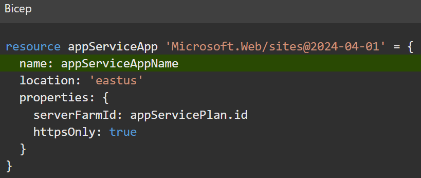
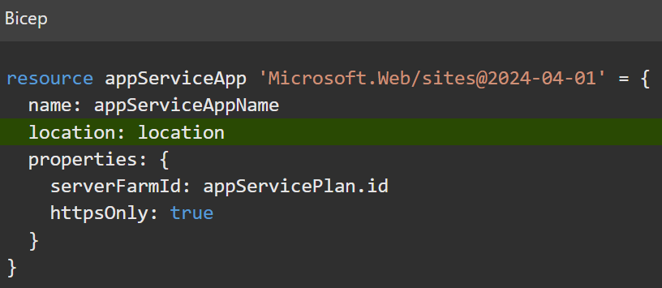
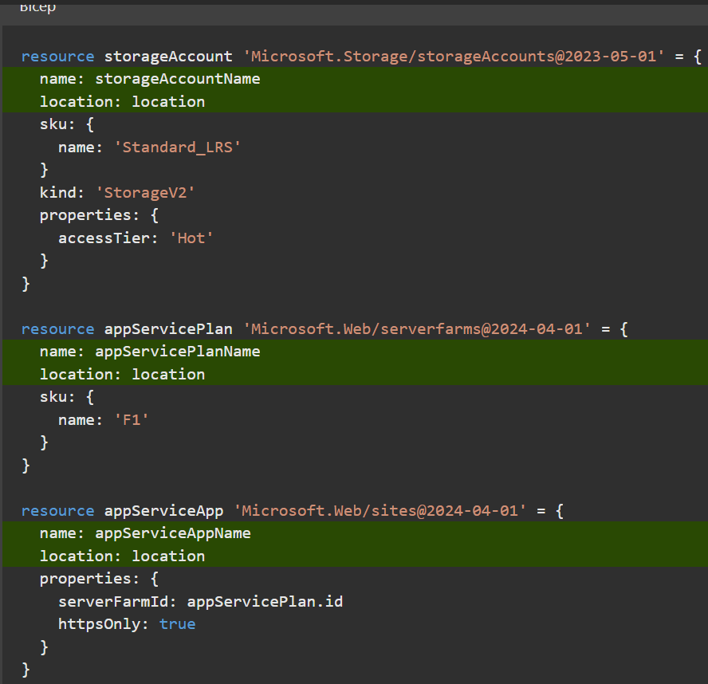

# Build your first Bicep template
[Link](https://learn.microsoft.com/en-us/training/modules/build-first-bicep-template/?source=learn)

Define Azure resources within a Bicep template.  
Improve the consistency and reliability of your deployments, reduce the manual effort required, and scale your deployments across environments.  
Your template will be flexible and reusable by using parameters, variables, expressions, and modules.  

## Introduction
## What is Bicep?
Bicep is a language for declaratively deploying Azure resources. Using Bicep, you can define how your Azure resources should be configured and deployed. You'll define your resources within a Bicep file called a template, then submit the template to **Azure Resource Manager**. Resource Manager then takes responsibility for deploying each resource within the template on your behalf.

## Define Resources
#### Define a resource

The main thing you'll do with Bicep templates is define your Azure resources. Here's an example of what a typical resource definition looks like in Bicep. This example creates a storage account named `toylaunchstorage`.
```bicep
resource storageAccount 'Microsoft.Storage/storageAccounts@2023-05-01' = {
  name: 'toylaunchstorage'
  location: 'westus3'
  sku: {
    name: 'Standard_LRS'
  }
  kind: 'StorageV2'
  properties: {
    accessTier: 'Hot'
  }
}
```
#### What happens when resources depend on each other?

A Bicep template usually includes several resources. Often, you need a resource to depend on another resource. You might have to extract some information from one resource to be able to define another. If you're deploying a web application, you'll have to create the server infrastructure before you can add an application to it. These relationships are called _dependencies_.

You'll need to deploy an App Service app for the template that will help launch the toy product, but to create an App Service app, you first need to create an App Service plan. The App Service plan represents the server-hosting resources, and it's declared like this example:
```bicep
resource appServicePlan 'Microsoft.Web/serverFarms@2023-12-01' = {
  name: 'toy-product-launch-plan'
  location: 'westus3'
  sku: {
    name: 'F1'
  }
}
```
This resource definition is telling Bicep you want to deploy an App Service plan that has the resource type `Microsoft.Web/serverFarms`. The plan resource is named `toy-product-launch-plan`, and it's deployed into the West US 3 region. It uses a pricing SKU of F1, which is App Service's free tier.

Now that you've declared the App Service plan, the next step is to declare the app:
```bicep
resource appServiceApp 'Microsoft.Web/sites@2023-12-01' = {
  name: 'toy-product-launch-1'
  location: 'westus3'
  properties: {
    serverFarmId: appServicePlan.id
    httpsOnly: true
  }
}
```
This template instructs Azure to host the app on the plan you created. Notice that the plan's definition includes the App Service plan's symbolic name on this line: `serverFarmId: appServicePlan.id`. This line means that Bicep will get the App Service plan's _resource ID_ using the `id` property. It's effectively saying: _this app's server-farm ID is the ID of the App Service plan defined earlier_.

By declaring the app resource with a property that references the plan's symbolic name, Azure understands the _implicit dependency_ between the App Service app and the plan. When it deploys the resources, Azure ensures it fully deploys the plan before it starts to deploy the app.

## Exercise - Define resources in a Bicep template

#### Create a Bicep template that contains a storage account

1.  Open Visual Studio Code.
    
2.  Create a new file called _main.bicep_.
    
3.  Save the empty file so that Visual Studio Code loads the Bicep tooling.
    
    You can either select **File** > **Save As** or select Ctrl+S in Windows (⌘+S on macOS). Be sure to remember where you've saved the file. For example, you might want to create a _templates_ folder in which to save the file.
    
4.  Add the following Bicep code into the file. You'll deploy the template soon. It's a good idea to type the code yourself instead of copying and pasting so you can see how the tooling helps you to write your Bicep files.
```bicep
resource storageAccount 'Microsoft.Storage/storageAccounts@2023-05-01' = {
  name: 'lm77toylaunchstorage'
  location: 'eastus'
  sku: {
    name: 'Standard_LRS'
  }
  kind: 'StorageV2'
  properties: {
    accessTier: 'Hot'
  }
}
```
#### Deploy the Bicep template to Azure

To deploy this template to Azure, you need to sign in to your Azure account from the Visual Studio Code terminal. Be sure you've installed the [Azure CLI](https://learn.microsoft.com/en-us/cli/azure/install-azure-cli), and remember to sign in with the same account that you used to activate the sandbox.

1.  On the **Terminal** menu, select **New Terminal**. The terminal window usually opens in the lower half of your screen.
    
2.  If the terminal window displays **bash** on the right side, it means the correct shell is already open. Alternatively, if you see a bash shell icon on the right, you can select it to launch the shell.
    
    
    
    If a shell other than **bash** appears, select the shell dropdown arrow, and then select **Git Bash**.
    
    
    
3.  In the terminal, go to the directory where you saved your template. For example, if you saved your template to the _templates_ folder, you can use this command:
```bash
cd ~/Documents/GitHub/Azure_DevOps/Bicep_Resource_Manager/templates
```
#### Set the default resource group

When you use the Azure CLI, you can set the default resource group and omit the parameter from the rest of the Azure CLI commands in this exercise. Set the default to the resource group that's created for you in the sandbox environment.
```bash
az configure --defaults group="learn-2fe2a6d4-d09a-4fa9-a927-10905901ffb8"
```
#### Deploy the template to Azure

Run the following command from the terminal in Visual Studio Code to deploy the Bicep template to Azure. The command can take a minute or two to complete, and then you'll see a successful deployment. If you see a warning about the location being hard-coded, you can ignore it. You'll fix the location later in the module. It's safe to proceed and the deployment will succeed.
```bash
az deployment group create --name main --template-file main.bicep
```
Verify deployment
```bash
az deployment group list --output table
```

#### Add an App Service plan and app to your Bicep template

In the previous task, you learned how to create a template that contains a single resource and deploy it. Now you're ready to deploy more resources, including a dependency. In this task, you'll add an App Service plan and app to the Bicep template.

1.  In the _main.bicep_ file in Visual Studio Code, add the following code to the bottom of the file:
```bicep
resource appServicePlan 'Microsoft.Web/serverfarms@2024-04-01' = {
  name: 'toy-product-launch-plan-starter'
  location: 'eastus'
  sku: {
    name: 'F1'
  }
}

resource appServiceApp 'Microsoft.Web/sites@2024-04-01' = {
  name: 'toy-product-launch-1'
  location: 'eastus'
  properties: {
    serverFarmId: appServicePlan.id
    httpsOnly: true
  }
}
```
#### Deploy the updated Bicep template

Run the following Azure CLI command in the terminal. You can ignore the warnings about the hard-coded location. You'll fix the location soon.
```bash
az deployment group create --name main --template-file main.bicep
```
## Add flexibility by using parameters and variables
### Add a parameter
In Bicep, you can define a parameter like this:
```bicep
param appServiceAppName string
```
Let's look at how each part of this definition works:

-   `param` tells Bicep that you're defining a parameter.
-   `appServiceAppName` is the name of the parameter. If you're deploying the template manually, you might be asked to enter a value, so it's important that the name is clear and understandable. The name is also how you refer to the parameter value within the template, just like with resource symbolic names.
-   `string` is the type of the parameter. You can specify several different types for Bicep parameters, including `string` for text, `int` for numbers, and `bool` for Boolean true or false values. You can also pass in more complex parameters by using the `array` and `object` types.
### Provide default values

You can optionally provide a _default value_ for a parameter. When you specify a default value, the parameter becomes optional. The person who's deploying the template can specify a value if they want, but if they don't, Bicep uses the default value.

Here's how you can add a default value:
```bicep
param appServiceAppName string = 'toy-product-launch-1'
```
Note
In this example, the Azure App Service app name has a hard-coded default value. This isn't a good idea, because App Service apps need unique names. You'll fix this shortly.

### Use parameter values in the template

After you've declared a parameter, you can refer to it throughout the rest of the template. Let's see how you can use your new parameter within the resource definition:
```bicep
resource appServiceApp 'Microsoft.Web/sites@2024-04-01' = {
  name: appServiceAppName
  location: 'eastus'
  properties: {
    serverFarmId: appServicePlan.id
    httpsOnly: true
  }
}
```

### Add a variable

You can define a variable like this:
```bicep
var appServicePlanName = 'toy-product-launch-plan'
```
Variables are defined in a similar way to parameters, but there are a few differences:

-   Use the `var` keyword to tell Bicep you're declaring a variable.
-   You must provide a value for a variable.
-   Variables don't need types. Bicep can determine the type based on the value that you set.

### Expressions

When you're writing templates, you often don't want to hard-code values, or even ask for them to be specified in a parameter. Instead, you want to discover values when the template runs. For example, you probably want to deploy all of the resources in a template into a single Azure region: the region where you've created the resource group. Or, you might want to automatically create a unique name for a resource based on a particular naming strategy your company uses.

_Expressions_ in Bicep are a powerful feature that helps you handle all sorts of interesting scenarios. Let's take a look at a few places where you can use expressions in a Bicep template.

### Resource locations

When you're writing and deploying a template, you often don't want to have to specify the location of every resource individually. Instead, you might have a simple business rule that says, _by default, deploy all resources into the same location in which the resource group was created_.

In Bicep, you can create a parameter called `location`, then use an expression to set its value:
```bicep
param location string = resourceGroup().location
```
Note
Some resources in Azure can be deployed only into certain locations. You might need separate parameters to set the locations of these resources.

You can now use the resource location parameter inside the template, like this:
```bicep
resource appServiceApp 'Microsoft.Web/sites@2024-04-01' = {
  name: appServiceAppName
  location: location
  properties: {
    serverFarmId: appServicePlan.id
    httpsOnly: true
  }
}
```


### Resource names

Many Azure resources need unique names. In your scenario, you have two resources that need unique names: the storage account and the App Service app. Asking for these values to be set as parameters can make it difficult for whoever uses the template, because they need to find a name that nobody else has used.

Bicep has another function called `uniqueString()` that comes in handy when you're creating resource names. When you use this function, you need to provide a _seed value_, which should be different across different deployments, but consistent across all deployments for the same resources.

If you choose a good seed value, you can get the same name every time you deploy the same set of resources, but you'll get a different name whenever you deploy a different set of resources by using the same template. Let's look at how you might use the `uniqueString()` function:
```bicep
param storageAccountName string = uniqueString(resourceGroup().id)
```
This parameter's default value uses the `resourceGroup()` function again, like you did when you set the resource location. This time, though, you're getting the ID for a resource group. Here's what a resource group ID looks like:
```text
/subscriptions/aaaa0a0a-bb1b-cc2c-dd3d-eeeeee4e4e4e/resourceGroups/MyResourceGroup
```
The resource group ID includes the Azure subscription ID (`aaaa0a0a-bb1b-cc2c-dd3d-eeeeee4e4e4e`) and the resource group name (`MyResourceGroup`). The resource group ID is often a good candidate for a seed value for resource names, because:

-   Every time you deploy the same resources, they'll go into the same resource group. The `uniqueString()` function will return the same value every time.
-   If you deploy into two different resource groups in the Azure subscription, the `resourceGroup().id` value will be different, because the resource group names will be different. The `uniqueString()` function will give different values for each set of resources.
-   If you deploy into two different Azure subscriptions, _even if you use the same resource group name_, the `resourceGroup().id` value will be different because the Azure subscription ID will be different. The `uniqueString()` function will again give different values for each set of resources.

> 💡 **Tip:**  
It's often a good idea to use template expressions to create resource names. Many Azure resource types have rules about the allowed characters and length of their names. Embedding the creation of resource names in the template means that anyone who uses the template doesn't have to remember to follow these rules themselves.

### Combined strings

If you just use the `uniqueString()` function to set resource names, you'll probably get unique names, but they won't be meaningful. A good resource name should also be descriptive, so that it's clear what the resource is for. You'll often want to create a name by combining a meaningful word or string with a unique value. This way, you'll have resources that have both meaningful _and_ unique names.

Bicep has a feature called _string interpolation_ that lets you combine strings. Let's see how it works:
```bicep
param storageAccountName string = 'toylaunch${uniqueString(resourceGroup().id)}'
```
The default value for the `storageAccountName` parameter now has two parts to it:

-   `toylaunch` is a hard-coded string that helps anyone who looks at the deployed resource in Azure to understand the storage account's purpose.
-   `${uniqueString(resourceGroup().id)}` is a way of telling Bicep to evaluate the output of the `uniqueString(resourceGroup().id)` function, then concatenate it into the string.

> 💡 **Tip:**  
Sometimes the `uniqueString()` function will create strings that start with a number. Some Azure resources, like storage accounts, don't allow their names to start with numbers. This means it's a good idea to use string interpolation to create resource names, like in the preceding example.

### Selecting SKUs for resources

The other members of your team are impressed with the Bicep code you've built so far. You've decided together that you'll use your template to deploy the resources to support all your new toy launches.

One of your colleagues has suggested that you create non-production environments for each product launch to help the marketing team test the sites before they're available to customers. However, you want to make sure you don't spend too much money on your non-production environments, so you decide on some policies together:

-   In production environments, storage accounts will be deployed at the `Standard_GRS` (geo-redundant storage) SKU for high resiliency. App Service plans will be deployed at the `P2v3` SKU for high performance.
-   In non-production environments, storage accounts will be deployed at the `Standard_LRS` (locally redundant storage) SKU. App Service plans will be deployed at the free `F1` SKU.

One way to implement these business requirements is to use parameters to specify each SKU. However, specifying every SKU as a parameter can become difficult to manage, especially when you have larger templates. Another option is to embed the business rules into the template by using a combination of parameters, variables, and expressions.

First, you can specify a parameter that indicates whether the deployment is for a production or non-production environment:
```bicep
@allowed([
  'nonprod'
  'prod'
])
param environmentType string
```
Notice that this code uses some new syntax to specify a list of _allowed values_ for the `environmentType` parameter. Bicep won't let anyone deploy the template unless they provide one of these values.

Next, you can create variables that determine the SKUs to use for the storage account and App Service plan based on the environment:
```bicep
var storageAccountSkuName = (environmentType == 'prod') ? 'Standard_GRS' : 'Standard_LRS'
var appServicePlanSkuName = (environmentType == 'prod') ? 'P2V3' : 'F1'
```
Notice some new syntax here, too. Let's break it down:

-   `(environmentType == 'prod')` evaluates to a Boolean (true or false) value, depending on which allowed value is used for `environmentType` parameter.
-   `?` is called a _ternary operator_, and it evaluates an `if/then` statement. The value after the `?` operator is used if the expression is true. If the expression evaluates to false, the value after the colon (`:`) is used.

We can translate these rules to:

-   For the `storageAccountSkuName` variable, if the `environmentType` parameter is set to `prod`, then use the `Standard_GRS` SKU. Otherwise, use the `Standard_LRS` SKU.
-   For the `appServicePlanSkuName` variable, if the `environmentType` parameter is set to `prod`, then use the `P2V3` SKU and the `PremiumV3` tier. Otherwise, use the `F1` SKU.

> 💡 **Tip:**  
When you create multipart expressions like this, it's best to use variables rather than embedding the expressions directly into the resource properties. This makes your templates easier to read and understand, because it avoids cluttering your resource definitions with logic.

When you use parameters, variables, and expressions in your template, you can reuse your template and quickly deploy a new set of resources. For example, each time your marketing department asks you to deploy a new website for the next toy launch, you supply new parameter values for each environment that you deploy, and you'll be set!

## Exercise - Add parameters and variables to your Bicep template
### Add the location and resource name parameters

1.  In the _main.bicep_ file in Visual Studio Code, add the following code to the top of the file:
```bicep
param location string = 'eastus'
param storageAccountName string = 'toylaunch${uniqueString(resourceGroup().id)}'
param appServiceAppName string = 'toylaunch${uniqueString(resourceGroup().id)}'

var appServicePlanName = 'toy-product-launch-plan'
```
The Bicep linter adds yellow squiggly lines underneath each parameter and variable name to indicate they're not used in the template. You'll fix this issue soon.
    
Notice that you're using expressions that include string interpolation and the `uniqueString()` function to define default parameter values. Someone deploying this template can override the default parameter values by specifying the values at deployment time, but they can't override the variable values.
    
Also notice that you're using a variable for the Azure App Service plan name, but you're using parameters for the other names. Storage accounts and App Service apps need globally unique names, but App Service plan names need to be unique only within their resource group. This difference means it's not a concern to use the same App Service plan name across different deployments, as long as the deployments are all going into different resource groups.
    
> 💡 **Tip:**  
You're specifying that the `location` parameter should be set to `westus3`. Normally, you would create resources in the same location as the resource group by using the `resourceGroup().location` property. But when you work with the Microsoft Learn sandbox, you need to use certain Azure regions that don't match the resource group's location.
    
2. Find the places within the resource definitions where the `location` and `name` properties are set, and update them to use the parameter values. After you're finished, the resource definitions within your Bicep file should look like this:
```bicep
resource storageAccount 'Microsoft.Storage/storageAccounts@2023-05-01' = {
  name: storageAccountName
  location: location
  sku: {
    name: 'Standard_LRS'
  }
  kind: 'StorageV2'
  properties: {
    accessTier: 'Hot'
  }
}

resource appServicePlan 'Microsoft.Web/serverfarms@2024-04-01' = {
  name: appServicePlanName
  location: location
  sku: {
    name: 'F1'
  }
}

resource appServiceApp 'Microsoft.Web/sites@2024-04-01' = {
  name: appServiceAppName
  location: location
  properties: {
    serverFarmId: appServicePlan.id
    httpsOnly: true
  }
}
```


### Automatically set the SKUs for each environment type

1.  In the _main.bicep_ file in Visual Studio Code, add the following Bicep parameter below the parameters that you created in the previous task:
```bicep
@allowed([
  'nonprod'
  'prod'
])
param environmentType string
```
Notice that you're defining a parameter with a set of allowed values, but you're not specifying a default value for this parameter.  

2. Below the line that declares the `appServicePlanName` variable, add the following variable definitions:
```bicep
var storageAccountSkuName = (environmentType == 'prod') ? 'Standard_GRS' : 'Standard_LRS'
var appServicePlanSkuName = (environmentType == 'prod') ? 'P2v3' : 'F1'
```
Notice that you're setting these variables values by using the ternary operator to express some `if/then/else` logic.
    
3. Find the places within the resource definitions where the `sku` properties are set and update them to use the parameter values. After you're finished, the resource definitions in your Bicep file should look like this:
```bicep
resource storageAccount 'Microsoft.Storage/storageAccounts@2023-05-01' = {
  name: storageAccountName
  location: location
  sku: {
    name: storageAccountSkuName
  }
  kind: 'StorageV2'
  properties: {
    accessTier: 'Hot'
  }
}

resource appServicePlan 'Microsoft.Web/serverfarms@2024-04-01' = {
  name: appServicePlanName
  location: location
  sku: {
    name: appServicePlanSkuName
  }
}

resource appServiceApp 'Microsoft.Web/sites@2024-04-01' = {
  name: appServiceAppName
  location: location
  properties: {
    serverFarmId: appServicePlan.id
    httpsOnly: true
  }
}
```
Notice that you haven't parameterized everything. You've set some properties right in the resource definitions, where you know these values aren't going to change between deployments.
    
4. Save the changes to the file.

### Verify your Bicep file
After you've completed all of the preceding changes, your _main.bicep_ file should look like this example:
```bicep
param location string = 'eastus'
param storageAccountName string = 'toylaunch${uniqueString(resourceGroup().id)}'
param appServiceAppName string = 'toylaunch${uniqueString(resourceGroup().id)}'

@allowed([
  'nonprod'
  'prod'
])
param environmentType string

var appServicePlanName = 'toy-product-launch-plan'
var storageAccountSkuName = (environmentType == 'prod') ? 'Standard_GRS' : 'Standard_LRS'
var appServicePlanSkuName = (environmentType == 'prod') ? 'P2v3' : 'F1'

resource storageAccount 'Microsoft.Storage/storageAccounts@2023-05-01' = {
  name: storageAccountName
  location: location
  sku: {
    name: storageAccountSkuName
  }
  kind: 'StorageV2'
  properties: {
    accessTier: 'Hot'
  }
}

resource appServicePlan 'Microsoft.Web/serverfarms@2024-04-01' = {
  name: appServicePlanName
  location: location
  sku: {
    name: appServicePlanSkuName
  }
}

resource appServiceApp 'Microsoft.Web/sites@2024-04-01' = {
  name: appServiceAppName
  location: location
  properties: {
    serverFarmId: appServicePlan.id
    httpsOnly: true
  }
}
```

If your file doesn't match, copy the example or adjust your file to match the example.

### Deploy the updated Bicep template
Run the following Azure CLI command in the terminal.
```bash
az deployment group create --name main --template-file main.bicep --parameters environmentType=nonprod
```
Notice that you're explicitly specifying the value for the `environmentType` parameter when you execute the deployment. You don't need to specify the other parameter values, because they have valid default values.

### Check your deployment

1.  In your browser, go back to the [Azure portal](https://portal.azure.com/) and go to your resource group. You'll still see one successful deployment, because the deployment used the same name as the first deployment.
2.  Select the **1 Succeeded** link.
3.  Select the deployment called **main**, and then select **Deployment details** to expand the list of deployed resources.
4. Notice that a new App Service app and storage account have been deployed with randomly generated names.  

## Group related resources by using modules
You can create individual Bicep files, called modules, for different parts of your deployment. The main Bicep template can reference these modules. Behind the scenes, modules are transpiled into a single JSON template for deployment.

Modules are also a way to make Bicep code even more reusable. You can have a single Bicep module that many other Bicep templates use.

You'll also often need to emit outputs from the Bicep modules and templates. Outputs are a way for your Bicep code to send data back to whoever or whatever started the deployment. Let's look at outputs first.

### Outputs

A human can manually deploy Bicep templates, or some sort of automated release process can deploy them. Either way, it's common to have some data from the template you need to send back to whoever or whatever is executing the template deployment.

Here are some example scenarios where you might need to get information from the template deployment:

-   You create a Bicep template that deploys a virtual machine, and you need to get the public IP address so you can SSH into the machine.
-   You create a Bicep template that accepts a set of parameters, like an environment name and an application name. The template uses an expression to name an Azure App Service app that it deploys. You need to output the app's name that the template has deployed so you can use it within a deployment pipeline to publish the application binaries.

You can use outputs for these scenarios. To define an output in a Bicep template, use the `output` keyword like this:

```bicep
output appServiceAppName string = appServiceAppName
```
The output definition includes a few key parts:

-   The `output` keyword tells Bicep you're defining an output.
-   `appServiceAppName` is the output's name. When someone deploys the template successfully, the output values include the name you specified so they can access the values they're expecting.
-   `string` is the output type. Bicep outputs support the same types as parameters.
-   A value must be specified for each output. Unlike parameters, outputs always need to have values. Output values can be expressions, references to parameters or variables, or properties of resources that are deployed within the file.

> 💡 **Tip:**  
Outputs can use the same names as variables and parameters. This convention can be helpful if you construct a complex expression within a variable to use within your template's resources, and you also need to expose the variable's value as an output.

Here's another example of an output. This one will have its value set to the fully qualified domain name (FQDN) of a public IP address resource.
```bicep
output ipFqdn string = publicIPAddress.properties.dnsSettings.fqdn
```
> 💡 **Tip:**  
Try to use resource properties as outputs rather than making assumptions about how resources will behave. For example, if you need to have an output for App Service app's URL, use the app's `defaultHostName` property instead of creating a string for the URL yourself. Sometimes these assumptions aren't valid in different environments, or the way the resource works changes, so it's safer to have the resource tell you its own properties.

> ⚠️ **Caution:**  
Don't create outputs for secret values like connection strings or keys. Anyone with access to your resource group can read outputs from templates. There are other approaches you can use to get access to secret resource properties, which we'll cover in a later module.

### Define a module

Bicep modules allow you to organize and reuse your Bicep code by creating smaller units that can be composed into a template. Any Bicep template can be used as a module by another template. Throughout this learning module, you've created Bicep templates. That means you've already created files that can be used as Bicep modules!

Imagine you have a Bicep template that deploys application, database, and networking resources for _solution A_. You might split this template into three modules, each of which is focused on its own set of resources. As a bonus, you can now reuse the modules in other templates for other solutions too; so when you develop a template for _solution B_, which has similar networking requirements to _solution A_, you can reuse the network module.


When you want the template to include a reference to a module file, use the `module` keyword. A module definition looks similar to a resource declaration, but instead of including a resource type and API version, you'll use the module's file name:
```bicep
module myModule 'modules/mymodule.bicep' = {
  name: 'MyModule'
  params: {
    location: location
  }
}
```
Let's look closely at some key parts of this module definition:

-   The `module` keyword tells Bicep you're about to use another Bicep file as a module.
-   Just like resources, modules need a _symbolic name_ like `myModule`. You'll use the symbolic name when you refer to the module's outputs in other parts of the template.
-   `modules/mymodule.bicep` is the path to the module file, relative to the template file. Remember, a module file is just a regular Bicep file.
-   Just like resources, the `name` property is mandatory. Azure uses the module name because it creates a separate deployment for each module within the template file. Those deployments have names you can use to identify them.
-   You can specify any _parameters_ of the module by using the `params` keyword. When you set the values of each parameter within the template, you can use expressions, template parameters, variables, properties of resources deployed within the template, and outputs from other modules. Bicep will automatically understand the dependencies between the resources.

### Modules and outputs

Just like templates, Bicep modules can define outputs. It's common to chain modules together within a template. In that case, the output from one module can be a parameter for another module. By using modules and outputs together, you can create powerful and reusable Bicep files.

### Design your modules

A good Bicep module follows some key principles:

✔️   **A module should have a clear purpose.** You can use modules to define all of the resources related to a specific part of your solution. For example, you might create a module that contains all of the resources used to monitor your application. You might also use a module to define a set of resources that belong together, like all of your database servers and databases.
    
✔️   **Don't put every resource into its own module.** You shouldn't create a separate module for every resource you deploy. If you have a resource that has many complex properties, it might make sense to put that resource into its own module, but in general, it's better for modules to combine multiple resources.
    
✔️   **A module should have clear parameters and outputs that make sense.** Consider the purpose of the module. Think about whether the module should manipulate parameter values, or whether the parent template should handle that, and then pass a single value through to the module. Similarly, think about the outputs a module should return, and make sure they're useful to the templates that will use the module.
    
✔️   **A module should be as self-contained as possible.** If a module needs to use a variable to define a part of a module, the variable should generally be included in the module file rather than in the parent template.
    
✔️   **A module shouldn't output secrets.** Just like templates, don't create module outputs for secret values like connection strings or keys.

## Exercise - Refactor your template to use modules
In this exercise, you'll update the Bicep template you previously created so it uses a module for the Azure App Service resources. Modules help to keep the intention of the main template clearer. You can reuse the App Service module in other templates if you choose to.

During the process, you'll:

-   Add a new module and move the App Service resources into it.
-   Reference the module from the main Bicep template.
-   Add an output for the App Service app's host name, and emit it from the module and template deployments.
-   Test the deployment to ensure that the template is valid.

### Add a new module file

1.  In Visual Studio Code, create a new folder called _modules_ in the same folder where you created your _main.bicep_ file. In the _modules_ folder, create a file called _appService.bicep_. Save the file.
    
2.  Add the following content into the _appService.bicep_ file:
```bicep
param location string
param appServiceAppName string

@allowed([
  'nonprod'
  'prod'
])
param environmentType string

var appServicePlanName = 'toy-product-launch-plan'
var appServicePlanSkuName = (environmentType == 'prod') ? 'P2v3' : 'F1'

resource appServicePlan 'Microsoft.Web/serverfarms@2024-04-01' = {
  name: appServicePlanName
  location: location
  sku: {
    name: appServicePlanSkuName
  }
}

resource appServiceApp 'Microsoft.Web/sites@2024-04-01' = {
  name: appServiceAppName
  location: location
  properties: {
    serverFarmId: appServicePlan.id
    httpsOnly: true
  }
}
```
-   Notice that you've copied the parameters and variables from your _main.bicep_ template, because the _appService.bicep_ template needs to be self-contained.
    
3. Save the changes to the file. Notice that Visual Studio Code doesn't show you any red squiggles to indicate warnings about missing variables, missing parameters, or invalid resources.

### Add a reference to the module from the parent template

Now that you have a complete module to deploy the App Service resources, you can refer to the module within the parent template. Because the module deploys the App Service resources, you can delete the associated resources and variables from the parent template.

1.  In the _main.bicep_ file, delete the App Service resources and the `appServicePlanName` and `appServicePlanSkuName` variable definitions. Don't delete the App Service parameters, because you still need them. Also, don't delete the storage account parameters, variable, or resources.
    
2.  At the bottom of the _main.bicep_ file, add the following Bicep code:
```bicep
module appService 'modules/appService.bicep' = {
  name: 'appService'
  params: {
    location: location
    appServiceAppName: appServiceAppName
    environmentType: environmentType
  }
}
```
Notice that you're specifying the parameters for your module by referencing the parameters in the parent template.

3. Save the changes to the file.

### Add the host name as an output

1.  Add the following Bicep code at the bottom of the _appService.bicep_ file:
```bicep
output appServiceAppHostName string = appServiceApp.properties.defaultHostName
```        
This code declares that an output for this module, which will be named `appServiceAppHostName`, will be of type `string`. The output will take its value from the `defaultHostName` property of the App Service app.
    
2.  Save the changes to the file.
This output is declared within a Bicep file we'll use as a module, so it's going to be available only to the parent template. You also need to return the output to the person who deployed the template.
    
3.  Open the _main.bicep_ file and add the following code at the bottom of the file:
```bicep
output appServiceAppHostName string = appService.outputs.appServiceAppHostName
```        
Notice that this output is declared in a similar way to the output in the module. But this time, you're referencing the module's output instead of a resource property.
    
4.  Save the changes to the file.

### Verify your Bicep files
After you've completed all of the preceding changes, your main.bicep file should look like this example:
```bicep
param location string = 'eastus'
param storageAccountName string = 'toylaunch${uniqueString(resourceGroup().id)}'
param appServiceAppName string = 'toylaunch${uniqueString(resourceGroup().id)}'

@allowed([
  'nonprod'
  'prod'
])
param environmentType string

var storageAccountSkuName = (environmentType == 'prod') ? 'Standard_GRS' : 'Standard_LRS'

resource storageAccount 'Microsoft.Storage/storageAccounts@2023-05-01' = {
  name: storageAccountName
  location: location
  sku: {
    name: storageAccountSkuName
  }
  kind: 'StorageV2'
  properties: {
    accessTier: 'Hot'
  }
}

module appService 'modules/appService.bicep' = {
  name: 'appService'
  params: {
    location: location
    appServiceAppName: appServiceAppName
    environmentType: environmentType
  }
}

output appServiceAppHostName string = appService.outputs.appServiceAppHostName
```
Your appService.bicep file should look like this example:
```bicep
param location string
param appServiceAppName string

@allowed([
  'nonprod'
  'prod'
])
param environmentType string

var appServicePlanName = 'toy-product-launch-plan'
var appServicePlanSkuName = (environmentType == 'prod') ? 'P2v3' : 'F1'

resource appServicePlan 'Microsoft.Web/serverfarms@2024-04-01' = {
  name: appServicePlanName
  location: location
  sku: {
    name: appServicePlanSkuName
  }
}

resource appServiceApp 'Microsoft.Web/sites@2024-04-01' = {
  name: appServiceAppName
  location: location
  properties: {
    serverFarmId: appServicePlan.id
    httpsOnly: true
  }
}

output appServiceAppHostName string = appServiceApp.properties.defaultHostName
```
If either file doesn't match, copy the example or adjust your template to match the example.

### Deploy the updated Bicep template

Run the following Azure CLI command in the terminal.
```bash
az deployment group create --name main --template-file main.bicep --parameters environmentType=nonprod
```
### Check your deployment

1.  In your browser, go back to the Azure portal. Go to your resource group; there are now two successful deployments.
    
2.  Select the **2 Succeeded** link. Notice that you have a deployment called **main** in the list, and a new deployment called **appService**.
    
    
    
3.  Select the deployment called **main**, then select **Deployment details** to expand the list of deployed resources.
    
    Notice that our module deployment appears in the list.
    
    
    
4.  Select the **Outputs** tab. Notice that there's an output called **appServiceAppHostName** with the host name of your App Service app. Copy the host name to your clipboard.
    
    
    
5.  Open a new browser tab and paste the host name that you copied. You should see the default App Service welcome page.
    
    
    

Congratulations! You've successfully deployed the foundations for a great app.

## Module assessment
Consider the following scenario, then choose the best response for each question that follows.

The manufacturing department at your toy company needs software to manage the factory. The IT department has built a web-based application for the manufacturing team to use, and it plans to host the application on Azure. The IT department needs to deploy the application to a test environment before it can be released to production.

1.

What's the best way for the team to create a template that deploys to both test and production environments?

Create a template that deploys all of the resources for the manufacturing application. Add template parameters for the values that might change between environments.

Create a module that deploys all of the resources for the manufacturing application. Create separate Bicep templates for each environment, and add the shared module to each environment's template.

Create a template that deploys all of the resources required for the manufacturing application. Add variables for the values that might change between environments.

2.

The template that the team has developed includes this line:  
`param siteName string = 'mysite-${uniqueString(resourceGroup().id)}'`  
Which of these statements is true?

Whoever deploys the template must specify a value for the `siteName` parameter.

The `siteName` parameter will have a different default value every time the template is deployed.

When the template is deployed to the same resource group in the same subscription repeatedly, the `siteName` parameter's default value will be the same each time.

3.

The Bicep template that the IT department wrote has two modules in it. Which of these statements is true?

If an output is added to one of the modules, it's automatically published as an output from the parent template too.

If an output is added to one of the modules, it will automatically be available for the parent template to use.

Modules can't have outputs; only templates can.


## Summary
> 💡 **Tip:**  
In this module, you've only scratched the surface of Bicep's capabilities. Keep following the [Fundamentals of Bicep learning path](https://learn.microsoft.com/en-us/training/paths/fundamentals-bicep/) and our other Bicep learning paths to progress your understanding.

## References

-   [Bicep documentation](https://learn.microsoft.com/en-us/azure/azure-resource-manager/bicep)
-   [Template reference for each Azure resource type](https://learn.microsoft.com/en-us/azure/templates/)
-   [Bicep functions](https://learn.microsoft.com/en-us/azure/azure-resource-manager/bicep/bicep-functions)

