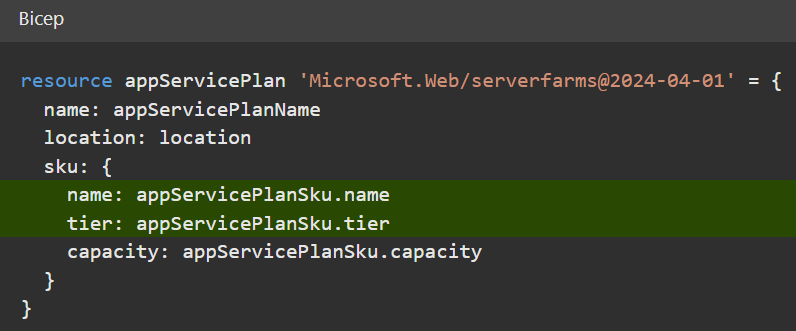
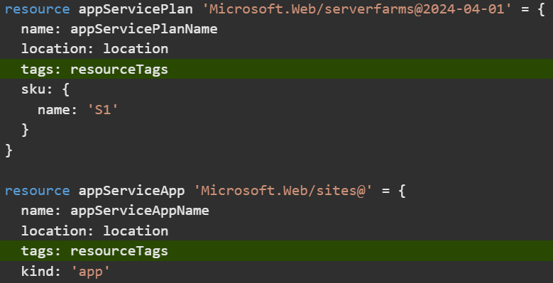
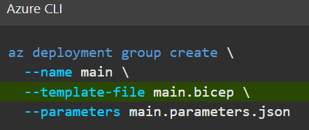
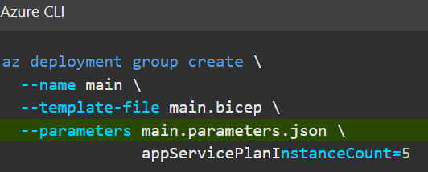
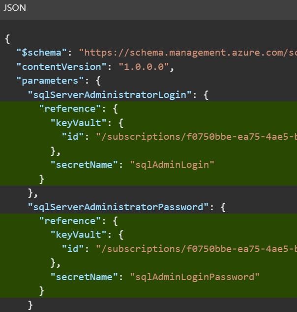
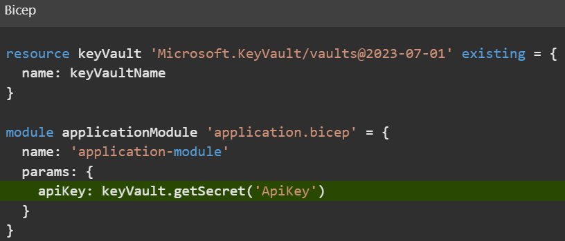

# Build reusable Bicep templates by using parameters 

> ⚠️ **Caution:**  

## Intro
[Link to Intro](https://learn.microsoft.com/en-us/training/modules/build-reusable-bicep-templates-parameters/1-introduction)  

By using parameters, you can create flexible and reusable Bicep templates.  

## Understand parameters

With _parameters_, you can provide information to a Bicep template at deployment time. You can make a Bicep template flexible and reusable by declaring parameters within your template.

_Decorators_ provide a way to attach constraints and metadata to a parameter, which helps anyone using your templates to understand what information they need to provide.

### Declare a parameter

In a Bicep template, you declare a parameter by using the `param` keyword. You can put these declarations anywhere in the template file, although it's usually a good idea to put them at the top of the file so your Bicep code is easy to read.

Here's how you declare a parameter:
```bicep
param environmentName string
```
Let's look at how each part works:

-   `param` indicates to Bicep that you're declaring a parameter.
    
-   `environmentName` refers to the name of the parameter. Although the parameter name can be anything, you should make the name clear and understandable for the template users. Within the same template, you can also refer to the parameter by using its name. Parameter names must be unique. They can't have the same name as a variable or a resource in the same Bicep file.
    
> 💡 **Tip:**  
    Use best practice naming conventions for parameter declarations. Good naming conventions make your templates easy to read and understand. Make sure you're using clear, descriptive names, and adopt consistent naming strategy.
    
-   `string` refers to the type of the parameter.
    
> 💡 **Tip:**  
    Think carefully about the parameters your template uses. Try to use parameters for settings that change between deployments. Variables and hard-coded values can be used for settings that don't change between deployments.
    

### Add a default value

You can assign default values to parameters in your templates. By assigning a default value, you're making the parameter optional. If the template is deployed without a specified value for the parameter, the default value is assigned.

Here's how you add a default value:
```bicep
param environmentName string = 'dev'
```
The parameter `environmentName` is assigned a default value of `dev`.

You can use expressions as default values. Here's an example of a string parameter named `location` with a default value set to the location of the current resource group:
```bicep
param location string = resourceGroup().location
```
> 💡 **Tip:**  
    Be mindful of the default values you use. Make sure that it'll be safe for someone to deploy the Bicep file with the default values. For example, consider using inexpensive pricing tiers and SKUs so that someone deploying the template to a test environment doesn't incur a large cost unnecessarily.

### Understand parameter types

When you declare a parameter, you need to tell Bicep what type of information the parameter will contain. Bicep will ensure that the value assigned to the parameter is compatible with the parameter type.

Parameters in Bicep can be one of the following types:

-   `string`, which lets you enter arbitrary text.
-   `int`, which lets you enter a number.
-   `bool`, which represents a Boolean (true or false) value.
-   `object` and `array`, which represent structured data and lists.

### Objects

You can use object parameters to combine structured data together in one place. An object can have multiple properties of different types. You can use objects within resource definitions, within variables, or within expressions in your Bicep file. Here's an example of an object:
```bicep
param appServicePlanSku object = {
  name: 'F1'
  tier: 'Free'
  capacity: 1
}
```
This parameter is an object with two string properties, `name` and `tier`, and an integer property, `capacity`. Notice that each of the properties is on its own line.

When you reference the parameter in the template, you can select the individual properties of the object by using a dot followed by the name of the property, like in this example:
```bicep
resource appServicePlan 'Microsoft.Web/serverfarms@2024-04-01' = {
  name: appServicePlanName
  location: location
  sku: {
    name: appServicePlanSku.name
    tier: appServicePlanSku.tier
    capacity: appServicePlanSku.capacity
  }
}
```

> 📝 **Important:**  
    Keep in mind that you don't specify the type of each property within an object. However, when you use a property's value, its type must match what's expected. In the previous example, both the name and the tier of the App Service plan SKU must be strings.

Another example of where you might use an object parameter is for specifying resource tags. You can attach custom tag metadata to the resources that you deploy, which you can use to identify important information about a resource.

Tags are useful for scenarios like tracking which team owns a resource, or when a resource belongs to a production or non-production environment. Typically, you'll use different tags for each environment, but you'll want to reuse the same tag values on all the resources within your template. For this reason, resource tags are a good use for an object parameter, like in this example:
```bicep
param resourceTags object = {
  EnvironmentName: 'Test'
  CostCenter: '1000100'
  Team: 'Human Resources'
}
```
Whenever you define a resource in your Bicep file, you can reuse it wherever you define the `tags` property:
```bicep
resource appServicePlan 'Microsoft.Web/serverfarms@2024-04-01' = {
  name: appServicePlanName
  location: location
  tags: resourceTags
  sku: {
    name: 'S1'
  }
}

resource appServiceApp 'Microsoft.Web/sites@' = {
  name: appServiceAppName
  location: location
  tags: resourceTags
  kind: 'app'
  properties: {
    serverFarmId: appServicePlan.id
  }
}
```


### Arrays

An array is a list of items. As an example, you might use an array of string values to declare a list of email addresses for an Azure Monitor action group. Or you might use an array of objects to represent a list of subnets for a virtual network.

> 📝 **Note:**  
    You can't specify the type of individual items that an array needs to contain. For example, you can't specify that an array must contain strings.

Let's consider an example. Azure Cosmos DB lets you create database accounts that span multiple regions, and it automatically handles the data replication for you. When you deploy a new database account, you need to specify the list of Azure regions that you want the account to be deployed into. Often, you'll need to have a different list of locations for different environments. For example, to save money in your test environment, you might use only one or two locations. But in your production environment, you might use several locations.

You can create an array parameter that specifies a list of locations:
```bicep
param cosmosDBAccountLocations array = [
  {
    locationName: 'australiaeast'
  }
  {
    locationName: 'southcentralus'
  }
  {
    locationName: 'westeurope'
  }
]
```
> 💡 **Tip:**  
    The preceding example is an array of objects. Each object has a `locationName` property, which is what Azure Cosmos DB expects. When you work with a resource definition in Visual Studio Code, you can start by entering resource properties so that you get IntelliSense from the Bicep tooling. You can create some example values by using this approach. After you're satisfied with the configuration, move that section of Bicep code to the parameter. In this way, you can replace a hard-coded property with a parameter that can be changed during each deployment, while still ensuring that the resource is configured correctly.

When you declare your Azure Cosmos DB resource, you can now reference the array parameter:
```bicep
resource account 'Microsoft.DocumentDB/databaseAccounts@2024-11-15' = {
  name: accountName
  location: location
  properties: {
    locations: cosmosDBAccountLocations
  }
}
```
It's then easy to use a different parameter value for your development environment by changing the value of the parameter. Soon, you'll learn how you can provide different parameter values without modifying your original template.

### Specify a list of allowed values

Sometimes you need to make sure that a parameter has certain values. For example, your team might decide that production App Service plans should be deployed by using the Premium v3 SKUs. To enforce this rule, you can use the `@allowed` parameter decorator. A _parameter decorator_ is a way of giving Bicep information about what a parameter's value needs to be. Here's how a string parameter named `appServicePlanSkuName` can be restricted so that only a few specific values can be assigned:
```bicep
@allowed([
  'P1v3'
  'P2v3'
  'P3v3'
])
param appServicePlanSkuName string
```
> 💡 **Tip:**  
    Use the `@allowed` decorator sparingly. If you use this decorator too broadly, you might block valid deployments if you don't keep the list up to date. The preceding example allows for only Premium v3 SKUs in production. If you need to use the same template to deploy some cheaper non-production environments, the list of allowed values might stop you from using other SKUs that you need to use.

### Restrict parameter length and values

When you use string parameters, you often need to limit the length of the string. Let's consider the example of Azure resource naming. All Azure resource types have limits around the length of their names. It's a good practice to specify the minimum and maximum character length for parameters that control naming, to avoid errors later during deployment. You can use the `@minLength` and `@maxLength` decorators to the minimum and maximum character lengths that you want to allow for a parameter.

Here's an example that declares a string parameter named `storageAccountName`, whose length can only be between 5 and 24 characters:
```bicep
@minLength(5)
@maxLength(24)
param storageAccountName string
```
> 📝 **Note:**  
    You can also apply the `@minLength` and `@maxLength` decorators to array parameters, to control how many items are allowed to be in the array.

When you work with numeric parameters, you might need values to be in a particular range. For example, your toy company might decide that whenever anybody deploys an App Service plan, they should always deploy at least one instance, but no more than 10 instances of the plan. To meet the requirements, you can use the `@minValue` and `@maxValue` decorators to specify the minimum and maximum allowed values. The following example declares the integer parameter `appServicePlanInstanceCount` whose value can only be between 1 and 10 (inclusive):
```bicep
@minValue(1)
@maxValue(10)
param appServicePlanInstanceCount int
```
### Add descriptions to parameters

Parameters are a great way to make your templates reusable by other people. When they use your templates, they'll need to understand what each parameter does so they can provide the right values. Bicep provides the `@description` decorator so that you can document your parameters' purpose in a human-readable way.
```bicep
@description('The locations into which this Cosmos DB account should be configured. This parameter needs to be a list of objects, each of which has a locationName property.')
param cosmosDBAccountLocations array
```
It's a good practice to provide descriptions for your parameters. Try to make the descriptions helpful, and provide any important information about what the template needs the parameter values to be.

> 📝 **Note:**  
    Bicep templates can sometimes be made available in the Azure portal for users to deploy, like when you use [template specs](https://learn.microsoft.com/en-us/azure/azure-resource-manager/templates/template-specs). The portal uses the descriptions and other decorators on parameters to help users understand what a parameter value needs to be.


## Exercise - Add parameters and decorators

### Create a Bicep template with parameters

1.  Open Visual Studio Code.  
2.  Create a new file called _main.bicep_.  
3.  Save the empty file so that Visual Studio Code loads the Bicep tooling.  

    You can either select **File** > **Save As** or select Ctrl+S in Windows (⌘+S on macOS). Be sure to remember where you've saved the file. For example, you might want to create a _scripts_ folder to save it in.
4.  Add the following content into the file. You'll deploy the template soon. Enter the content yourself instead of copying and pasting so that you can see how the tooling helps you to write your Bicep files.  
```bicep
param environmentName string = 'dev'
param solutionName string = 'toyhr${uniqueString(resourceGroup().id)}'
param appServicePlanInstanceCount int = 1
param appServicePlanSku object = {
  name: 'F1'
  tier: 'Free'
}
param location string = 'eastus'

var appServicePlanName = '${environmentName}-${solutionName}-plan'
var appServiceAppName = '${environmentName}-${solutionName}-app'
```
-   You're creating several parameters here, and they use a mixture of types. You're defining default values for each parameter. Some of the default values include string interpolation and the `uniqueString()` function.
    
> 💡 **Tip:**
    The `uniqueString()` function is useful for creating globally unique resource names. It returns a string that's the same on every deployment to the same resource group, but different when you deploy to different resource groups or subscriptions.
    
You're also defining variables that construct the names of the Azure App Service plan and App Service app. Their values include some of the parameters you've specified. Parameter values can be overridden by the user who executes the deployment, but the values of the variables can't be overridden.
    
> 💡 **Tip:**  
    You're specifying that the `location` parameter should be set to `westus3`. Normally, you would create resources in the same location as the resource group by using the `resourceGroup().location` property. But when you work with the Microsoft Learn sandbox, you need to use certain Azure regions that don't match the resource group's location.
    
5.   In the _main.bicep_ file in Visual Studio Code, add the following code to the bottom of the file:
```bicep
resource appServicePlan 'Microsoft.Web/serverfarms@2024-04-01' = {
  name: appServicePlanName
  location: location
  sku: {
    name: appServicePlanSku.name
    tier: appServicePlanSku.tier
    capacity: appServicePlanInstanceCount
  }
}

resource appServiceApp 'Microsoft.Web/sites@2024-04-01' = {
  name: appServiceAppName
  location: location
  properties: {
    serverFarmId: appServicePlan.id
    httpsOnly: true
  }
}
```
-   Notice that the resources use the values of the parameters you defined.
    
6.  Save the changes to the file.

### Add parameter descriptions

1.  In the _main.bicep_ file in Visual Studio Code, add the `@description` decorator directly above every parameter that you created in the previous task. The parameters should look similar to this example:
```bicep
@description('The name of the environment. This must be dev, test, or prod.')
param environmentName string = 'dev'

@description('The unique name of the solution. This is used to ensure that resource names are unique.')
param solutionName string = 'toyhr${uniqueString(resourceGroup().id)}'

@description('The number of App Service plan instances.')
param appServicePlanInstanceCount int = 1

@description('The name and tier of the App Service plan SKU.')
param appServicePlanSku object = {
  name: 'F1'
  tier: 'Free'
}

@description('The Azure region into which the resources should be deployed.')
param location string = 'eastus'
```

2. Save the changes to the file.

### Limit input values

Your toy company will deploy the HR application to three environments: `dev`, `test`, and `prod`. You'll limit the `environmentName` parameter to only allow those three values.

1.  In the _main.bicep_ file in Visual Studio Code, find the `environmentName` parameter. Insert an `@allowed` decorator underneath its `@description` decorator. After you're finished, the parameter should look like this example:
```bicep
@description('The name of the environment. This must be dev, test, or prod.')
@allowed([
  'dev'
  'test'
  'prod'
])
param environmentName string = 'dev'
```
-   Notice that you're limiting the parameter value for `environmentName` parameter to only `dev`, `test`, and `prod`. If more environments are added in the future, you'll need to update this list.
    
2.  Save the changes to the file.

### Limit input lengths

Your `solutionName` parameter is used to generate the names of resources. You want to enforce a minimum length of 5 characters and a maximum length of 30 characters.

1.  In the _main.bicep_ file in Visual Studio Code, find the `solutionName` parameter. Add `@minLength` and `@maxLength` decorators underneath the `@description` decorator. After you're finished, the parameter should look like this example:
```bicep
@description('The unique name of the solution. This is used to ensure that resource names are unique.')
@minLength(5)
@maxLength(30)
param solutionName string = 'toyhr${uniqueString(resourceGroup().id)}'
```
2.  Save the changes to the file.

### Limit numeric values

Next, you'll ensure that the `appServicePlanInstanceCount` parameter only allows values between 1 and 10.

1.  In the _main.bicep_ file in Visual Studio Code, find the `appServicePlanInstanceCount` parameter. Add `@minValue` and `@maxValue` decorators underneath the `@description` decorator. After you're finished, the parameter should look like this example:
```bicep
@description('The number of App Service plan instances.')
@minValue(1)
@maxValue(10)
param appServicePlanInstanceCount int = 1
```
2.  Save the changes to the file.

### Verify your Bicep file

After you've completed all of the preceding changes, your Bicep file should look like this example:
```bicep
@description('The name of the environment. This must be dev, test, or prod.')
@allowed([
  'dev'
  'test'
  'prod'
])
param environmentName string = 'dev'

@description('The unique name of the solution. This is used to ensure that resource names are unique.')
@minLength(5)
@maxLength(30)
param solutionName string = 'toyhr${uniqueString(resourceGroup().id)}'

@description('The number of App Service plan instances.')
@minValue(1)
@maxValue(10)
param appServicePlanInstanceCount int = 1

@description('The name and tier of the App Service plan SKU.')
param appServicePlanSku object = {
  name: 'F1'
  tier: 'Free'
}

@description('The Azure region into which the resources should be deployed.')
param location string = 'eastus'

var appServicePlanName = '${environmentName}-${solutionName}-plan'
var appServiceAppName = '${environmentName}-${solutionName}-app'

resource appServicePlan 'Microsoft.Web/serverfarms@2024-04-01' = {
  name: appServicePlanName
  location: location
  sku: {
    name: appServicePlanSku.name
    tier: appServicePlanSku.tier
    capacity: appServicePlanInstanceCount
  }
}

resource appServiceApp 'Microsoft.Web/sites@2024-04-01' = {
  name: appServiceAppName
  location: location
  properties: {
    serverFarmId: appServicePlan.id
    httpsOnly: true
  }
}
```

If it doesn't, either copy the example or adjust your template to match the example.

### Deploy the Bicep template to Azure

To deploy this template to Azure, you need to sign in to your Azure account from the Visual Studio Code terminal. Be sure you've installed the [Azure CLI](https://learn.microsoft.com/en-us/cli/azure/install-azure-cli), and remember to sign in with the same account that you used to activate the sandbox.

1.  On the **Terminal** menu, select **New Terminal**. The terminal window usually opens in the lower half of your screen.
    
2.  If the terminal window displays **bash** on the right side, it means the correct shell is already open. Alternatively, if you see a bash shell icon on the right, you can select it to launch the shell.
    
    
    
    If a shell other than **bash** appears, select the shell dropdown arrow, and then select **Git Bash**.
    
    
    
3.  In the terminal, go to the directory where you saved your template. For example, if you saved your template to the _templates_ folder, you can use this command:
```bash
cd ~/Documents/GitHub/Azure_DevOps/Bicep_Resource_Manager/templates
```
### Install Bicep

Run the following command to ensure you have the latest version of Bicep:
```bash
az bicep install && az bicep upgrade
```
### Sign in to Azure

1.  In the Visual Studio Code terminal, sign in to Azure by running the following command:
```bash
az login
```
2. In the browser that opens, sign in to your Azure account. The Visual Studio Code terminal displays a list of the subscriptions associated with this account. Select the subscription called **Concierge Subscription**.

If you've used more than one sandbox recently, the terminal might display more than one instance of _Concierge Subscription_. In this case, use the next two steps to set one as the default subscription.

a.  Get the Concierge Subscription IDs.
```bash
az account list --refresh --query "[?contains(name, 'Concierge Subscription')].id" --output table
```
b. Set the default subscription by using the subscription ID. Replace {your subscription ID} with the latest Concierge Subscription ID.
```bash
az account set --subscription {your subscription ID}
```

### Set the default resource group

When you use the Azure CLI, you can set the default resource group and omit the parameter from the rest of the Azure CLI commands in this exercise. Set the default to the resource group that's created for you in the sandbox environment.
```bash
az configure --defaults group="learn-8ee77343-afd9-483d-8bd5-0f26f18cbd10"
```
### Deploy the template to Azure by using the Azure CLI

Run the following code from the terminal in Visual Studio Code to deploy the Bicep template to Azure. You don't need to specify the parameter values because they have default values specified. This process can take a minute or two to complete, and then you'll see a successful deployment.
```bash
az deployment group create --name main --template-file main.bicep
```
You'll see `Running...` in the terminal.

### Verify your deployment

1.  Go to the [Azure portal](https://portal.azure.com/) and make sure you're in the sandbox subscription:
    
    1.  Select your avatar in the upper-right corner of the page.
    2.  Select **Switch directory**. In the list, choose the **Microsoft Learn Sandbox** directory.
2.  On the left-side panel, select **Resource groups**.
    
3.  Select **learn-8ee77343-afd9-483d-8bd5-0f26f18cbd10**.
    
4.  In **Overview**, you can see that one deployment succeeded.
    
    
    
5.  Select **1 Succeeded** to see the details of the deployment.
    
    
    
6.  Select the deployment called **main** to see what resources were deployed, and then select **Deployment details** to expand it. In this case, there's an App Service plan and app.
    
    
    
7.  On the left menu, select **Inputs**.
    
    
    
8.  Notice that the parameters and their values are listed.
    
    
    
9.  Leave the page open in your browser. You'll check on deployments again later.


## Provide values using parameter files
In the previous units, you provided the parameter values on the command line when you created a deployment. This approach works well when you're writing and testing your Bicep files, but it doesn't work well when you have many parameters or when you need to automate your deployments. In this unit, you'll learn about different ways that parameter values can be specified.

> 📝 **Note:**  
    The commands in this unit are shown to illustrate concepts. Don't run the commands yet. You'll practice what you learn here soon.

### Create parameters files

_Parameters files_ make it easy to specify parameter values together as a set. Within the parameters file, you provide values for the parameters in your Bicep file. Parameters files are created by using a Bicep parameters file with the `.bicepparam` file extension or a JSON parameters file that contains the parameter values. You can supply a parameters file when you deploy your Bicep template. Here's what a JSON parameters file looks like:
```json
{
  "$schema": "https://schema.management.azure.com/schemas/2019-04-01/deploymentParameters.json#",
  "contentVersion": "1.0.0.0",
  "parameters": {
    "appServicePlanInstanceCount": {
      "value": 3
    },
    "appServicePlanSku": {
      "value": {
        "name": "P1v3",
        "tier": "PremiumV3"
      }
    },
    "cosmosDBAccountLocations": {
      "value": [
        {
          "locationName": "australiaeast"
        },
        {
          "locationName": "southcentralus"
        },
        {
          "locationName": "westeurope"
        }
      ]
    }
  }
}
```

Let's look at each part of the parameters file in more detail:

-   `$schema` helps Azure Resource Manager to understand that this file is a parameters file.
-   `contentVersion` is a property that you can use to keep track of significant changes in your parameters file if you want. Usually, it's set to its default value of `1.0.0.0`.
-   The `parameters` section lists each parameter and the value you want to use. The parameter value must be specified as an object. The object has a property called `value` that defines the actual parameter value to use.

Generally, you'll create a parameters file for each environment. It's a good practice to include the environment name in the name of the parameters file. For example, you might have a parameters file named _main.parameters.dev.json_ for your development environment and one named _main.parameters.production.json_ for your production environment.

> 📝 **Note:**  
    Make sure you only specify values for parameters that exist in your Bicep template. When you create a deployment, Azure checks your parameters and gives you an error if you've tried to specify a value for a parameter that isn't in the Bicep file.

### Use parameters files at deployment time

When you create a new deployment by using the `az deployment group create` command, you can specify the name of the parameters file you want to use with the `--parameters` argument:
```bash
az deployment group create --name main --template-file main.bicep --parameters main.parameters.json
```


### Override parameter values

You've now learned about three ways to specify parameter values: default values, the command line, and parameters files. It's common to use different approaches to specify different values for the same parameter. You've already seen this approach when you worked with default values. When you create a default value for a parameter, but then specify a different value by using the command line, the command-line value takes precedence. Let's look at how parameters files fit into this order of precedence.


You can see that parameters files override default values, and command-line parameter values override parameters files.

Let's see how this approach works. Here's an example Bicep file that defines three parameters, each with default values:
```bicep
param location string = resourceGroup().location
param appServicePlanInstanceCount int = 1
param appServicePlanSku object = {
  name: 'F1'
  tier: 'Free'
}
```
Let's look at a parameters file that overrides the value of two of the parameters but doesn't specify a value for the `location` parameter:
```json
{
  "$schema": "https://schema.management.azure.com/schemas/2019-04-01/deploymentParameters.json#",
  "contentVersion": "1.0.0.0",
  "parameters": {
    "appServicePlanInstanceCount": {
      "value": 3
    },
    "appServicePlanSku": {
      "value": {
        "name": "P1v3",
        "tier": "PremiumV3"
      }
    }
  }
}
```
When you create the deployment, we also override the value for `appServicePlanInstanceCount`. Like with parameters files, you use the `--parameters` argument, but you add the value you want to override as its own value:
```bash
az deployment group create --name main --template-file main.bicep --parameters main.parameters.json appServicePlanInstanceCount=5
```


Let's look at what the values will be.

<table aria-label="Table 1" class="table">
<thead>
<tr>
<th>Parameter</th>
<th>Value</th>
<th>Explanation</th>
</tr>
</thead>
<tbody>
<tr>
<td><code>location</code></td>
<td>The resource group's location.</td>
<td>The Bicep file specifies this parameter as a default value, and it's not overridden.</td>
</tr>
<tr>
<td><code>appServicePlanSku</code></td>
<td>An object with a <code>name</code> property set to <code>P1v3</code> and a <code>tier</code> of <code>PremiumV3</code>.</td>
<td>The default value in the Bicep file is overridden by the parameters file.</td>
</tr>
<tr>
<td><code>appServicePlanInstanceCount</code></td>
<td><code>5</code></td>
<td>The value specified at deployment time overrides the default value and the value in the parameters file.</td>
</tr>
</tbody>
</table>

By using a mixture of the approaches to specify parameter values, you can avoid having to duplicate parameter values in lots of places, while still getting the flexibility to override where you need to.

## Secure your parameters

Sometimes you need to pass sensitive values into your deployments, like passwords and API keys. But you need to ensure these values are protected. In some situations, you don't want the person who's creating the deployment to know the secret values. Other times, someone will enter the parameter value when they create the deployment, but you need to make sure the secret values aren't logged. In this unit, you'll learn about the ways you can protect your parameters.

> 💡 **Tip:**  
    The best approach is to avoid using credentials entirely. [Managed identities for Azure resources](https://learn.microsoft.com/en-us/azure/active-directory/managed-identities-azure-resources/overview) can enable the components of your solution to securely communicate with one another without any credentials. Managed identities aren't available for every resource, but it's a good idea to use them wherever you can. Where you can't, you can use the approaches described here.

> 📝 **Note:**  
    The commands in this unit are shown to illustrate concepts. Don't run the commands yet. You'll practice what you learn here soon.

### Define secure parameters

The `@secure` decorator can be applied to string and object parameters that might contain secret values. When you define a parameter as `@secure`, Azure won't make the parameter values available in the deployment logs. Also, if you create the deployment interactively by using the Azure CLI or Azure PowerShell and you need to enter the values during the deployment, the terminal won't display the text on your screen.

As part of the HR application migration, you need to deploy an Azure SQL logical server and database. You'll provision the logical server with an administrator login and password. Because they're sensitive, you need these values to be secured. Here's an example declaration to create two string parameters for the SQL server's administrator details:
```bicep
@secure()
param sqlServerAdministratorLogin string

@secure()
param sqlServerAdministratorPassword string
```
Notice that neither parameter has a default value specified. It's a good practice to avoid specifying default values for usernames, passwords, and other secrets. Otherwise, if someone deploys your template and doesn't realize they should override the value, they'll weaken their security because they'll get the default value instead of something they've chosen themselves.

> 💡 **Tip:**  
    Make sure you don't create outputs for sensitive data. Output values can be accessed by anyone who has access to the deployment history. They're not appropriate for handling secrets.

### Avoid using parameters files for secrets

As you learned in the previous unit, parameters files are a great way to specify a set of parameter values. You'll often create parameters files for each environment you're deploying to. In general, you should avoid using parameters files to specify secret values. Parameters files are often saved to a centralized version control system, like Git. Many people might have access to it in the future. Don't save sensitive data to version control systems because they're not designed to store this sort of information.

### Integrate with Azure Key Vault

Azure Key Vault is a service designed to store and provide access to secrets. You can integrate your Bicep templates with Key Vault by using a parameters file with a reference to a Key Vault secret.

You can use this feature by referring to the key vault and secret in your parameters file. The value is never exposed because you only reference its identifier, which by itself isn't anything secret. When you deploy the template, Azure Resource Manager will contact the key vault and retrieve the data.

> 💡 **Tip:**  
    You can refer to secrets in key vaults that are located in a different resource group or subscription from the one you're deploying to.


Here's a parameters file that uses Key Vault references to look up the SQL logical server administrator login and password to use:
```json
{
  "$schema": "https://schema.management.azure.com/schemas/2019-04-01/deploymentParameters.json#",
  "contentVersion": "1.0.0.0",
  "parameters": {
    "sqlServerAdministratorLogin": {
      "reference": {
        "keyVault": {
          "id": "/subscriptions/f0750bbe-ea75-4ae5-b24d-a92ca601da2c/resourceGroups/PlatformResources/providers/Microsoft.KeyVault/vaults/toysecrets"
        },
        "secretName": "sqlAdminLogin"
      }
    },
    "sqlServerAdministratorPassword": {
      "reference": {
        "keyVault": {
          "id": "/subscriptions/f0750bbe-ea75-4ae5-b24d-a92ca601da2c/resourceGroups/PlatformResources/providers/Microsoft.KeyVault/vaults/toysecrets"
        },
        "secretName": "sqlAdminLoginPassword"
      }
    }
  }
}
```


Notice that instead of specifying a `value` for each of the parameters, this file has a `reference` object, which contains details of the key vault and secret.

> ℹ️ **Important:**  
    Your key vault must be configured to allow Resource Manager to access the data in the key vault during template deployments. Also, the user who deploys the template must have permission to access the key vault. You'll learn how to do these tasks in the next unit.

### Use Key Vault with modules

Modules enable you to create reusable Bicep files that encapsulate a set of resources. It's common to use modules to deploy parts of your solution. Modules may have parameters that accept secret values, and you can use Bicep's Key Vault integration to provide these values securely. Here's an example Bicep file that deploys a module and provides the value of the `ApiKey` secret parameter by taking it directly from Key Vault:
```bicep
resource keyVault 'Microsoft.KeyVault/vaults@2023-07-01' existing = {
  name: keyVaultName
}

module applicationModule 'application.bicep' = {
  name: 'application-module'
  params: {
    apiKey: keyVault.getSecret('ApiKey')
  }
}
```


Notice that in this Bicep file, the Key Vault resource is referenced by using the `existing` keyword. The keyword tells Bicep that the Key Vault already exists, and this code is a reference to that vault. Bicep won't redeploy it. Also, notice that the module's code uses the `getSecret()` function in the value for the module's `apiKey` parameter. This is a special Bicep function that can only be used with secure module parameters. Internally, Bicep translates this expression to the same kind of Key Vault reference you learned about earlier.


## Exercise - Add a parameter file and secure parameters

### Remove the default value for the App Service plan SKU

To make your template work across environments, the Azure App Service plan's SKU details will be provided in a parameters file rather than by a default value.

In the _main.bicep_ file in Visual Studio Code, update the `appServicePlanSku` parameter to remove its default value.
```bicep
@description('The name and tier of the App Service plan SKU.')
param appServicePlanSku object
```
### Add new parameters

Now you need to add a SQL server and database. First, you'll add parameters for the administrator login and password, and the database SKU. You'll set their values later.

In the _main.bicep_ file in Visual Studio Code, add the `sqlServerAdministratorLogin`, `sqlServerAdministratorPassword`, and `sqlDatabaseSku` parameters underneath the current parameter declarations. When you're finished, your parameter declarations should look like this example:
```bicep
@description('The name of the environment. This must be dev, test, or prod.')
@allowed([
  'dev'
  'test'
  'prod'
])
param environmentName string = 'dev'

@description('The unique name of the solution. This is used to ensure that resource names are unique.')
@minLength(5)
@maxLength(30)
param solutionName string = 'toyhr${uniqueString(resourceGroup().id)}'

@description('The number of App Service plan instances.')
@minValue(1)
@maxValue(10)
param appServicePlanInstanceCount int = 1

@description('The name and tier of the App Service plan SKU.')
param appServicePlanSku object

@description('The Azure region into which the resources should be deployed.')
param location string = 'eastus'

@secure()
@description('The administrator login username for the SQL server.')
param sqlServerAdministratorLogin string

@secure()
@description('The administrator login password for the SQL server.')
param sqlServerAdministratorPassword string

@description('The name and tier of the SQL database SKU.')
param sqlDatabaseSku object
```

Notice that you're not specifying default values for the `sqlServerAdministratorLogin` and `sqlServerAdministratorPassword` parameters. It's bad security practice to add default values for secure parameters. Also, you're not specifying a default value for `sqlDatabaseSku`. You'll specify a value in a parameters file.

### Add new variables

In the _main.bicep_ file in Visual Studio Code, add the `sqlServerName` and `sqlDatabaseName` variables underneath the existing variables. When you're finished, your variable declarations should look like this example:
```bicep
var appServicePlanName = '${environmentName}-${solutionName}-plan'
var appServiceAppName = '${environmentName}-${solutionName}-app'
var sqlServerName = '${environmentName}-${solutionName}-sql'
var sqlDatabaseName = 'Employees'
```

### Add SQL server and database resources

1.  In the _main.bicep_ file in Visual Studio Code, add the following code to the bottom of the file:
```bicep
resource sqlServer 'Microsoft.Sql/servers@2024-05-01-preview' = {
  name: sqlServerName
  location: location
  properties: {
    administratorLogin: sqlServerAdministratorLogin
    administratorLoginPassword: sqlServerAdministratorPassword
  }
}

resource sqlDatabase 'Microsoft.Sql/servers/databases@2024-05-01-preview' = {
  parent: sqlServer
  name: sqlDatabaseName
  location: location
  sku: {
    name: sqlDatabaseSku.name
    tier: sqlDatabaseSku.tier
  }
}
```
2. Save the changes to the file.

### Verify your Bicep file

After you've completed all of the preceding changes, your Bicep file should look like this example:
```bicep
@description('The name of the environment. This must be dev, test, or prod.')
@allowed([
  'dev'
  'test'
  'prod'
])
param environmentName string = 'dev'

@description('The unique name of the solution. This is used to ensure that resource names are unique.')
@minLength(5)
@maxLength(30)
param solutionName string = 'toyhr${uniqueString(resourceGroup().id)}'

@description('The number of App Service plan instances.')
@minValue(1)
@maxValue(10)
param appServicePlanInstanceCount int = 1

@description('The name and tier of the App Service plan SKU.')
param appServicePlanSku object

@description('The Azure region into which the resources should be deployed.')
param location string = 'eastus'

@secure()
@description('The administrator login username for the SQL server.')
param sqlServerAdministratorLogin string

@secure()
@description('The administrator login password for the SQL server.')
param sqlServerAdministratorPassword string

@description('The name and tier of the SQL database SKU.')
param sqlDatabaseSku object

var appServicePlanName = '${environmentName}-${solutionName}-plan'
var appServiceAppName = '${environmentName}-${solutionName}-app'
var sqlServerName = '${environmentName}-${solutionName}-sql'
var sqlDatabaseName = 'Employees'

resource appServicePlan 'Microsoft.Web/serverfarms@2024-04-01' = {
  name: appServicePlanName
  location: location
  sku: {
    name: appServicePlanSku.name
    tier: appServicePlanSku.tier
    capacity: appServicePlanInstanceCount
  }
}

resource appServiceApp 'Microsoft.Web/sites@2024-04-01' = {
  name: appServiceAppName
  location: location
  properties: {
    serverFarmId: appServicePlan.id
    httpsOnly: true
  }
}

resource sqlServer 'Microsoft.Sql/servers@2024-05-01-preview' = {
  name: sqlServerName
  location: location
  properties: {
    administratorLogin: sqlServerAdministratorLogin
    administratorLoginPassword: sqlServerAdministratorPassword
  }
}

resource sqlDatabase 'Microsoft.Sql/servers/databases@2024-05-01-preview' = {
  parent: sqlServer
  name: sqlDatabaseName
  location: location
  sku: {
    name: sqlDatabaseSku.name
    tier: sqlDatabaseSku.tier
  }
}
```

If it doesn't, either copy the example or adjust your template to match the example.

### Create a parameters file

1.  Open Visual Studio Code, and open the folder where the _main.bicep_ file is located. In the same folder, create a new file called _main.parameters.dev.json_.
    
2.  In the _main.parameters.dev.json_ file, add the following code:
```json
{
  "$schema": "https://schema.management.azure.com/schemas/2019-04-01/deploymentParameters.json#",
  "contentVersion": "1.0.0.0",
  "parameters": {
    "appServicePlanSku": {
      "value": {
        "name": "F1",
        "tier": "Free"
      }
    },
    "sqlDatabaseSku": {
      "value": {
        "name": "Standard",
        "tier": "Standard"
      }
    }
  }
}
```

3. Save the changes to the file.

### Deploy the Bicep template with the parameters file

Run the following Azure CLI command in the terminal. Notice that you're providing a parameters file for the deployment.
```bash
az deployment group create --name main --template-file main.bicep --parameters main.parameters.dev.json

$sqlServerAdministratorLogin='sqlbicepdemo'
$sqlServerAdministratorPassword='epicadm#1!'
```

You're prompted to enter the values for `sqlServerAdministratorLogin` and `sqlServerAdministratorPassword` parameters when you execute the deployment. As you type, the values aren't displayed in the terminal and aren't saved in your command history. You don't need to specify `solutionName` because it has a default value specified in the template. You don't need to specify the other parameter values because their values are specified in the parameters file.

> 💡 **Tip:**  
>When you enter the secure parameters, the values you choose must follow some rules:  
>-   `sqlServerAdministratorLogin` must not be an easily guessable login name like `admin` or `root`. It can contain only alphanumeric characters and must start with a letter.  
>-   `sqlServerAdministratorPassword` must be at least eight characters long and include lowercase letters, uppercase letters, numbers, and symbols. For more information on password complexity, see the [SQL Azure password policy](https://learn.microsoft.com/en-us/sql/relational-databases/security/password-policy#password-complexity).  
>
>If the parameter values don't meet the requirements, Azure SQL won't deploy your server.  
>
>Also, _make sure you keep a note of the login and password that you enter_. You'll use them in the next section.

The deployment might take a couple of minutes to finish.

### Create a key vault and secrets

Your toy company already has a key vault with the secrets it needs for its deployments. To simulate this scenario, you'll create a new key vault and add some secrets to use.

In the terminal, execute the following commands to create the key vault and secrets. Update the variable values before you execute these commands. Key vault names must be a globally unique string of 3 to 24 characters that can contain only uppercase and lowercase letters, hyphens (`-`), and numbers. For example, _demo-kv-1234567abcdefg_.

> ⚠️ **Caution:**  
    Make sure you use the same login and password that you used in the previous step. If you don't, the next deployment won't complete successfully.

For the `keyVaultName` replace `YOUR-KEY-VAULT-NAME` with a name for your key vault. The `read` commands for the `login` and `password` variables will prompt you for values. As you type, the values aren't displayed in the terminal and aren't saved in your command history.

To protect the variable values in your Bash terminal session, be aware of the following items:

-   Variable values aren't stored as a secure string and can be displayed by entering a command like `$yourVariableName` on the command line or with the `echo` command. In this exercise, after your vault secrets are created, you can remove each variable's existing value by running the `read` commands without inputting a value.
-   The `az keyvault secret set` uses the `--value` parameter to create a secret's value. The command's output displays a property named `value` that contains the secret's value. You can suppress the command's entire output with the parameter `--output none` as shown in the example.

To create the `keyVaultName`, `login`, and `password` variables, run each command separately. Then you can run the block of commands to create the key vault and secrets.
```bash
# keyVaultName='YOUR-KEY-VAULT-NAME'
keyVaultName='bicep-kv-7735e'
read -s -p "Enter the login name: " login
read -s -p "Enter the password: " password

az keyvault create --name $keyVaultName --location eastus --enabled-for-template-deployment true
az keyvault secret set --vault-name $keyVaultName --name "sqlServerAdministratorLogin" --value $login --output none
az keyvault secret set --vault-name $keyVaultName --name "sqlServerAdministratorPassword" --value $password --output none
```

> 📝 **Note:**  
>You're setting the `-EnabledForTemplateDeployment` setting on the vault so that Azure can use the secrets from your vault during deployments. If you don't set this setting then, by default, your deployments can't access secrets in your vault.  
>
>Also, whoever executes the deployment must also have permission to access the vault. Because you created the key vault, you're the owner, so you won't have to explicitly grant the permission in this exercise. For your own vaults, [you need to grant access to the secrets](https://learn.microsoft.com/en-us/azure/azure-resource-manager/templates/key-vault-parameter#grant-access-to-the-secrets).

### Get the key vault's resource ID

To use the key vault secrets in your deployment, you need the resource ID of the vault. Run the following command to retrieve the key vault's resource ID:
```bash
az keyvault show --name $keyVaultName --query id --output tsv
```
The resource ID will look something like this example:
```output
/subscriptions/3dea82b3-b58e-4478-a9c9-ee2d973577a8/resourceGroups/learn-8ee77343-afd9-483d-8bd5-0f26f18cbd10/providers/Microsoft.KeyVault/vaults/bicep-kv-7735e
```

Copy the resource ID. You'll use it in the next step.

## Add a key vault reference to a parameters file

1.  In the _main.parameters.dev.json_ file, append the following code after the `sqlDatabaseSku` parameter's closing brace. Make sure that you replace `YOUR-KEY-VAULT-RESOURCE-ID` with the value of the key vault resource ID you copied in the previous step. After you're finished, your parameters file should look like this example:
```json
{
  "$schema": "https://schema.management.azure.com/schemas/2019-04-01/deploymentParameters.json#",
  "contentVersion": "1.0.0.0",
  "parameters": {
    "appServicePlanSku": {
      "value": {
        "name": "F1",
        "tier": "Free"
      }
    },
    "sqlDatabaseSku": {
      "value": {
        "name": "Standard",
        "tier": "Standard"
      }
    },
    "sqlServerAdministratorLogin": {
      "reference": {
        "keyVault": {
          "id": "YOUR-KEY-VAULT-RESOURCE-ID"
        },
        "secretName": "sqlServerAdministratorLogin"
      }
    },
    "sqlServerAdministratorPassword": {
      "reference": {
        "keyVault": {
          "id": "YOUR-KEY-VAULT-RESOURCE-ID"
        },
        "secretName": "sqlServerAdministratorPassword"
      }
    }
  }
}
```
2. Save the changes to the file.

### Deploy the Bicep template with parameters file and Azure Key Vault references

Run the following Azure CLI command in the terminal. You're providing a parameters file along with a Bicep file.
```bash
az deployment group create --name main --template-file main.bicep --parameters main.parameters.dev.json
```
You aren't prompted to enter the values for `sqlServerAdministratorLogin` and `sqlServerAdministratorPassword` parameters when you execute the deployment this time. Azure retrieves the values from your key vault instead.

The deployment completes more quickly this time because the Azure resources already exist.

### Check your deployment

1.  In your browser, go back to the Azure portal. Go to your resource group. You'll still see one successful deployment, because the deployment used the same name as the first deployment.
    
2.  Select the **1 Succeeded** link.
    
3.  Select the deployment called **main**.
    
4.  On the left menu, select **Inputs**.
    
5.  Notice that the `appServicePlanSku` and the `sqlDatabaseSku` parameter values have both been set to the values in the parameters file. Also, notice that the `sqlServerAdministratorLogin` and `sqlServerAdministratorPassword` parameter values aren't displayed, because you applied the `@secure()` decorator to them.
    
    


## Module assessment

You're deploying a template that a colleague has written. They give you a Bicep template named _main.bicep_ with these parameter definitions:
```bicep
@maxLength(5)
param projectName string = 'dog'

@secure()
param apiKey string
```
They also give you the following parameters file named _main.parameters.production.json_:
```json
{
  "$schema": "https://schema.management.azure.com/schemas/2019-04-01/deploymentParameters.json#",
  "contentVersion": "1.0.0.0",
  "parameters": {
    "projectName": {
      "value": "cat"
    },
    "apiKey": {
      "reference": {
        "keyVault": {
          "id": "/subscriptions/aaaa0a0a-bb1b-cc2c-dd3d-eeeeee4e4e4e/resourceGroups/PlatformResources/providers/Microsoft.KeyVault/vaults/toysecrets"
        },
        "secretName": "KeyToAccessPartnerApi"
      }
    }
  }
}
```

You deploy the template by using this Azure CLI command:
```bash
az deployment group create --template-file main.bicep --parameters main.parameters.production.json projectName=bird
```

1.

What will the value of the `projectName` parameter be when this template is deployed?

`dog`

`cat`

`bird`

2.

Which of these values for the `projectName` parameter would result in a deployment error?

An empty string.

`1`

`animal`

3.

You want to view the value of the `apiKey` parameter after the deployment has completed. Which of these statements is true?

You cannot view the value of the `apiKey` parameter for the deployment.

You can view the value of the `apiKey` parameter for this deployment by looking at the output of the deployment command.

You can view the value of the `apiKey` parameter by inspecting the resource group deployments in the Azure portal.


## Summary

Your company's HR department is migrating an on-premises web application to Azure. The application will handle information about all of the toy company employees, so security is important.

You created a Bicep template to deploy an Azure App Service plan, an application, and an Azure SQL server and database. You parameterized the template to make it generalizable for deploying across multiple environments. You applied parameter decorators to control the allowed parameter values. Finally, you created a parameter file with Azure Key Vault references to keep the administrator login and password secure.

Imagine how much work it would be to deploy these resources for each environment. You'd have to manually provision the resources and remember to configure them correctly each time. Manually deploying Azure infrastructure might lead to inconsistency and security risks.

Bicep makes it easy to describe your Azure resources and create reusable templates. You can parameterize the templates and use parameter files to automate and secure your deployments.

Now, when you want to deploy your infrastructure for other environments, you can use the Bicep template and parameter file that you created. Your company can safely and consistently provision Azure resources.

## Learn more

-   [Bicep parameters](https://learn.microsoft.com/en-us/azure/azure-resource-manager/templates/bicep-file#parameters)
-   [Parameters in Bicep](https://learn.microsoft.com/en-us/azure/azure-resource-manager/bicep/parameters)
-   [Create Bicep parameter file](https://learn.microsoft.com/en-us/azure/azure-resource-manager/bicep/parameter-files)
-   [Azure Key Vault references](https://learn.microsoft.com/en-us/azure/azure-resource-manager/bicep/key-vault-parameter)