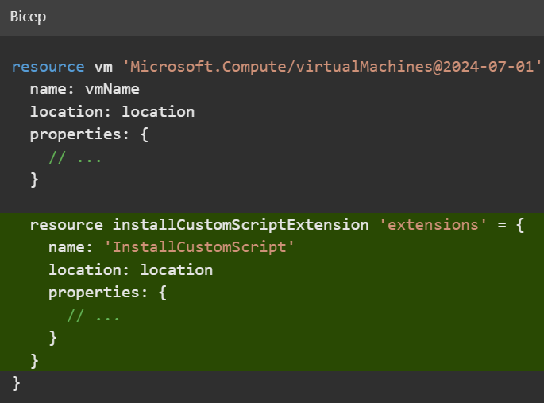
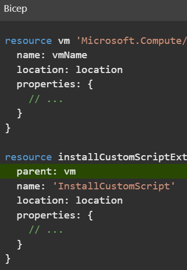
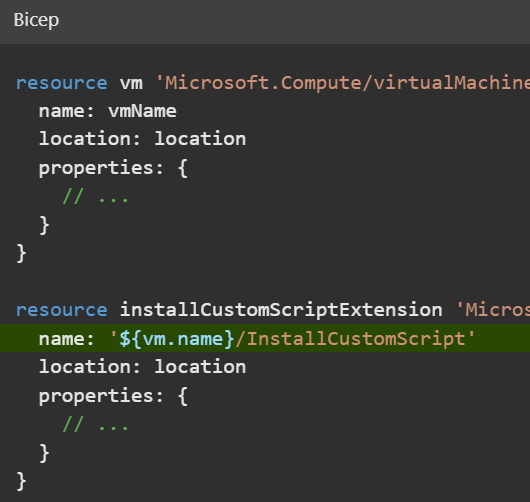
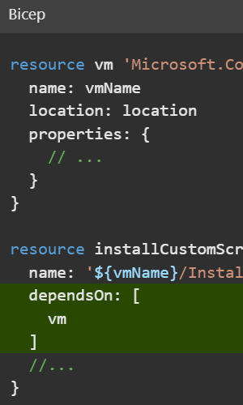
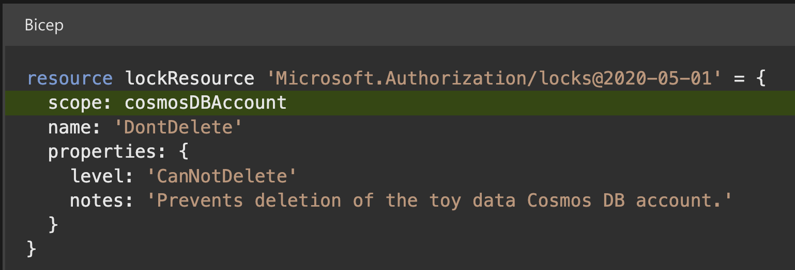
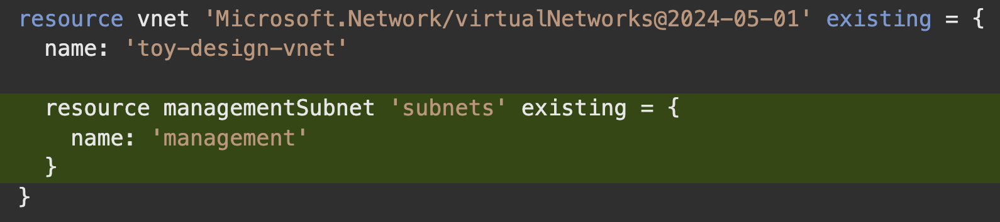
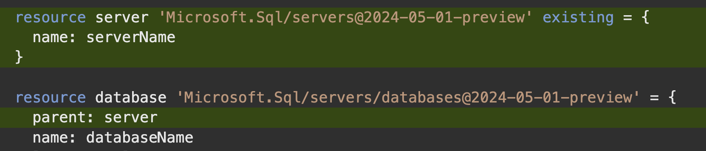
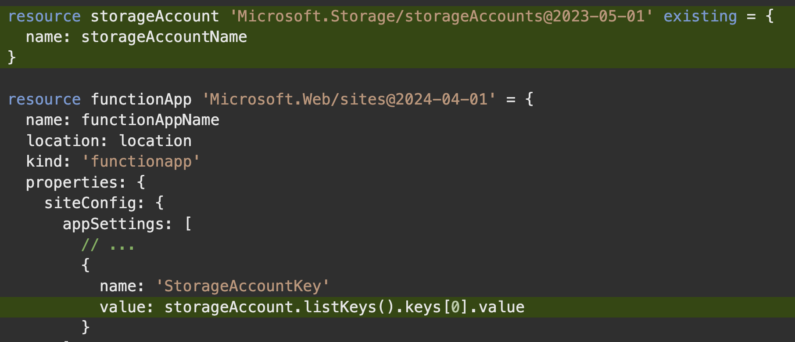

# Deploy child and extension resource by using Bicep

# Introduction

Child and extension resources enable your Azure deployments to access the advanced functionality and power of the Azure platform. You can create these resource types in Bicep by using a clear and understandable template syntax.

You can also use Bicep to refer to resources that were created outside of the Bicep file. For example, you can refer to resources that your colleagues created manually by using the Azure portal, or from within another Bicep template or module, even if the resources are in a different resource group or subscription. By using these features of Bicep, you can unlock the ability to create powerful templates that deploy all the components of your Azure infrastructure.

## Example scenario

Suppose you're responsible for deploying and configuring Azure infrastructure at a toy company. Your company's R&D department contacts you because they're working on a new toy drone that sprays glitter over unsuspecting targets. R&D team members are starting to test the drone. They plan to collect telemetry about the distance the drone can fly, the amount of glitter it can spray, and the battery level.

They want you to set up a new Azure Cosmos DB database for storing this valuable and highly sensitive product test data. They need you to log all database-access attempts so that they can feel confident that no competitors are accessing the data.

The team created a storage account to store all their product design documents, and they want you to help audit all attempts to access the documents.


## What will you be doing?

In this module, you learn about Azure resource types and how child and extension resources are used throughout Azure. You create a Bicep template that deploys a set of Azure resources, and you use several features of Bicep, including:

-   Child resource definitions, through nested resources and the `parent` property, and by constructing multipart resource names.
-   Extension resource definitions, by using the `scope` property.
-   Existing resource references, by using the `existing` keyword.

## What's the main goal?

By the end of this module, you'll be able to create Bicep templates that include child and extension resources. You'll also be able to create Bicep templates that refer to preexisting Azure resources that were created outside of the template file.

## Prerequisites

You should be familiar with:

-   Creating and deploying basic Bicep templates.
-   Azure, including the Azure portal, subscriptions, resource groups, and resource definitions.

To complete the exercises in the module, you need:

-   [Visual Studio Code](https://code.visualstudio.com/), installed locally.
-   The [Bicep extension for Visual Studio Code](https://marketplace.visualstudio.com/items?itemName=ms-azuretools.vscode-bicep), installed.
-   One of the following:
    -   The latest [Azure CLI](https://learn.microsoft.com/en-us/cli/azure/install-azure-cli) tools, installed locally.
    -   The latest version of [Azure PowerShell](https://learn.microsoft.com/en-us/powershell/azure/install-az-ps), installed locally.


# Understand Azure resources

All Azure resources are deployed with a specific _type_. The type identifies the kind of resource it is. A resource ID is the way Azure identifies a specific instance of a resource. It's important to understand how resource types and resource IDs are structured, because they give you important information when you're writing Bicep templates.

## Resource providers

Azure Resource Manager is designed so that many different _resource providers_ can be managed through Resource Manager APIs and Azure Resource Manager (ARM) templates. A resource provider is a logical grouping of resource types that usually relate to one or a few Azure services. Examples of resource providers include:

-   `Microsoft.Compute`, which is used for virtual machines.
-   `Microsoft.Network`, which is used for networking resources like virtual networks, network security groups, and route tables.
-   `Microsoft.Cache`, which is used for Azure Cache for Redis.
-   `Microsoft.Sql`, which is used for Azure SQL.
-   `Microsoft.Web`, which is used for Azure App Service and Azure Functions.
-   `Microsoft.DocumentDB`, which is used for Azure Cosmos DB.

> 📝 **Note**  
>
>The resource provider names and resource type names occasionally don't match the names of the Azure services they are for, or they might be old product or resource names. For example, the resource provider for Log Analytics workspaces is `Microsoft.OperationalInsights`.

The [documentation for each resource type's](https://learn.microsoft.com/en-us/azure/templates/) ARM template syntax is organized according to resource provider.

Resource providers have to be registered for your subscription before you can use the resource types they expose. Registration is usually a one-time process. When you submit a Bicep deployment, Resource Manager automatically registers the resource providers used in the file. You can also [register a resource provider](https://learn.microsoft.com/en-us/azure/azure-resource-manager/management/resource-providers-and-types#register-resource-provider) by using the Azure portal, the Azure CLI, or Azure PowerShell.

## Resource types

A resource provider exposes multiple different types. Each resource type has its own set of properties and behaviors that define the resource and what it can do. For example, within the `Microsoft.Web` resource provider, there are several resource types, including:

-   `sites`. Defines an App Service application or Azure Functions application. Properties include the environment variables that your application uses, and the supported protocols (HTTP and HTTPS) to access the application.
-   `serverFarms`. Defines an App Service plan, the infrastructure that runs your applications. Properties include the size and SKU of the servers, and the number of instances of your plan that you want to deploy.

When you define resources in Bicep, you have to specify their resource type and the version of the resource provider's API that you want Bicep to use for the resource. This information helps the Bicep tooling and the Resource Manager determine which properties should be provided with the resource definition.

> 💡 **Tip**  
>
>It's a good idea to use a recent API version for each resource. New features in Azure services are sometimes available only in newer API versions.

You combine the resource provider and type name to make a fully qualified resource type name. The fully qualified type name consists of the resource provider name, a slash (`/`), and the resource type. For example, a storage account's fully qualified type name is `Microsoft.Storage/storageAccounts`. In this instance, its resource provider name is `Microsoft.Storage` and the resource type is `storageAccounts`.

## Resource IDs

Every Azure resource has a unique resource ID. This ID includes information that helps disambiguate the resource from any other resource of the same type, or even from different resources that might share the same name. A resource ID for a storage account looks like this:

```
/subscriptions/aaaa0a0a-bb1b-cc2c-dd3d-eeeeee4e4e4e/resourceGroups/ToyDevelopment/providers/Microsoft.Storage/storageAccounts/secrettoys
```    

Here's a visual representation of the same information:


You can see that a resource ID contains information about the resource type and the specific resource you deployed. Here's a breakdown of this example resource ID into its components:

-   `subscriptions/aaaa0a0a-bb1b-cc2c-dd3d-eeeeee4e4e4e` indicates that the resource is in the Azure subscription that has ID `aaaa0a0a-bb1b-cc2c-dd3d-eeeeee4e4e4e`.
-   `resourceGroups/ToyDevelopment` indicates that the resource is in the resource group named `ToyDevelopment`.
-   `providers/Microsoft.Storage` indicates that the resource is using a type from the `Microsoft.Storage` resource provider.
-   `storageAccounts` is the resource type.
-   `secrettoys` is the name of the storage account.

> 💡 **Tip**  
>
>You can access the ID of any resource in Bicep by using the symbolic name and the `id` property. For example, if you define a >storage account that has the symbolic name `toyDesignDocumentsStorageAccount`, you can access its resource ID by using the >expression `toyDesignDocumentsStorageAccount.id`.

Now that you understand the basics of resource types and resource IDs, you'll look at child resources.


# Define child resources

It makes sense to deploy some resources only within the context of their parent. These resources are called _child resources_. There are many child resource types in Azure. Here are a few examples:

| Name                       | Resource type                                                   |
|----------------------------|-----------------------------------------------------------------|
| Virtual network subnets    | `Microsoft.Network/virtualNetworks/subnets`                     |
| App Service configuration  | `Microsoft.Web/sites/config`                                    |
| SQL databases              | `Microsoft.Sql/servers/databases`                               |
| Virtual machine extensions | `Microsoft.Compute/virtualMachines/extensions`                  |
| Storage blob containers    | `Microsoft.Storage/storageAccounts/blobServices/containers`     |
| Azure Cosmos DB containers | `Microsoft.DocumentDB/databaseAccounts/sqlDatabases/containers` |
|                            |                                                                 |


For example, consider a storage blob container. A blob container must be deployed into a storage account, and it doesn't make sense for a container to exist outside of a storage account.

Child resource types have longer names that are made up of multiple parts. A storage blob container has this fully qualified type name: `Microsoft.Storage/storageAccounts/blobServices/containers`. The resource ID for a blob container includes the name of the storage account that contains the container, and the container's name.

> 📝 **Note**
>
>Some child resources might have the same name as other child resource types from different parents. For example, `containers` is a child type of both storage accounts and Azure Cosmos DB databases. The names are the same, but they represent different resources, and their fully qualified type names are different.

## How are child resources defined?

With Bicep, you can declare child resources in several ways. Each method has its own advantages, and each is suitable for some situations and not for others. The following sections describe each approach.

> 💡 **Tip**
>
>All the following approaches result in the same deployment activities in Azure. You can choose the approach that best fits your needs without having to worry about breaking anything. And you can update your template and change the approach you're using.

### Nested resources

One approach to defining a child resource is to _nest_ the child resource inside the parent. Here's an example of a Bicep template that deploys a virtual machine and a virtual machine extension. A _virtual machine extension_ is a child resource that provides extra behavior for a virtual machine. In this case, the extension runs a custom script on the virtual machine after deployment.

**Bicep Code**
```bicep
    resource vm 'Microsoft.Compute/virtualMachines@2024-07-01' = {
      name: vmName
      location: location
      properties: {
        // ...
      }
    
      resource installCustomScriptExtension 'extensions' = {
        name: 'InstallCustomScript'
        location: location
        properties: {
          // ...
        }
      }
    }
```    



Notice that the nested resource has a simpler resource type than normal. Even though the fully qualified type name is `Microsoft.Compute/virtualMachines/extensions`, the nested resource automatically inherits the parent's resource type, so you need to specify only the child resource type, `extensions`.

Also notice that there's no API version specified for the nested resource. Bicep assumes that you want to use the same API version as the parent resource, although you can override the API version if you want to.

You can refer to a nested resource by using the `::` operator. For example, you can create an output that returns the full resource ID of the extension:

**Bicep Code**
```bicep
    output childResourceId string = vm::installCustomScriptExtension.id
```    

Nesting resources is a simple way to declare a child resource. Nesting resources also makes the parent-child relationship obvious to anyone reading the template. However, if you have lots of nested resources, or multiple layers of nesting, templates can become harder to read. Also, you can only nest resources up to five layers deep.

### Parent property

A second approach is to declare the child resource without any nesting. Then, use the `parent` property to inform Bicep about the parent-child relationship:

**Bicep Code**
```bicep
    resource vm 'Microsoft.Compute/virtualMachines@2024-07-01' = {
      name: vmName
      location: location
      properties: {
        // ...
      }
    }
    
    resource installCustomScriptExtension 'Microsoft.Compute/virtualMachines/extensions@2024-07-01' = {
      parent: vm
      name: 'InstallCustomScript'
      location: location
      properties: {
        // ...
      }
    }
```
  


Notice that the child resource uses the `parent` property to refer to the symbolic name of its parent.

This approach to referencing the parent is another easy way to declare a child resource. Bicep understands the relationship between parent and child resources, so you don't need to specify the fully qualified resource name or set up a dependency between the resources. This approach also avoids having too much nesting, which can become difficult to read. However, you need to explicitly specify the full resource type and API version each time you define a child resource by using the `parent` property.

To refer to a child resource that's declared with the `parent` property, use its symbolic name as you would with a normal parent resource:

**Bicep Code**
```bicep
    output childResourceId string = installCustomScriptExtension.id
```    

### Construct the resource name

There are some circumstances where you can't use nested resources or the `parent` keyword. Examples include when you declare child resources within a `for` loop, or when you need to use complex expressions to dynamically select a parent resource for a child. In these situations, you can deploy a child resource by manually constructing the child resource name so that it includes its parent resource name, as shown here:

**Bicep Code**
```bicep
    resource vm 'Microsoft.Compute/virtualMachines@2024-07-01' = {
      name: vmName
      location: location
      properties: {
        // ...
      }
    }
    
    resource installCustomScriptExtension 'Microsoft.Compute/virtualMachines/extensions@2024-07-01' = {
      name: '${vm.name}/InstallCustomScript'
      location: location
      properties: {
        // ...
      }
    }
```    



Notice that this example uses string interpolation to append the virtual machine resource `name` property to the child resource name. Bicep understands that there's a dependency between your child and parent resources. You could declare the child resource name by using the `vmName` variable instead. If you do that, though, your deployment might fail because Bicep wouldn't understand that the parent resource needs to be deployed before the child resource.

To resolve this problem, you could manually inform Bicep about the dependency by using the `dependsOn` keyword, as shown here:

**Bicep Code**
```bicep
    resource vm 'Microsoft.Compute/virtualMachines@2024-07-01' = {
      name: vmName
      location: location
      properties: {
        // ...
      }
    }
    
    resource installCustomScriptExtension 'Microsoft.Compute/virtualMachines/extensions@2024-07-01' = {
      name: '${vmName}/InstallCustomScript'
      dependsOn: [
        vm
      ]
      //...
    }
```



> 💡 **Tip**  
> 
> It's generally best to avoid constructing resource names because when you do you lose a lot of the benefits that Bicep provides when it understands the relationships between your resources. Use this option only when you can't use one of the other approaches for declaring child resources.

## Child resource IDs

You start creating a child resource ID by including its parent's resource ID and then appending the child resource type and name. For example, consider an Azure Cosmos DB account named `toyrnd`. The Azure Cosmos DB resource provider exposes a type called `databaseAccounts`, which is the parent resource you deploy:

    /subscriptions/aaaa0a0a-bb1b-cc2c-dd3d-eeeeee4e4e4e/resourceGroups/ToyDevelopment/providers/Microsoft.DocumentDB/databaseAccounts/toyrnd
    

Here's a visual depiction of the same resource ID:


If you add a database to this account, you can use the `sqlDatabases` child resource type. Say you add a database named `FlightTests` to the Azure Cosmos DB account. Here's the child resource ID:


    /subscriptions/aaaa0a0a-bb1b-cc2c-dd3d-eeeeee4e4e4e/resourceGroups/ToyDevelopment/providers/Microsoft.DocumentDB/databaseAccounts/toyrnd/sqlDatabases/FlightTests
    

Here's a visual representation:


You can have multiple levels of child resources. Here's an example resource ID that shows a storage account with two levels of children:


    /subscriptions/aaaa0a0a-bb1b-cc2c-dd3d-eeeeee4e4e4e/resourceGroups/ToyDevelopment/providers/Microsoft.Storage/storageAccounts/secrettoys/blobServices/default/containers/glitterspecs
    

Here's a visual representation of the same resource ID:


This resource ID has several components:

-   Everything up to `secrettoys` is the parent resource ID.
    
-   `blobServices` indicates that the resource is within a child resource type called `blobServices`.
    
    > 📝 **Note**
    > 
    > You don't have to create `blobServices` resources yourself. The `Microsoft.Storage` resource provider automatically creates this resource when you create a storage account. This type of resource is sometimes called an _implicit_ resource. They're fairly uncommon, but you can find them throughout Azure.
    
-   `default` is the name of the `blobServices` child resource.
    
    > 📝 **Note**
    >
    >Sometimes only a single instance of a child resource is allowed. This type of instance is called a _singleton_, and it's often given the name `default`.
    
-   `containers` indicates that the resource is within a child resource type called `containers`.
    
-   `glitterspecs` is the name of the blob container.
    

When you work with child resources, resource IDs can get long and look complicated. However, if you break down a resource ID into its component parts, it's easier to understand how the resource is structured. A resource ID can also give you important clues about how the resource behaves.


# Exercise - Define child resources

ou're starting to work on your R&D team's requests. You decide to start by creating an Azure Cosmos DB database for the toy drone's test data. In this exercise, you create the Azure Cosmos DB account and two child resources. You create one child resource by using the `parent` property and the other as a nested resource.

During the process, you:

-   Create a Bicep file that deploys an Azure Cosmos DB account.
-   Add a database and container, both of which are child resources of the Azure Cosmos DB account.
-   Deploy the template and verify the deployment.

This exercise uses the [Bicep extension for Visual Studio Code](https://marketplace.visualstudio.com/items?itemName=ms-azuretools.vscode-bicep). Be sure to install this extension in Visual Studio Code.

## Create a Bicep template that contains an Azure Cosmos DB account

First, you create a new Bicep template that contains an Azure Cosmos DB account. To do so:

1.  Open Visual Studio Code.
    
2.  Create a new file called _main.bicep_.
    
3.  Save the empty file so that Visual Studio Code loads the Bicep tooling.
    
    You can either select **File** > **Save As** or select Ctrl+S in Windows (⌘+S on macOS). Be sure to remember where you saved the file. For example, you might want to create a _templates_ folder to save it in.
    
4.  Add the following content to the file. It's a good idea to enter it manually rather than copy and paste it. That way, you can see how the tooling helps you write your Bicep files.  
    Bicep Code
    ```Bicep
    
        param cosmosDBAccountName string = 'toyrnd-${uniqueString(resourceGroup().id)}'
        param location string = resourceGroup().location
        
        resource cosmosDBAccount 'Microsoft.DocumentDB/databaseAccounts@2024-11-15' = {
          name: cosmosDBAccountName
          location: location
          properties: {
            databaseAccountOfferType: 'Standard'
            locations: [
              {
                locationName: location
              }
            ]
          }
        }
    ```    
    
    > 💡 **Tip**
    >
    >Bicep is strict about where you put line breaks, so be sure to add line breaks only where shown here.
    
    This Bicep template deploys an Azure Cosmos DB account that's the parent resource you build upon in the next section.
    
5.  Save the changes to the file.

## Add a database

Next, you create the database, which is a child resource of the Azure Cosmos DB account.

1.  At the top of the file, between the two existing parameters, add the following parameter:
    
    Bicep Code
    ```bicep
        param cosmosDBDatabaseThroughput int = 400
    ```    
    
2.  Under the parameter declarations, add the following variable:
    
    Bicep Code
    ```bicep
        var cosmosDBDatabaseName = 'FlightTests'
    ```    
    
3.  Add the following resource definition at the bottom of the file, below the Azure Cosmos DB account resource definition.
    
    Bicep Code
    ```bicep
        resource cosmosDBDatabase 'Microsoft.DocumentDB/databaseAccounts/sqlDatabases@2024-11-15' = {
          parent: cosmosDBAccount
          name: cosmosDBDatabaseName
          properties: {
            resource: {
              id: cosmosDBDatabaseName
            }
            options: {
              throughput: cosmosDBDatabaseThroughput
            }
          }
        }
    ```    
    
    Notice that this code deploys the database, which is a child resource, by using the `parent` property. Also notice that the code uses the fully qualified resource type, with the API version specified explicitly.
    
4.  Save the changes to the file.
    

## Add a container

Now you add another child resource. This time, you add it as a nested resource instead of using the `parent` property.

1.  Near the top of the file, below the `cosmosDBDatabaseName` variable definition, add the following variables:
    
    Bicep Code
    ```bicep
        var cosmosDBContainerName = 'FlightTests'
        var cosmosDBContainerPartitionKey = '/droneId'
    ```    
    
2.  Near the bottom of the file, within the database resource definition and before its closing brace (`}`), add the following nested resource definition:
    
    Bicep Code
    ```bicep
        resource container 'containers' = {
          name: cosmosDBContainerName
          properties: {
            resource: {
              id: cosmosDBContainerName
              partitionKey: {
                kind: 'Hash'
                paths: [
                  cosmosDBContainerPartitionKey
                ]
              }
            }
            options: {}
          }
        }
    ```    
    
    Notice that you used a short resource type, `containers`, because Bicep understands that it belongs under the parent resource type. Bicep knows that the fully qualified resource type is `Microsoft.DocumentDB/databaseAccounts/sqlDatabases/containers`. You didn't specify an API version, so Bicep uses the version from the parent resource.
    
3.  Save the changes to the file.
    

## Verify your Bicep file

After you complete the preceding steps, your _main.bicep_ file should look like this example:

Bicep Code
```bicep
    param cosmosDBAccountName string = 'toyrnd-${uniqueString(resourceGroup().id)}'
    param cosmosDBDatabaseThroughput int = 400
    param location string = resourceGroup().location
    
    var cosmosDBDatabaseName = 'FlightTests'
    var cosmosDBContainerName = 'FlightTests'
    var cosmosDBContainerPartitionKey = '/droneId'
    
    resource cosmosDBAccount 'Microsoft.DocumentDB/databaseAccounts@2024-11-15' = {
      name: cosmosDBAccountName
      location: location
      properties: {
        databaseAccountOfferType: 'Standard'
        locations: [
          {
            locationName: location
          }
        ]
      }
    }
    
    resource cosmosDBDatabase 'Microsoft.DocumentDB/databaseAccounts/sqlDatabases@2024-11-15' = {
      parent: cosmosDBAccount
      name: cosmosDBDatabaseName
      properties: {
        resource: {
          id: cosmosDBDatabaseName
        }
        options: {
          throughput: cosmosDBDatabaseThroughput
        }
      }
    
      resource container 'containers' = {
        name: cosmosDBContainerName
        properties: {
          resource: {
            id: cosmosDBContainerName
            partitionKey: {
              kind: 'Hash'
              paths: [
                cosmosDBContainerPartitionKey
              ]
            }
          }
          options: {}
        }
      }
    }
```    

If it doesn't look the same, either copy the example or adjust your template to match the example.


# Define extension resources

Extension resources are always attached to other Azure resources. They _extend_ the behavior of those resources with extra functionality.

Some examples of common extension resources are:

| Name                | Resource type                             |
|---------------------|-------------------------------------------|
| Role assignments    | Microsoft.Authorization/roleAssignments   |
| Policy assignments  | Microsoft.Authorization/policyAssignments |
| Locks               | Microsoft.Authorization/locks             |
| Diagnostic settings | Microsoft.Insights/diagnosticSettings     |
|                     |                                           |

For example, consider a lock, which can be used to prevent the deletion or modification of an Azure resource. It doesn't make sense to deploy a lock by itself. It always has to be deployed onto another resource.

> 📝 **Note**
>
>The commands in this unit are shown to illustrate concepts. Don't run the commands yet. You'll practice what you learn here soon.

## How are extension resources defined?

In Bicep, you mostly define an extension resource in the same way as you define a normal resource. However, you add the `scope` property to inform Bicep that the resource should be attached to another resource that's defined elsewhere in the Bicep file. You use the resource's symbolic name to refer to it. For example, here's the definition of an Azure Cosmos DB account that you created previously:

Bicep Code
```bicep
    resource cosmosDBAccount 'Microsoft.DocumentDB/databaseAccounts@2024-05-15' = {
      name: cosmosDBAccountName
      location: location
      properties: {
        // ...
      }
    }
```    

You can add a resource lock, which prevents anybody from deleting the Azure Cosmos DB account:

Bicep Code
```bicep
    resource lockResource 'Microsoft.Authorization/locks@2020-05-01' = {
      scope: cosmosDBAccount
      name: 'DontDelete'
      properties: {
        level: 'CanNotDelete'
        notes: 'Prevents deletion of the toy data Cosmos DB account.'
      }
    }
```    



Notice that the example uses the `scope` property with the Azure Cosmos DB account's symbolic name. This property setting informs Bicep to deploy the resource lock onto the Azure Cosmos DB account, so the account can no longer be deleted.

## Extension resource IDs

An ID for an extension resource is slightly different from IDs for other resources. It consists of its parent resource ID, the separator `/providers/`, and the extension resource ID.

Say you deployed the previously mentioned Azure Cosmos DB account, and the account was named `toyrnd`. Here's what the lock's resource ID would look like:


    /subscriptions/aaaa0a0a-bb1b-cc2c-dd3d-eeeeee4e4e4e/resourceGroups/ToyDevelopment/providers/Microsoft.DocumentDB/databaseAccounts/toyrnd/providers/Microsoft.Authorization/locks/DontDelete
    

Here's a visual representation:


If you see a resource ID that starts with a normal resource ID and then includes `/providers/` and another resource type and name, you're looking at an extension resource ID.

# Work with existing resources

Bicep files often need to refer to resources that were created elsewhere. These resources might be created manually, maybe by a colleague using the Azure portal. Or they might be created in another Bicep file. There are many reasons why you need to refer to these resources, such as:

-   You're adding an SQL database into an Azure SQL logical server instance that someone already created.
-   You're configuring diagnostics settings for resources that are defined in another Bicep module.
-   You have to securely access the keys for a storage account that was manually deployed into your subscription.

Bicep provides the `existing` keyword for you to use in these situations.

> 📝 **Note**
>
>The commands in this unit are shown to illustrate concepts. Don't run the commands yet. You'll practice what you learn here soon.

## Refer to existing resources

In a Bicep file, you can define a resource that already exists. The declaration looks similar to a normal resource definition, but there are a few key differences. In the following example of an existing resource definition, the definition refers to a storage account named `toydesigndocs`. The storage account is in the same resource group that your Bicep template is deploying resources to.

Bicep Code
```bicep
    resource storageAccount 'Microsoft.Storage/storageAccounts@2023-05-01' existing = {
      name: 'toydesigndocs'
    }
```    

Let's look closely at what makes up this definition:

-   As you would with a normal resource, you include the `resource` keyword, a symbolic name, and the resource type and API version.
    
    > 📝 **Note**
    >
    >Remember, the symbolic name is used only in the current Bicep file. If you create this resource by using one Bicep file and refer to it by using the `existing` resource in a different Bicep file, the symbolic names don't have to match.
    
-   The `existing` keyword indicates to Bicep that the resource definition is a reference to a resource that's already created, and that Bicep shouldn't try to deploy it.
    
-   The `name` property is the Azure resource name of the storage account that was previously deployed.
    
-   You don't need to specify the `location`, `sku`, or `properties` because the template doesn't deploy the resource. It just references an existing resource. Think of it as a placeholder resource.

## Refer to child resources

You can also refer to an existing child resource. Use the same kind of syntax that you used when you deployed a child resource. The following example shows how you can refer to an existing subnet, which is a child resource of a virtual network. The example uses a nested child resource:

Bicep Code
```bicep
    resource vnet 'Microsoft.Network/virtualNetworks@2024-05-01' existing = {
      name: 'toy-design-vnet'
    
      resource managementSubnet 'subnets' existing = {
        name: 'management'
      }
    }
```    


Notice that both the parent and child resource have the `existing` keyword applied.

You can then refer to the subnet by using the same `::` operator that you use for other nested child resources:

Bicep Code
```bicep
    output managementSubnetResourceId string = vnet::managementSubnet.id
```    

## Refer to resources outside the resource group

You often need to refer to resources in a different resource group. For example, if you have a virtual network in a centralized resource group, you might want to deploy a virtual machine into that virtual network in its own resource group. You can use the `scope` keyword to refer to existing resources in a different resource group. The following example shows how you can refer to a virtual network named `toy-design-vnet` in the `networking-rg` resource group:

Bicep Code
```bicep
    resource vnet 'Microsoft.Network/virtualNetworks@2024-05-01' existing = {
      scope: resourceGroup('networking-rg')
      name: 'toy-design-vnet'
    }
```    

Notice that the `scope` uses the `resourceGroup()` keyword to refer to the resource group that contains the virtual network.

You can even refer to resources within a different Azure subscription, as long as the subscription is within your Microsoft Entra tenant. If your networking team provisions the virtual network in a different subscription, the template can refer to it as shown in this example:

Bicep Code
```bicep
    resource vnet 'Microsoft.Network/virtualNetworks@2024-05-01' existing = {
      scope: resourceGroup('aaaa0a0a-bb1b-cc2c-dd3d-eeeeee4e4e4e', 'networking-rg')
      name: 'toy-design-vnet'
    }
```    

Notice that the `scope` uses the `resourceGroup()` keyword to refer to the Azure subscription ID (`aaaa0a0a-bb1b-cc2c-dd3d-eeeeee4e4e4e`) and resource group name that contains the virtual network.

Now that you understand how to refer to existing resources, let's look at how you can use this capability in your templates.

## Add child and extension resources to an existing resource

You can add a child resource to an existing parent resource by using a combination of the `existing` keyword and the `parent` keyword. The following example template creates an Azure SQL database in a server that already exists:

Bicep Code
```bicep
    resource server 'Microsoft.Sql/servers@2024-05-01-preview' existing = {
      name: serverName
    }
    
    resource database 'Microsoft.Sql/servers/databases@2024-05-01-preview' = {
      parent: server
      name: databaseName
      location: location
      sku: {
        name: 'Standard'
        tier: 'Standard'
      }
    }
```
    

If you need to deploy an extension resource to an existing resource, you can use the `scope` keyword. Here's a template that uses the `existing` keyword and the `scope` keyword to add a resource lock to a storage account that already exists:

Bicep Code
```bicep
    resource storageAccount 'Microsoft.Storage/storageAccounts@2023-05-01' existing = {
      name: 'toydesigndocs'
    }
    
    resource lockResource 'Microsoft.Authorization/locks@2020-05-01' = {
      scope: storageAccount
      name: 'DontDelete'
      properties: {
        level: 'CanNotDelete'
        notes: 'Prevents deletion of the toy design documents storage account.'
      }
    }
```    

## Refer to an existing resource's properties

Resources often need to refer to the properties of other resources. For example, if you deploy an application, it might need to know the keys or connection information for another resource. You can use the `existing` keyword to get access to the properties of the resource that you're referring to.

> 💡 **Tip**
>
>It's a best practice to look up keys from other resources in this way instead of passing them around through outputs. You'll always get the most up-to-date data. Also, it's important to note that outputs aren't designed to handle secure data like keys.

The way that you access the information about a resource depends on the type of information you're getting. If it's a property that isn't considered sensitive, you ordinarily use only the `properties` of the resource. The following example template deploys an Azure Functions application and uses the access details (_instrumentation key_) for an existing Application Insights instance:

Bicep Code
```bicep
    resource applicationInsights 'Microsoft.Insights/components@2020-02-02' existing = {
      name: applicationInsightsName
    }
    
    resource functionApp 'Microsoft.Web/sites@2024-04-01' = {
      name: functionAppName
      location: location
      kind: 'functionapp'
      properties: {
        siteConfig: {
          appSettings: [
            // ...
            {
              name: 'APPINSIGHTS_INSTRUMENTATIONKEY'
              value: applicationInsights.properties.InstrumentationKey
            }
          ]
        }
      }
    }
```    

In this example, because the instrumentation key isn't considered sensitive data, it's available in the `properties` of the resource. When you need to access secure data, such as the credentials to use to access a resource, use the `listKeys()` function, as shown in the following code:

Bicep Code
```bicep
    resource storageAccount 'Microsoft.Storage/storageAccounts@2023-05-01' existing = {
      name: storageAccountName
    }
    
    resource functionApp 'Microsoft.Web/sites@2024-04-01' = {
      name: functionAppName
      location: location
      kind: 'functionapp'
      properties: {
        siteConfig: {
          appSettings: [
            // ...
            {
              name: 'StorageAccountKey'
              value: storageAccount.listKeys().keys[0].value
            }
          ]
        }
      }
    }
```    



Notice that the `listKeys` function returns a `keys` array. The Bicep code retrieves the `value` property from the first item in the `keys` array. For each resource type, different information is available from the `listKeys()` function. The Bicep extension for Visual Studio Code gives you hints to help you to understand the data that each resource's `listKeys()` function returns. The following screenshot shows the `listKeys()` function's output for a storage account:

[](https://learn.microsoft.com/en-us/training/modules/child-extension-bicep-templates/media/6-code-hint-listkeys-storage.png#lightbox)

Some resources also support other functions. Visual Studio Code IntelliSense lists the functions available for each resource. In the following screenshot, you can see that storage accounts provide functions named `listAccountSas()` and `listServiceSas()` in addition to `listKeys()`:

[](https://learn.microsoft.com/en-us/training/modules/child-extension-bicep-templates/media/6-code-hint-functions.png#lightbox)

> ⚠️ **Important**
>
>The `listKeys()` function provides access to sensitive data about the resource. This means that the user or service principal that runs the deployment needs to have the appropriate level of permission on the resource. This is usually the _Contributor_ built-in role, or a custom role that assigns the appropriate permission.

# Exercise - Deploy extension resources and use existing resources
[Link to Exercise](https://learn.microsoft.com/en-us/training/modules/child-extension-bicep-templates/7-exercise-deploy-extension-existing-resources?pivots=powershell)  

Now that you finished creating the database for your R&D team to use, you need to ensure that access to the database is logged. You have an existing Log Analytics workspace that you want these logs to be sent to. You also need to send the logs from the R&D team's storage account to the same Log Analytics workspace. In this exercise, you update your Bicep file to meet these requirements.

During the process, you'll:

-   Create a Log Analytics workspace.
-   Update your Bicep file to add diagnostic settings to your Azure Cosmos DB account.
-   Create a storage account.
-   In your Bicep file, update the diagnostic settings for the storage account.
-   Deploy your template and verify the result.

## Create a Log Analytics workspace

Create a Log Analytics workspace to simulate having an existing one in your organization. Use the Azure CLI instead of Bicep.

In the terminal, run the following Azure CLI command:

Azure CLI Code
```bash
    az monitor log-analytics workspace create \
      --workspace-name ToyLogs \
      --location eastus
```    

Create a Log Analytics workspace to simulate having an existing one in your organization. Use Azure PowerShell instead of Bicep.

In the terminal, run the following Azure PowerShell command:

Azure PowerShell Code
```ps1
    New-AzOperationalInsightsWorkspace `
      -Name ToyLogs `
      -Location eastus
```    

> 📝 **Note**
>
>In this example, you deploy the Log Analytics workspace into the same subscription and resource group as your other resources. In many situations, you'll store Log Analytics workspaces in resource groups that aren't the same as the ones your application resources are in. Bicep can still reference them.

## Add diagnostics settings for Azure Cosmos DB

Your R&D team needs to log all requests to the Azure Cosmos DB account. You decide to use [Azure Monitor integration for Azure Cosmos DB](https://learn.microsoft.com/en-us/azure/cosmos-db/cosmosdb-monitor-resource-logs) to collect the _DataPlaneRequests_ log, which contains information about requests to Azure Cosmos DB.

Now that you created your simulated preexisting Log Analytics workspace, you can reference it from within your Bicep template as an existing resource. You can use it as the destination for the Azure Cosmos DB logs.

To add diagnostics settings, use the following steps:

1.  In Visual Studio Code, open the _main.bicep_ file in the editor. Below the existing variable definitions, add the following code:
    
    Bicep Code
    ```bicep
        var logAnalyticsWorkspaceName = 'ToyLogs'
        var cosmosDBAccountDiagnosticSettingsName = 'route-logs-to-log-analytics'
    ```    
    
2.  At the bottom of the file, below the resource definitions, add the following code:
    
    Bicep Code
    ```bicep
        resource logAnalyticsWorkspace 'Microsoft.OperationalInsights/workspaces@2023-09-01' existing = {
          name: logAnalyticsWorkspaceName
        }
    ```    
    
    Notice that this resource definition uses the `existing` keyword, and that you're intentionally omitting other properties that you'd normally specify if you were deploying the Log Analytics workspace through this Bicep template.
    
3.  Below the code you just added, add the following code:
    
    Bicep Code
    ```bicep
        resource cosmosDBAccountDiagnostics 'Microsoft.Insights/diagnosticSettings@2021-05-01-preview' = {
          scope: cosmosDBAccount
          name: cosmosDBAccountDiagnosticSettingsName
          properties: {
            workspaceId: logAnalyticsWorkspace.id
            logs: [
              {
                category: 'DataPlaneRequests'
                enabled: true
              }
            ]
          }
        }
    ```    
    
    Notice that this code deploys an extension resource. It uses the `scope` keyword to inform Bicep that the resource should be attached to the Azure Cosmos DB account. The code also uses the `id` property of the existing `logAnalyticsWorkspace` resource so that Azure knows where to send the Azure Cosmos DB logs.
    

## Create a storage account for toy design documents

Create an Azure storage account to simulate one that your R&D team already created in your organization. Use the Azure CLI instead of Bicep.

In the terminal, run the following Azure CLI command. Replace `{storageaccountname}` with a name that's likely to be unique. The name must be all lowercase, contain 24 or fewer characters, and have no spaces or special characters. Note the name. You'll need it later.

Azure CLI Code
```bash
    az storage account create \
      --name {storageaccountname} \
      --location eastus
```    

Create an Azure storage account to simulate one that your R&D team already created in your organization. Use Azure PowerShell instead of Bicep.

In the terminal, run the following Azure PowerShell command. Replace `{storageaccountname}` with a name that's likely to be unique. The name must be all lowercase, contain 24 or fewer characters, and have no spaces or special characters.

Azure PowerShell Code
```ps1
    New-AzStorageAccount `
      -Name {storageaccountname} `
      -Location eastus `
      -SkuName Standard_LRS
```    

## Add diagnostics settings for the storage account

Your R&D team wants you to log all successful requests to the storage account they created. You decide to use [Azure Storage integration with Azure Monitor logs](https://learn.microsoft.com/en-us/azure/storage/blobs/monitor-blob-storage) to achieve this goal. You decide to log all read, write, and delete activities in blob storage on the R&D team's storage account.

You need to update your Bicep template to reference the storage account that you created in the previous step.

1.  Near the top of the _main.bicep_ file, below the parameter definitions, add the following parameter definition:
    
    Bicep Code
    ```bicep
        param storageAccountName string
    ```    
    
2.  Under the variable definitions, add the following variable definition:
    
    Bicep Code
    ```bicep
        var storageAccountBlobDiagnosticSettingsName = 'route-logs-to-log-analytics'
    ```    
    
3.  At the bottom of the file, under the resource definitions, add the following definition:
    
    Bicep Code
    ```bicep
        resource storageAccount 'Microsoft.Storage/storageAccounts@2023-05-01' existing = {
          name: storageAccountName
        
          resource blobService 'blobServices' existing = {
            name: 'default'
          }
        }
    ```    
    
    Notice that both of these resources use the `existing` keyword.
    
4.  At the bottom of the file, below the storage account definition that you added in the previous step, add the following code:
    
    Bicep Code
    ```bicep
        resource storageAccountBlobDiagnostics 'Microsoft.Insights/diagnosticSettings@2021-05-01-preview' = {
          scope: storageAccount::blobService
          name: storageAccountBlobDiagnosticSettingsName
          properties: {
            workspaceId: logAnalyticsWorkspace.id
            logs: [
              {
                category: 'StorageRead'
                enabled: true
              }
              {
                category: 'StorageWrite'
                enabled: true
              }
              {
                category: 'StorageDelete'
                enabled: true
              }
            ]
          }
        }
    ```    
    
    Notice that this extension resource has its `scope` set to the nested existing resource. Bicep knows that it should attach the extension resource to the `blobServices` child resource.
    
5.  Save the changes to the file.
    

## Verify your Bicep file

After you complete the preceding changes, your _main.bicep_ file should look like this example:

Bicep Code
```bicep
    param cosmosDBAccountName string = 'toyrnd-${uniqueString(resourceGroup().id)}'
    param cosmosDBDatabaseThroughput int = 400
    param location string = resourceGroup().location
    param storageAccountName string
    
    var cosmosDBDatabaseName = 'FlightTests'
    var cosmosDBContainerName = 'FlightTests'
    var cosmosDBContainerPartitionKey = '/droneId'
    var logAnalyticsWorkspaceName = 'ToyLogs'
    var cosmosDBAccountDiagnosticSettingsName = 'route-logs-to-log-analytics'
    var storageAccountBlobDiagnosticSettingsName = 'route-logs-to-log-analytics'
    
    resource cosmosDBAccount 'Microsoft.DocumentDB/databaseAccounts@2024-11-15' = {
      name: cosmosDBAccountName
      location: location
      properties: {
        databaseAccountOfferType: 'Standard'
        locations: [
          {
            locationName: location
          }
        ]
      }
    }
    
    resource cosmosDBDatabase 'Microsoft.DocumentDB/databaseAccounts/sqlDatabases@2024-11-15' = {
      parent: cosmosDBAccount
      name: cosmosDBDatabaseName
      properties: {
        resource: {
          id: cosmosDBDatabaseName
        }
        options: {
          throughput: cosmosDBDatabaseThroughput
        }
      }
    
      resource container 'containers' = {
        name: cosmosDBContainerName
        properties: {
          resource: {
            id: cosmosDBContainerName
            partitionKey: {
              kind: 'Hash'
              paths: [
                cosmosDBContainerPartitionKey
              ]
            }
          }
          options: {}
        }
      }
    }
    
    resource logAnalyticsWorkspace 'Microsoft.OperationalInsights/workspaces@2023-09-01' existing = {
      name: logAnalyticsWorkspaceName
    }
    
    resource cosmosDBAccountDiagnostics 'Microsoft.Insights/diagnosticSettings@2021-05-01-preview' = {
      scope: cosmosDBAccount
      name: cosmosDBAccountDiagnosticSettingsName
      properties: {
        workspaceId: logAnalyticsWorkspace.id
        logs: [
          {
            category: 'DataPlaneRequests'
            enabled: true
          }
        ]
      }
    }
    
    resource storageAccount 'Microsoft.Storage/storageAccounts@2023-05-01' existing = {
      name: storageAccountName
    
      resource blobService 'blobServices' existing = {
        name: 'default'
      }
    }
    
    resource storageAccountBlobDiagnostics 'Microsoft.Insights/diagnosticSettings@2021-05-01-preview' = {
      scope: storageAccount::blobService
      name: storageAccountBlobDiagnosticSettingsName
      properties: {
        workspaceId: logAnalyticsWorkspace.id
        logs: [
          {
            category: 'StorageRead'
            enabled: true
          }
          {
            category: 'StorageWrite'
            enabled: true
          }
          {
            category: 'StorageDelete'
            enabled: true
          }
        ]
      }
    }
```    

If it doesn't look the same, either copy the example or adjust your template to match the example.

## Deploy the template to Azure

In the terminal, run the following Azure CLI command. Replace `{storageaccountname}` with the name of the storage account that you created earlier in this exercise.

Azure CLI Code
```bash
    az deployment group create \
      --name main \
      --template-file main.bicep \
      --parameters storageAccountName={storageaccountname}
```    

In the terminal, run the following Azure PowerShell command. Replace `{storageaccountname}` with the name of the storage account that you created earlier in this exercise.

Azure PowerShell Code
```ps1
    New-AzResourceGroupDeployment `
      -Name main `
      -TemplateFile main.bicep `
      -storageAccountName {storageaccountname}
```    

### Check your deployment

1.  In your browser, go back to the Azure portal. Go to your resource group. Because the deployment used the same name as the first deployment, you still see one successful deployment.
    
2.  Select the **1 Succeeded** link.
    
3.  Select the deployment called **main**, and then select **Deployment details** to expand the list of deployed resources.
    
    
    
    Notice that there are two resources listed that have a type of `Microsoft.Insights/diagnosticSettings`. These resources are the extension resources you deployed. One of the resources is attached to the storage account and the other is attached to the Azure Cosmos DB account. You can now verify that the Azure Cosmos DB diagnostic settings are configured correctly.
    
4.  Select the Azure Cosmos DB account resource. The portal displays the Azure Cosmos DB account.
    
    
    
5.  In the **Search** box at the top left, enter _Diagnostic settings_, and then select **Diagnostic settings**.
    
    
    
6.  The Azure portal might prompt you to enable full-text query support for logging. You don't need it for this exercise, so select **Not now**.
    
    
    
7.  Notice that there's a diagnostic setting named **route-logs-to-log-analytics** that's configured to route the logs to the **ToyLogs** workspace.
    
    
    
    If you want, you can also verify that the storage account has a similar diagnostic setting enabled for blob storage.

# Module assessment

1. 

Your R&D team asked you to deploy an Azure SQL database so they can compare it to Azure Cosmos DB. An SQL database is a child resource of the Azure SQL logical server resource. Which of these statements is true?

- The SQL database resource might be in a different resource provider than its parent.

- -> You can use the `parent` property to inform Bicep about the relationship between the parent and child resources.

- An Azure SQL logical server instance is an implicit resource.

2. 

You're asked to deploy an extension resource with the type `Microsoft.Authorization/roleAssignments`. Which of these approaches should you consider?

- -> Use the `scope` property on a resource definition.

- Use the `parent` property on a resource definition.

- Use a nested resource declaration.

3. 

Which of these statements is true?

- When you use the `existing` keyword on a resource declaration, Bicep redeploys the resource.

- All resource definitions in a Bicep file need to have an SKU property set, even existing resources.

- -> You can access the properties of existing resources by using the resource's symbolic name.


# Summary

Your R&D team needed a new Azure Cosmos DB database to store the data it collects when it tests the new drone it's developing. The team asked you to make sure that all successful attempts to access the data are logged. The team also wanted you to log access to another storage account that it already created for storing design documents.

By using Bicep, you were able to create a template with child resources. You used the template to create an Azure Cosmos DB account, database, and container. You used extension resources to configure the diagnostics settings for the Azure Cosmos DB account and send its logs to a Log Analytics workspace. You also used the `existing` keyword so that you could add diagnostics settings to the R&D team's storage account.

Creating comprehensive and powerful Bicep templates requires you to understand child and extension resources. Without using these features of the Bicep language, you would be limited in what you could model in your infrastructure-as-code templates.

## Learn more

-   [Child resources](https://learn.microsoft.com/en-us/azure/azure-resource-manager/bicep/child-resource-name-type)
-   [Extension resources](https://learn.microsoft.com/en-us/azure/azure-resource-manager/bicep/scope-extension-resources)
-   [Extension resource types](https://learn.microsoft.com/en-us/azure/azure-resource-manager/management/extension-resource-types)

