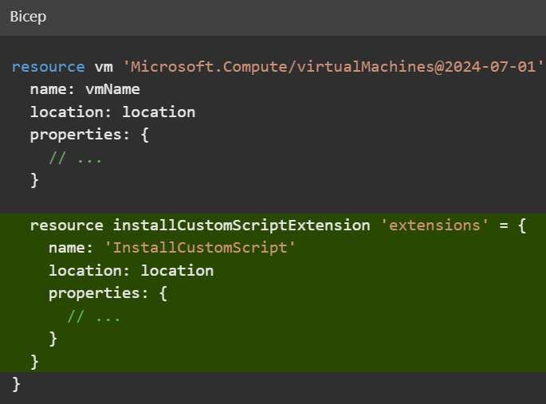

# Deploy child and extension resource by using Bicep

# Introduction

Child and extension resources enable your Azure deployments to access the advanced functionality and power of the Azure platform. You can create these resource types in Bicep by using a clear and understandable template syntax.

You can also use Bicep to refer to resources that were created outside of the Bicep file. For example, you can refer to resources that your colleagues created manually by using the Azure portal, or from within another Bicep template or module, even if the resources are in a different resource group or subscription. By using these features of Bicep, you can unlock the ability to create powerful templates that deploy all the components of your Azure infrastructure.

## Example scenario

Suppose you're responsible for deploying and configuring Azure infrastructure at a toy company. Your company's R&D department contacts you because they're working on a new toy drone that sprays glitter over unsuspecting targets. R&D team members are starting to test the drone. They plan to collect telemetry about the distance the drone can fly, the amount of glitter it can spray, and the battery level.

They want you to set up a new Azure Cosmos DB database for storing this valuable and highly sensitive product test data. They need you to log all database-access attempts so that they can feel confident that no competitors are accessing the data.

The team created a storage account to store all their product design documents, and they want you to help audit all attempts to access the documents.


## What will you be doing?

In this module, you learn about Azure resource types and how child and extension resources are used throughout Azure. You create a Bicep template that deploys a set of Azure resources, and you use several features of Bicep, including:

-   Child resource definitions, through nested resources and the `parent` property, and by constructing multipart resource names.
-   Extension resource definitions, by using the `scope` property.
-   Existing resource references, by using the `existing` keyword.

## What's the main goal?

By the end of this module, you'll be able to create Bicep templates that include child and extension resources. You'll also be able to create Bicep templates that refer to preexisting Azure resources that were created outside of the template file.

## Prerequisites

You should be familiar with:

-   Creating and deploying basic Bicep templates.
-   Azure, including the Azure portal, subscriptions, resource groups, and resource definitions.

To complete the exercises in the module, you need:

-   [Visual Studio Code](https://code.visualstudio.com/), installed locally.
-   The [Bicep extension for Visual Studio Code](https://marketplace.visualstudio.com/items?itemName=ms-azuretools.vscode-bicep), installed.
-   One of the following:
    -   The latest [Azure CLI](https://learn.microsoft.com/en-us/cli/azure/install-azure-cli) tools, installed locally.
    -   The latest version of [Azure PowerShell](https://learn.microsoft.com/en-us/powershell/azure/install-az-ps), installed locally.


# Understand Azure resources

All Azure resources are deployed with a specific _type_. The type identifies the kind of resource it is. A resource ID is the way Azure identifies a specific instance of a resource. It's important to understand how resource types and resource IDs are structured, because they give you important information when you're writing Bicep templates.

## Resource providers

Azure Resource Manager is designed so that many different _resource providers_ can be managed through Resource Manager APIs and Azure Resource Manager (ARM) templates. A resource provider is a logical grouping of resource types that usually relate to one or a few Azure services. Examples of resource providers include:

-   `Microsoft.Compute`, which is used for virtual machines.
-   `Microsoft.Network`, which is used for networking resources like virtual networks, network security groups, and route tables.
-   `Microsoft.Cache`, which is used for Azure Cache for Redis.
-   `Microsoft.Sql`, which is used for Azure SQL.
-   `Microsoft.Web`, which is used for Azure App Service and Azure Functions.
-   `Microsoft.DocumentDB`, which is used for Azure Cosmos DB.

> 📝 **Note**  
>
>The resource provider names and resource type names occasionally don't match the names of the Azure services they are for, or they might be old product or resource names. For example, the resource provider for Log Analytics workspaces is `Microsoft.OperationalInsights`.

The [documentation for each resource type's](https://learn.microsoft.com/en-us/azure/templates/) ARM template syntax is organized according to resource provider.

Resource providers have to be registered for your subscription before you can use the resource types they expose. Registration is usually a one-time process. When you submit a Bicep deployment, Resource Manager automatically registers the resource providers used in the file. You can also [register a resource provider](https://learn.microsoft.com/en-us/azure/azure-resource-manager/management/resource-providers-and-types#register-resource-provider) by using the Azure portal, the Azure CLI, or Azure PowerShell.

## Resource types

A resource provider exposes multiple different types. Each resource type has its own set of properties and behaviors that define the resource and what it can do. For example, within the `Microsoft.Web` resource provider, there are several resource types, including:

-   `sites`. Defines an App Service application or Azure Functions application. Properties include the environment variables that your application uses, and the supported protocols (HTTP and HTTPS) to access the application.
-   `serverFarms`. Defines an App Service plan, the infrastructure that runs your applications. Properties include the size and SKU of the servers, and the number of instances of your plan that you want to deploy.

When you define resources in Bicep, you have to specify their resource type and the version of the resource provider's API that you want Bicep to use for the resource. This information helps the Bicep tooling and the Resource Manager determine which properties should be provided with the resource definition.

> 💡 **Tip**  
>
>It's a good idea to use a recent API version for each resource. New features in Azure services are sometimes available only in newer API versions.

You combine the resource provider and type name to make a fully qualified resource type name. The fully qualified type name consists of the resource provider name, a slash (`/`), and the resource type. For example, a storage account's fully qualified type name is `Microsoft.Storage/storageAccounts`. In this instance, its resource provider name is `Microsoft.Storage` and the resource type is `storageAccounts`.

## Resource IDs

Every Azure resource has a unique resource ID. This ID includes information that helps disambiguate the resource from any other resource of the same type, or even from different resources that might share the same name. A resource ID for a storage account looks like this:

```
/subscriptions/aaaa0a0a-bb1b-cc2c-dd3d-eeeeee4e4e4e/resourceGroups/ToyDevelopment/providers/Microsoft.Storage/storageAccounts/secrettoys
```    

Here's a visual representation of the same information:


You can see that a resource ID contains information about the resource type and the specific resource you deployed. Here's a breakdown of this example resource ID into its components:

-   `subscriptions/aaaa0a0a-bb1b-cc2c-dd3d-eeeeee4e4e4e` indicates that the resource is in the Azure subscription that has ID `aaaa0a0a-bb1b-cc2c-dd3d-eeeeee4e4e4e`.
-   `resourceGroups/ToyDevelopment` indicates that the resource is in the resource group named `ToyDevelopment`.
-   `providers/Microsoft.Storage` indicates that the resource is using a type from the `Microsoft.Storage` resource provider.
-   `storageAccounts` is the resource type.
-   `secrettoys` is the name of the storage account.

> 💡 **Tip**  
>
>You can access the ID of any resource in Bicep by using the symbolic name and the `id` property. For example, if you define a >storage account that has the symbolic name `toyDesignDocumentsStorageAccount`, you can access its resource ID by using the >expression `toyDesignDocumentsStorageAccount.id`.

Now that you understand the basics of resource types and resource IDs, you'll look at child resources.


# Define child resources

It makes sense to deploy some resources only within the context of their parent. These resources are called _child resources_. There are many child resource types in Azure. Here are a few examples:

| Name                       | Resource type                                                   |
|----------------------------|-----------------------------------------------------------------|
| Virtual network subnets    | `Microsoft.Network/virtualNetworks/subnets`                     |
| App Service configuration  | `Microsoft.Web/sites/config`                                    |
| SQL databases              | `Microsoft.Sql/servers/databases`                               |
| Virtual machine extensions | `Microsoft.Compute/virtualMachines/extensions`                  |
| Storage blob containers    | `Microsoft.Storage/storageAccounts/blobServices/containers`     |
| Azure Cosmos DB containers | `Microsoft.DocumentDB/databaseAccounts/sqlDatabases/containers` |
|                            |                                                                 |


For example, consider a storage blob container. A blob container must be deployed into a storage account, and it doesn't make sense for a container to exist outside of a storage account.

Child resource types have longer names that are made up of multiple parts. A storage blob container has this fully qualified type name: `Microsoft.Storage/storageAccounts/blobServices/containers`. The resource ID for a blob container includes the name of the storage account that contains the container, and the container's name.

> 📝 **Note**
>
>Some child resources might have the same name as other child resource types from different parents. For example, `containers` is a child type of both storage accounts and Azure Cosmos DB databases. The names are the same, but they represent different resources, and their fully qualified type names are different.

## How are child resources defined?

With Bicep, you can declare child resources in several ways. Each method has its own advantages, and each is suitable for some situations and not for others. The following sections describe each approach.

> 💡 **Tip**
>
>All the following approaches result in the same deployment activities in Azure. You can choose the approach that best fits your needs without having to worry about breaking anything. And you can update your template and change the approach you're using.

### Nested resources

One approach to defining a child resource is to _nest_ the child resource inside the parent. Here's an example of a Bicep template that deploys a virtual machine and a virtual machine extension. A _virtual machine extension_ is a child resource that provides extra behavior for a virtual machine. In this case, the extension runs a custom script on the virtual machine after deployment.

**Bicep Code**
```bicep
    resource vm 'Microsoft.Compute/virtualMachines@2024-07-01' = {
      name: vmName
      location: location
      properties: {
        // ...
      }
    
      resource installCustomScriptExtension 'extensions' = {
        name: 'InstallCustomScript'
        location: location
        properties: {
          // ...
        }
      }
    }
```    



Notice that the nested resource has a simpler resource type than normal. Even though the fully qualified type name is `Microsoft.Compute/virtualMachines/extensions`, the nested resource automatically inherits the parent's resource type, so you need to specify only the child resource type, `extensions`.

Also notice that there's no API version specified for the nested resource. Bicep assumes that you want to use the same API version as the parent resource, although you can override the API version if you want to.

You can refer to a nested resource by using the `::` operator. For example, you can create an output that returns the full resource ID of the extension:

**Bicep Code**
```bicep
    output childResourceId string = vm::installCustomScriptExtension.id
```    

Nesting resources is a simple way to declare a child resource. Nesting resources also makes the parent-child relationship obvious to anyone reading the template. However, if you have lots of nested resources, or multiple layers of nesting, templates can become harder to read. Also, you can only nest resources up to five layers deep.

### Parent property

A second approach is to declare the child resource without any nesting. Then, use the `parent` property to inform Bicep about the parent-child relationship:

**Bicep Code**
```bicep
    resource vm 'Microsoft.Compute/virtualMachines@2024-07-01' = {
      name: vmName
      location: location
      properties: {
        // ...
      }
    }
    
    resource installCustomScriptExtension 'Microsoft.Compute/virtualMachines/extensions@2024-07-01' = {
      parent: vm
      name: 'InstallCustomScript'
      location: location
      properties: {
        // ...
      }
    }
```
  


Notice that the child resource uses the `parent` property to refer to the symbolic name of its parent.

This approach to referencing the parent is another easy way to declare a child resource. Bicep understands the relationship between parent and child resources, so you don't need to specify the fully qualified resource name or set up a dependency between the resources. This approach also avoids having too much nesting, which can become difficult to read. However, you need to explicitly specify the full resource type and API version each time you define a child resource by using the `parent` property.

To refer to a child resource that's declared with the `parent` property, use its symbolic name as you would with a normal parent resource:

**Bicep Code**
```bicep
    output childResourceId string = installCustomScriptExtension.id
```    

### Construct the resource name

There are some circumstances where you can't use nested resources or the `parent` keyword. Examples include when you declare child resources within a `for` loop, or when you need to use complex expressions to dynamically select a parent resource for a child. In these situations, you can deploy a child resource by manually constructing the child resource name so that it includes its parent resource name, as shown here:

**Bicep Code**
```bicep
    resource vm 'Microsoft.Compute/virtualMachines@2024-07-01' = {
      name: vmName
      location: location
      properties: {
        // ...
      }
    }
    
    resource installCustomScriptExtension 'Microsoft.Compute/virtualMachines/extensions@2024-07-01' = {
      name: '${vm.name}/InstallCustomScript'
      location: location
      properties: {
        // ...
      }
    }
```    


Notice that this example uses string interpolation to append the virtual machine resource `name` property to the child resource name. Bicep understands that there's a dependency between your child and parent resources. You could declare the child resource name by using the `vmName` variable instead. If you do that, though, your deployment might fail because Bicep wouldn't understand that the parent resource needs to be deployed before the child resource.

To resolve this problem, you could manually inform Bicep about the dependency by using the `dependsOn` keyword, as shown here:

**Bicep Code**
```bicep
    resource vm 'Microsoft.Compute/virtualMachines@2024-07-01' = {
      name: vmName
      location: location
      properties: {
        // ...
      }
    }
    
    resource installCustomScriptExtension 'Microsoft.Compute/virtualMachines/extensions@2024-07-01' = {
      name: '${vmName}/InstallCustomScript'
      dependsOn: [
        vm
      ]
      //...
    }
```


> 💡 **Tip**  
> 
> It's generally best to avoid constructing resource names because when you do you lose a lot of the benefits that Bicep provides when it understands the relationships between your resources. Use this option only when you can't use one of the other approaches for declaring child resources.

## Child resource IDs

You start creating a child resource ID by including its parent's resource ID and then appending the child resource type and name. For example, consider an Azure Cosmos DB account named `toyrnd`. The Azure Cosmos DB resource provider exposes a type called `databaseAccounts`, which is the parent resource you deploy:

    /subscriptions/aaaa0a0a-bb1b-cc2c-dd3d-eeeeee4e4e4e/resourceGroups/ToyDevelopment/providers/Microsoft.DocumentDB/databaseAccounts/toyrnd
    

Here's a visual depiction of the same resource ID:


If you add a database to this account, you can use the `sqlDatabases` child resource type. Say you add a database named `FlightTests` to the Azure Cosmos DB account. Here's the child resource ID:


    /subscriptions/aaaa0a0a-bb1b-cc2c-dd3d-eeeeee4e4e4e/resourceGroups/ToyDevelopment/providers/Microsoft.DocumentDB/databaseAccounts/toyrnd/sqlDatabases/FlightTests
    

Here's a visual representation:


You can have multiple levels of child resources. Here's an example resource ID that shows a storage account with two levels of children:


    /subscriptions/aaaa0a0a-bb1b-cc2c-dd3d-eeeeee4e4e4e/resourceGroups/ToyDevelopment/providers/Microsoft.Storage/storageAccounts/secrettoys/blobServices/default/containers/glitterspecs
    

Here's a visual representation of the same resource ID:


This resource ID has several components:

-   Everything up to `secrettoys` is the parent resource ID.
    
-   `blobServices` indicates that the resource is within a child resource type called `blobServices`.
    
    > 📝 **Note**
    > 
    > You don't have to create `blobServices` resources yourself. The `Microsoft.Storage` resource provider automatically creates this resource when you create a storage account. This type of resource is sometimes called an _implicit_ resource. They're fairly uncommon, but you can find them throughout Azure.
    
-   `default` is the name of the `blobServices` child resource.
    
    > 📝 **Note**
    >
    >Sometimes only a single instance of a child resource is allowed. This type of instance is called a _singleton_, and it's often given the name `default`.
    
-   `containers` indicates that the resource is within a child resource type called `containers`.
    
-   `glitterspecs` is the name of the blob container.
    

When you work with child resources, resource IDs can get long and look complicated. However, if you break down a resource ID into its component parts, it's easier to understand how the resource is structured. A resource ID can also give you important clues about how the resource behaves.


